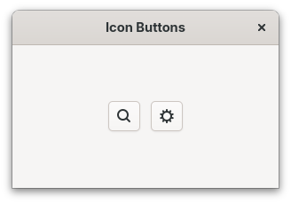
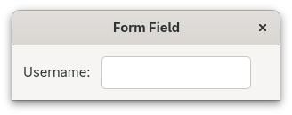
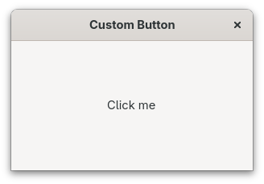
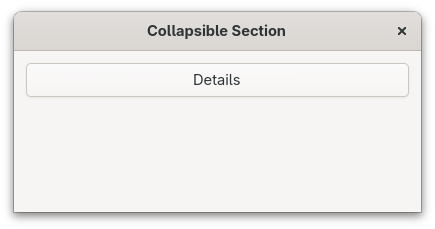
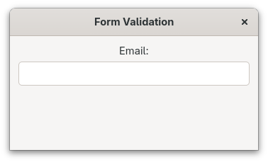
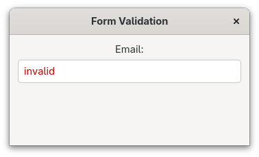
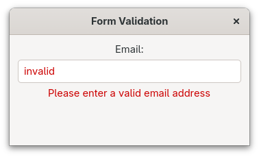

# Accessibility

GTK strives to be accessible by default.
Most built-in widgets already expose the right information to assistive technologies like screen readers.
However, when you build custom widgets or use widgets in unusual ways, you may need to provide additional accessibility information.

GTK's accessibility is built on the [`Accessible`](https://gtk-rs.org/gtk4-rs/stable/latest/docs/gtk4/prelude/trait.AccessibleExt.html) interface.
Every widget implements this interface, which allows it to communicate with assistive technologies through a tree of accessible objects.

## Accessible Labels and Descriptions

When a widget doesn't have visible text, assistive technologies have no way to describe it to users.
This commonly happens with icon-only buttons.
The solution is to set an accessible label.

Filename: <a class=file-link href="https://github.com/gtk-rs/gtk4-rs/blob/main/book/listings/accessibility/1/main.rs">listings/accessibility/1/main.rs</a>

```rust,no_run
{{#rustdoc_include ../listings/accessibility/1/main.rs:icon_button}}
```

The [`update_property`](https://gtk-rs.org/gtk4-rs/stable/latest/docs/gtk4/prelude/trait.AccessibleExtManual.html#method.update_property) method lets you set accessible properties like `Label` (a short, descriptive name) and `Description` (additional context).
The `Label` is what screen readers announce when the widget receives focus.

Filename: <a class=file-link href="https://github.com/gtk-rs/gtk4-rs/blob/main/book/listings/accessibility/1/main.rs">listings/accessibility/1/main.rs</a>

```rust,no_run
{{#rustdoc_include ../listings/accessibility/1/main.rs:description}}
```

<div style="text-align:center"></div>

> When a widget already has visible text (like a regular button with a label), GTK automatically uses that text as the accessible label.
> You only need to set it manually for widgets without visible text.

## Accessible Relationships

Sometimes widgets are related to each other in ways that help users understand the interface.
For example, a label might describe an adjacent entry field.
You can express this relationship using [`accessible::Relation`](https://gtk-rs.org/gtk4-rs/stable/latest/docs/gtk4/accessible/enum.Relation.html).

Filename: <a class=file-link href="https://github.com/gtk-rs/gtk4-rs/blob/main/book/listings/accessibility/2/main.rs">listings/accessibility/2/main.rs</a>

```rust,no_run
{{#rustdoc_include ../listings/accessibility/2/main.rs:labelled_by}}
```

When a screen reader focuses the entry, it will announce the label's text, so the user knows what information to enter.

<div style="text-align:center"></div>

Group related components in a single container to improve navigation for assistive technology users.
For example, place a label and its entry together in a `Box`, as done above.

## Custom Widgets

When creating a custom widget, follow these steps to make it accessible:

1. **Determine the appropriate role.** Set an [`AccessibleRole`](https://gtk-rs.org/gtk4-rs/stable/latest/docs/gtk4/enum.AccessibleRole.html) that matches the widget's behavior, so assistive technologies know what kind of element it is.

2. **Update properties when content changes.** Keep accessible properties like `Label` and `Description` in sync with the widget's visual content.

3. **Update states when state changes.** Reflect dynamic changes — like expanded/collapsed or checked/unchecked — using [`accessible::State`](https://gtk-rs.org/gtk4-rs/stable/latest/docs/gtk4/accessible/enum.State.html).

4. **Update relations.** Connect the widget to related widgets using accessible relations.

Let's build a `CustomButton` widget step by step.

### Setting the Role

First, define the subclass and set the accessible role in `class_init`.
By setting `AccessibleRole::Button`, screen readers will announce this as a button.

Filename: <a class=file-link href="https://github.com/gtk-rs/gtk4-rs/blob/main/book/listings/accessibility/3/custom_button/imp.rs">listings/accessibility/3/custom_button/imp.rs</a>

```rust,no_run
{{#rustdoc_include ../listings/accessibility/3/custom_button/imp.rs:subclass}}
```

### Keyboard Navigation

# Doesn't work yet, also make a video to demonstrate

A custom widget built from a non-focusable base like `gtk::Widget` won't receive keyboard focus by default.
Setting `focusable` to `true` lets users Tab to it, and setting `focus_on_click` to `true` also gives it focus when clicked.

Filename: <a class=file-link href="https://github.com/gtk-rs/gtk4-rs/blob/main/book/listings/accessibility/3/custom_button/imp.rs">listings/accessibility/3/custom_button/imp.rs</a>

```rust,no_run
{{#rustdoc_include ../listings/accessibility/3/custom_button/imp.rs:object_impl}}
```

<div style="text-align:center"></div>

Users can now press Tab to move between custom buttons and press Enter or Space to activate them.

Ensure that:

1. **Focus order is logical.** By default, focus follows the widget hierarchy.

2. **Custom keyboard shortcuts are documented and discoverable.** Consider adding them to your application's shortcuts window.

## Accessible States

For built-in widgets like `CheckButton` or `Expander`, GTK manages states automatically.
When you compose widgets into your own patterns, you need to update the state yourself.

Let's build a collapsible section. We start with a vertical container:

Filename: <a class=file-link href="https://github.com/gtk-rs/gtk4-rs/blob/main/book/listings/accessibility/4/main.rs">listings/accessibility/4/main.rs</a>

```rust,no_run
{{#rustdoc_include ../listings/accessibility/4/main.rs:container}}
```

Next, create a toggle button and a revealer, then set the initial accessible state and relation.
The `Controls` relation tells assistive technologies that the button controls the revealer.

Filename: <a class=file-link href="https://github.com/gtk-rs/gtk4-rs/blob/main/book/listings/accessibility/4/main.rs">listings/accessibility/4/main.rs</a>

```rust,no_run
{{#rustdoc_include ../listings/accessibility/4/main.rs:initial_state}}
```

When the user clicks the button, we toggle the revealer and update the accessible state to match:

Filename: <a class=file-link href="https://github.com/gtk-rs/gtk4-rs/blob/main/book/listings/accessibility/4/main.rs">listings/accessibility/4/main.rs</a>

```rust,no_run
{{#rustdoc_include ../listings/accessibility/4/main.rs:update_state}}
```

Finally, assemble the widgets and present the window:

Filename: <a class=file-link href="https://github.com/gtk-rs/gtk4-rs/blob/main/book/listings/accessibility/4/main.rs">listings/accessibility/4/main.rs</a>

```rust,no_run
{{#rustdoc_include ../listings/accessibility/4/main.rs:window}}
```

<div style="text-align:center">
  
  
</div>

## Don't Rely on Color Alone

Color should never be the only way to convey information.
Users who are color-blind or using a screen reader won't notice a red border.

Consider form validation. We set up a labeled entry with a hidden error label:

Filename: <a class=file-link href="https://github.com/gtk-rs/gtk4-rs/blob/main/book/listings/accessibility/5/main.rs">listings/accessibility/5/main.rs</a>

```rust,no_run
{{#rustdoc_include ../listings/accessibility/5/main.rs:setup}}
```

When the input is invalid, we add the `error` CSS class to turn the border red:

Filename: <a class=file-link href="https://github.com/gtk-rs/gtk4-rs/blob/main/book/listings/accessibility/5/main.rs">listings/accessibility/5/main.rs</a>

```rust,no_run
{{#rustdoc_include ../listings/accessibility/5/main.rs:wrong}}
```

Finally, assemble the widgets and present the window:

Filename: <a class=file-link href="https://github.com/gtk-rs/gtk4-rs/blob/main/book/listings/accessibility/5/main.rs">listings/accessibility/5/main.rs</a>

```rust,no_run
{{#rustdoc_include ../listings/accessibility/5/main.rs:window}}
```

<div style="text-align:center">
  
  
</div>

Instead, combine color with a visible error message and an accessible state:

Filename: <a class=file-link href="https://github.com/gtk-rs/gtk4-rs/blob/main/book/listings/accessibility/6/main.rs">listings/accessibility/6/main.rs</a>

```rust,no_run
{{#rustdoc_include ../listings/accessibility/6/main.rs:correct}}
```

This way, the error is communicated through three channels: color (red border), text (error label), and the `Invalid` state for screen readers.

<div style="text-align:center"></div>

## Testing Accessibility

Testing is essential for ensuring your application works well with assistive technologies.

### Orca Screen Reader

[Orca](https://orca.gnome.org/) is the GNOME screen reader.
You can enable it in Settings → Accessibility → Screen Reader, or toggle it with **Super+Alt+S** (Super is typically the Windows key).
Try navigating your application using only the keyboard while Orca announces elements.

### Accessibility Checklist

When reviewing your application's accessibility, check that:

- All interactive elements have accessible labels
- Icon-only buttons have descriptive accessible labels
- Custom widgets have appropriate roles
- Dynamic state changes are reflected in accessible states
- The application is fully usable with keyboard only
- Focus is visible and moves in a logical order
- Color is not the only way to convey information

## Further Reading

- [GTK accessibility documentation](https://docs.gtk.org/gtk4/section-accessibility.html)
- [GNOME Accessibility Guidelines](https://developer.gnome.org/documentation/guidelines/accessibility.html)
- [Coding Guidelines for Supporting Accessibility](https://developer.gnome.org/documentation/guidelines/accessibility/coding-guidelines.html)
- [Making Custom Components Accessible](https://developer.gnome.org/documentation/guidelines/accessibility/custom-widgets.html)
