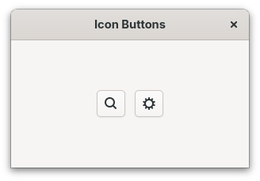
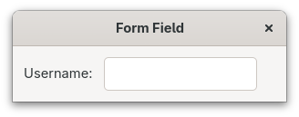
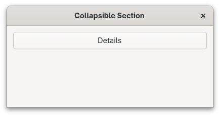
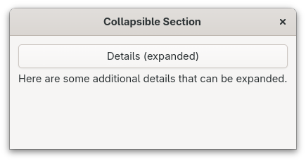
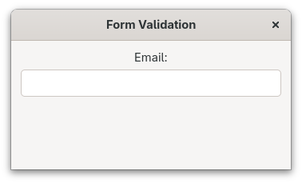
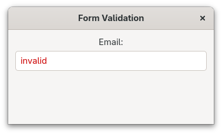
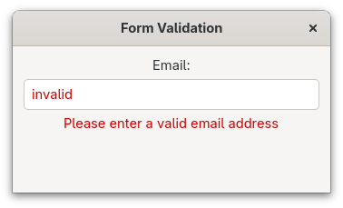

# Accessibility

Making your app accessible means that people with disabilities are able to use it.
There are many nuances to this topic, however in this chapter we are discussing the following disabilities and how you can adapt your app to still make it usable for people with these disabilities:
- Visual impairments including blindness and color blindness
- Difficulty or inability to precisely move a mouse

GTK strives to be accessible by default.
Most built-in widgets already expose the right information so that screen readers can read the relevant pieces of information to blind people.
However, when you build custom widgets or use widgets in unusual ways, you may need to provide additional information.

## Accessible Labels and Descriptions

When a widget doesn't have visible text, assistive technologies have no way to describe it to users.
This commonly happens with icon-only buttons.
The solution is to set an accessible label.

Filename: <a class=file-link href="https://github.com/gtk-rs/gtk4-rs/blob/main/book/listings/accessibility/1/main.rs">listings/accessibility/1/main.rs</a>

```rust,no_run
{{#rustdoc_include ../listings/accessibility/1/main.rs:icon_button}}
```

The [`update_property`](https://gtk-rs.org/gtk4-rs/stable/latest/docs/gtk4/accessible/trait.AccessibleExtManual.html#method.update_property) method lets you set accessible properties like `Label` (a short, descriptive name) and `Description` (additional context).
The `Label` is what screen readers announce when the widget receives focus.

Filename: <a class=file-link href="https://github.com/gtk-rs/gtk4-rs/blob/main/book/listings/accessibility/1/main.rs">listings/accessibility/1/main.rs</a>

```rust,no_run
{{#rustdoc_include ../listings/accessibility/1/main.rs:description}}
```

<div style="text-align:center"></div>

> When a widget already has visible text (like a regular button with a label), GTK automatically uses that text as the accessible label.
> You only need to set it manually for widgets without visible text.

## Accessible Relationships

Sometimes widgets are related to each other in ways that help users understand the interface.
For example, a label might describe an adjacent entry field.
You can express this relationship using [`accessible::Relation`](https://gtk-rs.org/gtk4-rs/stable/latest/docs/gtk4/accessible/enum.Relation.html).

Filename: <a class=file-link href="https://github.com/gtk-rs/gtk4-rs/blob/main/book/listings/accessibility/2/main.rs">listings/accessibility/2/main.rs</a>

```rust,no_run
{{#rustdoc_include ../listings/accessibility/2/main.rs:labelled_by}}
```

When a screen reader focuses the entry, it will announce the label's text, so the user knows what information to enter.

<div style="text-align:center"></div>

Group related components in a single container to improve navigation for assistive technology users.
For example, place a label and its entry together in a `Box`, as done above.

## Custom Widgets

When you create a custom widget you are mostly on your own, that includes accessibility.
Here's a quick checklist you can follow:

1. **Determine the appropriate role.** Set an [`AccessibleRole`](https://gtk-rs.org/gtk4-rs/stable/latest/docs/gtk4/enum.AccessibleRole.html) that matches the widget's behavior, so assistive technologies know what kind of element it is.

2. **Update properties when content changes.** Keep accessible properties like `Label` and `Description` in sync with the widget's visual content.

3. **Update states when state changes.** Reflect dynamic changes using [`accessible::State`](https://gtk-rs.org/gtk4-rs/stable/latest/docs/gtk4/accessible/enum.State.html).

4. **Update relations.** Connect the widget to related widgets using accessible relations.

Let's follow these steps with a custom widget called `Custom Button`.

### Setting the Role

First, we define the subclass and set the accessible role in `class_init`.
By setting [`AccessibleRole::Button`](https://gtk-rs.org/gtk4-rs/stable/latest/docs/gtk4/enum.AccessibleRole.html#variant.Button), screen readers will announce this as a button.
We also set a custom CSS name so we can style the widget, including a visible focus ring.
The `label` property will hold the button's text and is exposed as a GObject property so it can be bound to the inner `Label` widget.

Filename: <a class=file-link href="https://github.com/gtk-rs/gtk4-rs/blob/main/book/listings/accessibility/3/custom_button/imp.rs">listings/accessibility/3/custom_button/imp.rs</a>

```rust,no_run
{{#rustdoc_include ../listings/accessibility/3/custom_button/imp.rs:subclass}}
```

### Focus Ring

A custom widget doesn't automatically get a visible focus indicator.
We need to add CSS that draws one when the widget receives keyboard focus.

Filename: <a class=file-link href="https://github.com/gtk-rs/gtk4-rs/blob/main/book/listings/accessibility/3/resources/style.css">listings/accessibility/3/resources/style.css</a>

```css
{{#include ../listings/accessibility/3/resources/style.css}}
```

### Keyboard Navigation

A custom widget built from a non-focusable base like `gtk::Widget` won't receive keyboard focus by default.
Setting `focusable` to `true` lets users Tab to it, and setting `focus_on_click` to `true` also gives it focus when clicked.
The keyboard shortcuts for Enter and Space are bound to the `activate` signal in `class_init`, following the same pattern GTK uses for its built-in button.

In `constructed`, we also create a child `Label` and use [`bind_property`](https://gtk-rs.org/gtk-rs-core/stable/latest/docs/glib/object/trait.ObjectExt.html#method.bind_property) to keep the child's text in sync with our `label` property.
The [`LabelledBy`](https://gtk-rs.org/gtk4-rs/stable/latest/docs/gtk4/accessible/enum.Relation.html#variant.LabelledBy) relation tells assistive technologies that the button is labelled by its child, so screen readers will announce the label text when the button receives focus.

Filename: <a class=file-link href="https://github.com/gtk-rs/gtk4-rs/blob/main/book/listings/accessibility/3/custom_button/imp.rs">listings/accessibility/3/custom_button/imp.rs</a>

```rust,no_run
{{#rustdoc_include ../listings/accessibility/3/custom_button/imp.rs:object_impl}}
```

Let's load the CSS and add two custom buttons in a `gtk::Box`.

```rust,no_run
{{#rustdoc_include ../listings/accessibility/3/main.rs:main}}
```

<div style="text-align:center">
 <video autoplay muted loop>
  <source src="vid/accessibility_custom_button.webm" type="video/webm">
  <p>A video which shows two custom buttons. The focus is constantly switched between those two.</p>
 </video>
</div>

Users can now press Tab to move between custom buttons and press Enter or Space to activate them.

For your own custom widgets, ensure that:

- the focus order is logical. By default, focus follows the widget hierarchy.
- custom keyboard shortcuts are documented and discoverable. Consider adding them to your application's shortcuts window.

## Accessible States

For built-in widgets like `CheckButton` or `Expander`, GTK manages states automatically.
When you compose widgets into your own patterns, you need to update the accessible state yourself.

Let's build a collapsible section. We start with a vertical container:

Filename: <a class=file-link href="https://github.com/gtk-rs/gtk4-rs/blob/main/book/listings/accessibility/4/main.rs">listings/accessibility/4/main.rs</a>

```rust,no_run
{{#rustdoc_include ../listings/accessibility/4/main.rs:container}}
```

Next, create a toggle button and a revealer, then set the initial accessible state and relation.
The [`accessible::Relation::Controls`](https://gtk-rs.org/gtk4-rs/stable/latest/docs/gtk4/accessible/enum.Relation.html) relation tells assistive technologies that the button controls the revealer.

Filename: <a class=file-link href="https://github.com/gtk-rs/gtk4-rs/blob/main/book/listings/accessibility/4/main.rs">listings/accessibility/4/main.rs</a>

```rust,no_run
{{#rustdoc_include ../listings/accessibility/4/main.rs:initial_state}}
```

When the user clicks the button, we toggle the revealer and update the accessible state to match.
We also use [`announce`](https://gtk-rs.org/gtk4-rs/stable/latest/docs/gtk4/prelude/trait.AccessibleExt.html#method.announce) to tell screen readers about the newly revealed content:

Filename: <a class=file-link href="https://github.com/gtk-rs/gtk4-rs/blob/main/book/listings/accessibility/4/main.rs">listings/accessibility/4/main.rs</a>

```rust,no_run
{{#rustdoc_include ../listings/accessibility/4/main.rs:update_state}}
```

Finally, assemble the widgets and present the window:

Filename: <a class=file-link href="https://github.com/gtk-rs/gtk4-rs/blob/main/book/listings/accessibility/4/main.rs">listings/accessibility/4/main.rs</a>

```rust,no_run
{{#rustdoc_include ../listings/accessibility/4/main.rs:window}}
```

This is how the app looks like. First in its collapsed, and then in its expanded state.
<div style="text-align:center">
  
  
</div>

## Don't Rely on Color Alone

Color should never be the only way to convey information.
Let's demonstrate this with a simple example where we only use color to notify the user about an invalid entry. 


First, we set up a labeled entry with a hidden error label:

Filename: <a class=file-link href="https://github.com/gtk-rs/gtk4-rs/blob/main/book/listings/accessibility/5/main.rs">listings/accessibility/5/main.rs</a>

```rust,no_run
{{#rustdoc_include ../listings/accessibility/5/main.rs:setup}}
```

When the input is invalid, we add the `error` CSS class to turn the border red:

Filename: <a class=file-link href="https://github.com/gtk-rs/gtk4-rs/blob/main/book/listings/accessibility/5/main.rs">listings/accessibility/5/main.rs</a>

```rust,no_run
{{#rustdoc_include ../listings/accessibility/5/main.rs:wrong}}
```

Finally, assemble the widgets and present the window:

Filename: <a class=file-link href="https://github.com/gtk-rs/gtk4-rs/blob/main/book/listings/accessibility/5/main.rs">listings/accessibility/5/main.rs</a>

```rust,no_run
{{#rustdoc_include ../listings/accessibility/5/main.rs:window}}
```

This doesn't look too bad.

<div style="text-align:center">
  
</div>

And when we enter an invalid email address, the color of my entry turns red.

<div style="text-align:center">
  
</div>


However, people who are color-blind or are using a screen reader won't notice the red font.
What we will therefore do instead is to combine color with a visible error message and an accessible state:

Filename: <a class=file-link href="https://github.com/gtk-rs/gtk4-rs/blob/main/book/listings/accessibility/6/main.rs">listings/accessibility/6/main.rs</a>

```rust,no_run
{{#rustdoc_include ../listings/accessibility/6/main.rs:correct}}
```

This way, the error is communicated through three channels: 
- red color,
- text of an error label, 
- and the `Invalid` state which will be announced by screen readers.

<div style="text-align:center"></div>

## Testing Accessibility

Testing is essential for ensuring your application works well with assistive technologies.

### Orca Screen Reader

On Linux you can use [Orca](https://orca.gnome.org/) which is pre-installed on many linux distributions.
On GNOME can enable it in Settings → Accessibility → Screen Reader, or toggle it with **Super+Alt+S** (Super is typically the Windows key).
Try navigating your application using only the keyboard while Orca announces elements.
If the screen reader isn't announcing the correct thing, it is time to adapt your application.

### Accessibility Checklist

Here are some things you can look out for:

- The application needs to be fully usable with keyboard only
- Focus should be visible and move in a logical order
- Color must not be the only way to convey information
- All interactive elements and icon-only buttons need to have accessible labels
- Custom widgets need to have appropriate roles
- Dynamic state changes need to be reflected in accessible states

## Conclusion

Hopefully, this gave you a good overview over what it means to create an application that is accessible to everyone.
Of course that only scratched the surface of this topic. 
For a more information, I can recommend the following resources.

- [GTK accessibility documentation](https://docs.gtk.org/gtk4/section-accessibility.html)
- [GNOME Accessibility Guidelines](https://developer.gnome.org/documentation/guidelines/accessibility.html)
- [Coding Guidelines for Supporting Accessibility](https://developer.gnome.org/documentation/guidelines/accessibility/coding-guidelines.html)
- [Making Custom Components Accessible](https://developer.gnome.org/documentation/guidelines/accessibility/custom-widgets.html)
