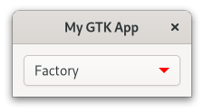

# CSS

When you want to modify the style of your website, you use [CSS](https://de.wikipedia.org/wiki/Cascading_Style_Sheets).
Since so many people are already familiar with web development, it makes sense that GTK supports its own variant of CSS.

> We will not explain every piece of CSS syntax used in this chapter.
> If you are new to it or just need a refresher, have a look at the [MDN Web Docs](https://developer.mozilla.org/en-US/docs/Web/CSS/Syntax)

Let us say we have a button and we want to set its font color to red.
Every widget has a corresponding CSS node.
In the case of `gtk::Button`, this node is called `button`.
Therefore, we create a `style.css` file with the following content:

<span class="filename">Filename: listings/css/1/style.css</span>

```css
{{#rustdoc_include ../listings/css/1/style.css}}
```

Next, we load the CSS file in the startup step of the application.
As usual, the widgets are created during the activate step.

<span class="filename">Filename: listings/css/1/main.rs</span>

```rust ,no_run,noplayground
{{#rustdoc_include ../listings/css/1/main.rs:main}}
```

When we now run the app, we notice that our button *and* the "close" button are red.
Probably not what we wanted, but that is what we typed.
We did not specify for which button the rule should apply, so it was applied to both of them.

<div style="text-align:center"></div>

>The `GtkInspector` comes in quite handy (not only) when playing with CSS.
>Make sure that the window of your app is focused and press <kbd>Ctrl</kbd> + <kbd>Shift</kbd> + <kbd>D</kbd>.
> A window will pop up which lets you browse and even manipulate the state of your app.
> Open the `CSS` view and override the button color with the following snippet.
>```css
>button {
>  color: blue;
>}
>```

## Classes

[Class selectors](https://developer.mozilla.org/en-US/docs/Web/CSS/Class_selectors) are one way to limit the amount of elements a CSS rule applies to.
Let us look at few different scenarios where they are involved.


### Classes Applied by GTK

GTK adds style classes to many of its nodes, often depending on a certain condition.
In the case of the node [`button`](https://gtk-rs.org/gtk4-rs/stable/latest/docs/gtk4/struct.Button.html#css-nodes), the style class `.text-button` will be added when the content of the corresponding widget is just a label.
That is why we create a new CSS rule which only applies to `button` nodes with the style class `text_button`.


<span class="filename">Filename: listings/css/2/style.css</span>

```css
{{#rustdoc_include ../listings/css/2/style.css}}
```

<div style="text-align:center"></div>

### Classes Applied Manually

If we want to apply different rules to nodes which got the same style classes added, we will have to think of a different strategy.
For that we add our own CSS class with [`add_css_class`](../docs/gtk4/prelude/trait.WidgetExt.html#tymethod.add_css_class).

<span class="filename">Filename: listings/css/3/main.rs</span>

```rust ,no_run,noplayground
{{#rustdoc_include ../listings/css/3/main.rs:buttons}}
```

And we create a CSS rule that applies to `button` nodes with the style class `button_1`.

<span class="filename">Filename: listings/css/3/style.css</span>

```css
{{#rustdoc_include ../listings/css/3/style.css}}
```

This way, only the first button gets colored red.
If you want to make sure that CSS rules only apply to a hand-selected set of nodes, adding your own style classes is your best bet.
Just make sure that you do not choose a name for your style class that GTK either adds itself or provides CSS rules for.
This brings us to the next point.

<div style="text-align:center"></div>

### CSS Rules Provided by GTK

Certain styles are common enough that GTK provides its own CSS rules for.
If you want to indicate that your button leads to a destructive or suggested action, you can add the "destructive-action" or "suggested-action" style class to it.
You do not have to provide a CSS file here.
After you have added the style class, the `button` node will match the CSS rule provided by GTK.
Most widgets will document these rules in their documentation under [CSS nodes](../docs/gtk4/struct.Button.html#css-nodes).

<span class="filename">Filename: listings/css/4/main.rs</span>

```rust ,no_run,noplayground
{{#rustdoc_include ../listings/css/4/main.rs:buttons}}
```

<div style="text-align:center"></div>

### Interface Builder

We can also add style classes with the interface builder.
Just add the `<style>` element to your widget.
The `<style>` element is documented [here](../docs/gtk4/struct.Widget.html#gtkwidget-as-gtkbuildable). 

<span class="filename">Filename: listings/css/5/window/window.ui</span>

```xml
{{#rustdoc_include ../listings/css/5/window/window.ui}}
```


## Pseudo-classes

Sometimes you want your CSS rules to apply to even more precise conditions than style classes allow.
That is where [pseudo-classes](https://developer.mozilla.org/en-US/docs/Web/CSS/Pseudo-classes) come in.
With pseudo-classes you can specify a specific state of the CSS node.
Let us use a single button with the style class `button_1` added to demonstrate this concept.

<span class="filename">Filename: listings/css/6/window/window.ui</span>

```xml
{{#rustdoc_include ../listings/css/6/window/window.ui}}
```

By adding the pseudo-class `hover`, we say that we only want this rule to apply for `button` nodes with style class `button_1` over which we currently hover.
We also set the `background-image` to `none`, so that it does not overlay the `background-color`, and add a bit of transition time.

<span class="filename">Filename: listings/css/6/style.css</span>

```css
{{#rustdoc_include ../listings/css/6/style.css}}
```

If we now hover over the button, we see that over the span of one second its background turns yellow and its font turns red.
After we removed the cursor, the button returns to its original state.

<div style="text-align:center">
 <video autoplay muted loop>
  <source src="vid/css_6.webm" type="video/webm">
Your browser does not support the video tag.
 </video>
</div>

## Nodes

We already learned that such a thing as CSS nodes exist, but in our examples a widget always corresponded to a single node.
[`gtk::ComboBoxText`](../docs/gtk4/struct.ComboBoxText.html) does not, so let us see how this widget behaves.

First, we create a `ComboBoxText` as child, populate it with the entries "Factory", "Home" and "Subway" and choose "Factory" as the default entry.


<span class="filename">Filename: listings/css/7/window/window.ui</span>

```xml
{{#rustdoc_include ../listings/css/7/window/window.ui}}
```

A `ComboBoxText` contains text and a small image of an arrow.
Let us say we want to give the arrow a different color, but not the text.
How would we do that?

We see the answer by checking the CSS nodes of [`gtk::Combobox`](https://gtk-rs.org/gtk4-rs/stable/latest/docs/gtk4/struct.ComboBox.html#css-nodes) the more general form of `ComboBoxText`.

```
combobox
├── box.linked
│   ╰── button.combo
│       ╰── box
│           ├── cellview
│           ╰── arrow
╰── window.popup
```

We see that the `combobox` node has children, which themselves can have children and attached style classes.
Now we know that we have to add a CSS rule that applies to the `arrow` node, which is a descendant of `combobox`.

<span class="filename">Filename: listings/css/7/style.css</span>

```css
{{#rustdoc_include ../listings/css/7/style.css}}
```

Indeed, the resulting app features a `ComboBoxText` with a red arrow.

<div style="text-align:center"></div>

## Images

Do we really want to settle with an arrow?
Maybe there are much nicer icons out there you do not even know about yet.
Fear not, the [Icon Library](https://apps.gnome.org/app/org.gnome.design.IconLibrary/) has you covered there.
Scroll through the provided icons and choose one from the pre-installed system icons for now.
In a follow-up chapter, you will learn how GResource can be used to embed the other icons as well.

For now, we take the icon with the semantic name "format-justify-fill-symbolic".
In the screenshot below you see that this corresponds to three parallel lines.
However, on a different system this icon might look different or not exist at all.
This is why it is typically better to embed the icons you use.

GTK provides its own parameter for loading icons in buttons and expanders: `-gtk-icon-source`.
You can find the full list of supported parameters in GTK's [documentation](https://docs.gtk.org/gtk4/css-properties.html#gtk-css-properties).


<span class="filename">Filename: listings/css/8/style.css</span>

```css
{{#rustdoc_include ../listings/css/8/style.css}}
```

Voilà, the arrow is replaced with the one we selected ourselves. 

<div style="text-align:center"></div>


## Exported Colors

Now that we know how to use CSS, it is time to update our To-Do app a bit.
Before, the individual tasks were a bit hard to distinguish.
Let us change that!

First, we add the style class `todo_row` to our `TodoRow`.

<span class="filename">Filename: listings/todo_app/3/todo_row/todo_row.ui</span>

```xml
{{#rustdoc_include ../listings/todo_app/3/todo_row/todo_row.ui}}
```

One way to make the rows set apart a bit is to add borders.
But which color to use for the borders?
Our To-Do app should represent a real world app, so we will not be satisfied with choosing yellow and calling it a day.
Your stylesheet has colors defined for these use cases, so let us have a look.
As of this writing, the exported colors of the default stylesheet can be found in its [source code](https://gitlab.gnome.org/GNOME/gtk/-/blob/main/gtk/theme/Default/_colors-public.scss).

There we find the color `borders`, which should be used for the widget's main borders color.
Perfect!
We can access exported colors by adding an `@` in front of their names.

<span class="filename">Filename: listings/todo_app/3/style.css</span>

```css
{{#rustdoc_include ../listings/todo_app/3/style.css}}
```

Now our tasks have borders around them, and we are one step further in finishing our To-Do app.

<div style="text-align:center"></div>

## Conclusion

We now learned how to use CSS to style our apps.
We can make our CSS rules as specific as we want them to be.
Even targeting nodes deep within the inheritance tree is not a problem anymore.

In the following chapter, we will learn how to include CSS files, icons and basically everything that our app needs during runtime in a binary bundle. 
