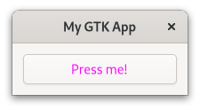
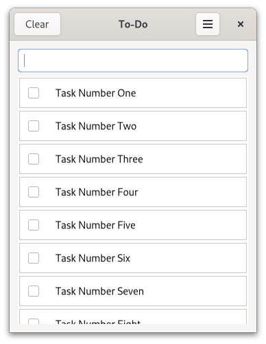

# CSS

When you want to modify the style of your website you use [CSS](https://de.wikipedia.org/wiki/Cascading_Style_Sheets).
Since so many people are familiar with web development, it makes sense that GTK supports its own variant of CSS.


<span class="filename">Filename: listings/css/1/main.rs</span>

```rust ,no_run,noplayground
{{#rustdoc_include ../listings/css/1/main.rs:load_css}}
```

If you are not already familiar with CSS, now would be a good time to make yourself familiar with its [syntax](https://developer.mozilla.org/en-US/docs/Web/CSS/Syntax).

<span class="filename">Filename: listings/css/1/style.css</span>

```css
{{#rustdoc_include ../listings/css/1/style.css}}
```

<span class="filename">Filename: listings/css/1/main.rs</span>

```rust ,no_run,noplayground
{{#rustdoc_include ../listings/css/1/main.rs:build_ui}}
```


<div style="text-align:center"></div>

>The `GtkInspector` is very handy when it comes to, well, inspecting GTK apps.
>Make sure the window of your app is focused and press <kbd>Ctrl</kbd> + <kbd>Shift</kbd> + <kbd>D</kbd>.
> A window will pop up which lets you browse and even manipulate the state of your app.
> Open the `CSS` view and override the button color with the following snippet.
>```css
>button {
>  color: blue;
>}
>```

## Classes

### Classes Applied by GTK


<span class="filename">Filename: listings/css/2/style.css</span>

```css
{{#rustdoc_include ../listings/css/2/style.css}}
```

<div style="text-align:center"></div>

### Classes Applied Manually

<span class="filename">Filename: listings/css/3/main.rs</span>

```rust ,no_run,noplayground
{{#rustdoc_include ../listings/css/3/main.rs:build_ui}}
```


<span class="filename">Filename: listings/css/3/main.rs</span>

```rust ,no_run,noplayground
{{#rustdoc_include ../listings/css/3/main.rs:buttons}}
```


<span class="filename">Filename: listings/css/3/style.css</span>

```css
{{#rustdoc_include ../listings/css/3/style.css}}
```

<div style="text-align:center"></div>

### Classes Provided by GTK

<span class="filename">Filename: listings/css/4/main.rs</span>

```rust ,no_run,noplayground
{{#rustdoc_include ../listings/css/4/main.rs:buttons}}
```

<div style="text-align:center"></div>

### Interface Builder

<span class="filename">Filename: listings/css/5/window/window.ui</span>

```xml
{{#rustdoc_include ../listings/css/5/window/window.ui}}
```


## Pseudo-classes

<span class="filename">Filename: listings/css/6/window/window.ui</span>

```xml
{{#rustdoc_include ../listings/css/6/window/window.ui}}
```

<span class="filename">Filename: listings/css/6/style.css</span>

```css
{{#rustdoc_include ../listings/css/6/style.css}}
```

<div style="text-align:center">
 <video autoplay muted loop>
  <source src="vid/css_6.webm" type="video/webm">
Your browser does not support the video tag.
 </video>
</div>

## Nodes

[Icon Library](https://apps.gnome.org/de/app/org.gnome.design.IconLibrary/)


<span class="filename">Filename: listings/css/7/window/window.ui</span>

```xml
{{#rustdoc_include ../listings/css/7/window/window.ui}}
```

<span class="filename">Filename: listings/css/7/style.css</span>

```css
{{#rustdoc_include ../listings/css/7/style.css}}
```

<div style="text-align:center"></div>

## Images


<span class="filename">Filename: listings/css/8/style.css</span>

```css
{{#rustdoc_include ../listings/css/8/style.css}}
```

<div style="text-align:center"></div>


## Exported Colors

<span class="filename">Filename: listings/todo_app/3/todo_row/todo_row.ui</span>

```xml
{{#rustdoc_include ../listings/todo_app/3/todo_row/todo_row.ui}}
```

The exported colors are currently only documented directly in the [stylesheet](https://gitlab.gnome.org/GNOME/gtk/-/blob/main/gtk/theme/Default/_colors-public.scss) of GTK.

<span class="filename">Filename: listings/todo_app/3/style.css</span>

```css
{{#rustdoc_include ../listings/todo_app/3/style.css}}
```

<div style="text-align:center"></div>
