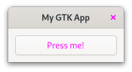

# CSS

When you want to modify the styling and layout of your GTK app you use [CSS](https://de.wikipedia.org/wiki/Cascading_Style_Sheets).
If you are not already familiar with CSS, now would be a good time to make yourself familiar with its [syntax](https://developer.mozilla.org/en-US/docs/Web/CSS/Syntax).

[GtkInspector](https://wiki.gnome.org/Projects/GTK/Inspector)

<span class="filename">Filename: listings/css/1/main.rs</span>

```rust ,no_run,noplayground
{{#rustdoc_include ../listings/css/1/main.rs}}
```

<span class="filename">Filename: listings/css/1/style.css</span>

```css
{{#rustdoc_include ../listings/css/1/style.css}}
```

<div style="text-align:center"></div>

## Classes

### Classes Applied by GTK


[Icon Library](https://apps.gnome.org/de/app/org.gnome.design.IconLibrary/)

<span class="filename">Filename: listings/css/2/main.rs</span>

```rust ,no_run,noplayground
{{#rustdoc_include ../listings/css/2/main.rs:build_ui}}
```

<span class="filename">Filename: listings/css/2/style.css</span>

```css
{{#rustdoc_include ../listings/css/2/style.css}}
```

<div style="text-align:center"></div>

### Classes Applied Manually


<span class="filename">Filename: listings/css/3/main.rs</span>

```rust ,no_run,noplayground
{{#rustdoc_include ../listings/css/3/main.rs:buttons}}
```


<span class="filename">Filename: listings/css/3/style.css</span>

```css
{{#rustdoc_include ../listings/css/3/style.css}}
```

<div style="text-align:center"></div>

### Classes Provided by GTK

<span class="filename">Filename: listings/css/4/main.rs</span>

```rust ,no_run,noplayground
{{#rustdoc_include ../listings/css/4/main.rs:buttons}}
```

<div style="text-align:center"></div>

### Interface Builder

<span class="filename">Filename: listings/css/5/window/window.ui</span>

```xml
{{#rustdoc_include ../listings/css/5/window/window.ui}}
```


## Pseudo-classes

<span class="filename">Filename: listings/css/6/window/window.ui</span>

```xml
{{#rustdoc_include ../listings/css/6/window/window.ui}}
```

<span class="filename">Filename: listings/css/6/style.css</span>

```css
{{#rustdoc_include ../listings/css/6/style.css}}
```

<div style="text-align:center">
 <video autoplay muted loop>
  <source src="vid/css_6.webm" type="video/webm">
Your browser does not support the video tag.
 </video>
</div>

## Nodes

<span class="filename">Filename: listings/css/7/window/window.ui</span>

```xml
{{#rustdoc_include ../listings/css/7/window/window.ui}}
```

<span class="filename">Filename: listings/css/7/style.css</span>

```css
{{#rustdoc_include ../listings/css/7/style.css}}
```

## Images


<span class="filename">Filename: listings/css/8/style.css</span>

```css
{{#rustdoc_include ../listings/css/8/style.css}}
```


