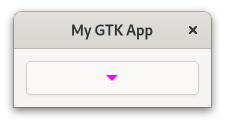

# CSS

When you want to modify the style of your website, you use [CSS](https://de.wikipedia.org/wiki/Cascading_Style_Sheets).
Similarly, GTK supports its own variant of CSS in order to style your app.

> We will not explain every piece of syntax used in this chapter.
> If you are new to CSS or just need a refresher, have a look at the [MDN Web Docs](https://developer.mozilla.org/en-US/docs/Web/CSS/Syntax).

Let's say we have a button and we want to set its font color to magenta.
Every type of widget has a corresponding CSS node.
In the case of `gtk::Button`, this node is called `button`.
Therefore, we create a `style.css` file with the following content:

Filename: <a class=file-link href="https://github.com/gtk-rs/gtk4-rs/blob/master/book/listings/css/1/style.css">listings/css/1/style.css</a>

```css
{{#rustdoc_include ../listings/css/1/style.css}}
```

Next, we need to load the CSS file in the startup step of the application.
As usual, the widgets are created during the "activate" step.

Filename: <a class=file-link href="https://github.com/gtk-rs/gtk4-rs/blob/master/book/listings/css/1/main.rs">listings/css/1/main.rs</a>

```rust ,no_run,noplayground
{{#rustdoc_include ../listings/css/1/main.rs:main}}
```

When we now run the app, we notice that our button *and* the "close" button are magenta.
Probably not what we wanted, but that is what our CSS snippet does.
We did not specify for which button the rule should apply, so it was applied to both of them.

<div style="text-align:center"></div>

>The `GtkInspector` comes in quite handy (not only) when playing with CSS.
>Make sure that the window of your app is focused and press <kbd>Ctrl</kbd> + <kbd>Shift</kbd> + <kbd>D</kbd>.
> A window will pop up which lets you browse and even manipulate the state of your app.
> Open the CSS view and override the button color with the following snippet.
>```css
>button {
>  color: blue;
>}
>```
> With the pause button you can toggle whether your CSS code is active or not.

## Style Classes Applied by GTK

[Class selectors](https://developer.mozilla.org/en-US/docs/Web/CSS/Class_selectors) are one way to choose which specific elements a CSS rule applies to.
GTK adds style classes to many of its widgets, often depending on their content.
A [`gtk::Button`](../docs/gtk4/struct.Button.html#css-nodes), for example, will get the `text-button` style class when its content is a label.
That is why we create a new CSS rule which only applies to `button` nodes with the style class `text_button`.


Filename: <a class=file-link href="https://github.com/gtk-rs/gtk4-rs/blob/master/book/listings/css/2/style.css">listings/css/2/style.css</a>

```css
{{#rustdoc_include ../listings/css/2/style.css}}
```

Now only the font of our button becomes magenta.

<div style="text-align:center"></div>

## Adding Your Own Style Class

With [`add_css_class`](../docs/gtk4/prelude/trait.WidgetExt.html#tymethod.add_css_class) we can also add our own style classes to widgets.
One use-case for this is when you want a rule to apply to a hand-picked set of widgets.
For example if we have two buttons, but want only one of them to have magenta font.
Relying on one of the style classes which GTK adds will not help since both will get the same ones.
Which is why we add the style class `button-1` to the first one.

Filename: <a class=file-link href="https://github.com/gtk-rs/gtk4-rs/blob/master/book/listings/css/3/main.rs">listings/css/3/main.rs</a>

```rust ,no_run,noplayground
{{#rustdoc_include ../listings/css/3/main.rs:buttons}}
```

Then, we create a CSS rule that applies to `button` nodes with the style class `button-1`.

Filename: <a class=file-link href="https://github.com/gtk-rs/gtk4-rs/blob/master/book/listings/css/3/style.css">listings/css/3/style.css</a>

```css
{{#rustdoc_include ../listings/css/3/style.css}}
```

We can see that this way only the first button gets colored magenta.

<div style="text-align:center"></div>


## Specifying Name of a Widget


If you want that your rule only applies to a single widget, matching with style classes can be fine.
Ideally however, you would give the widget a name and match with that name instead.
This way your intentions are more clear, compared to matching with style classes that can apply to multiple widgets. 

Again, we have two buttons but want to color only one of them magenta.
We set the name of the first one with [`set_widget_name`](../docs/gtk4/prelude/trait.WidgetExt.html#tymethod.set_widget_name).

Filename: <a class=file-link href="https://github.com/gtk-rs/gtk4-rs/blob/master/book/listings/css/4/main.rs">listings/css/4/main.rs</a>

```rust ,no_run,noplayground
{{#rustdoc_include ../listings/css/4/main.rs:buttons}}
```

Then, create a CSS rule that applies to `button` nodes with the name `button-1`.
The name is specified after the `#` symbol.

Filename: <a class=file-link href="https://github.com/gtk-rs/gtk4-rs/blob/master/book/listings/css/4/style.css">listings/css/4/style.css</a>

```css
{{#rustdoc_include ../listings/css/4/style.css}}
```

Again, the style rule only applies to the first button.

<div style="text-align:center"></div>


## CSS Rules Provided by GTK

Certain styles are common enough that GTK provides CSS rules for them.
For example, if you want to indicate that your button leads to a destructive or suggested action you don't have to provide your own CSS rules.
All you have to do is to add "destructive-action" or "suggested-action" style class to your button.
Most widgets will document these rules in their documentation under [CSS nodes](../docs/gtk4/struct.Button.html#css-nodes).

Filename: <a class=file-link href="https://github.com/gtk-rs/gtk4-rs/blob/master/book/listings/css/5/main.rs">listings/css/5/main.rs</a>

```rust ,no_run,noplayground
{{#rustdoc_include ../listings/css/5/main.rs:buttons}}
```

<div style="text-align:center"></div>

## Interface Builder

We can also add style classes with the interface builder.
Just add the `<style>` element to your widget.
The `<style>` element is documented together with [`gtk::Widget`](../docs/gtk4/struct.Widget.html#gtkwidget-as-gtkbuildable).
Adding again destructive and suggested buttons, would then look like this:

Filename: <a class=file-link href="https://github.com/gtk-rs/gtk4-rs/blob/master/book/listings/css/6/window/window.ui">listings/css/6/window/window.ui</a>

```xml
{{#rustdoc_include ../listings/css/6/window/window.ui}}
```


## Pseudo-classes

Sometimes you want your CSS rules to apply under even more precise conditions than style classes allow.
That is where [pseudo-classes](https://developer.mozilla.org/en-US/docs/Web/CSS/Pseudo-classes) come in.
Let's use a single button with name `button-1` to demonstrate this concept.

Filename: <a class=file-link href="https://github.com/gtk-rs/gtk4-rs/blob/master/book/listings/css/7/window/window.ui">listings/css/7/window/window.ui</a>

```xml
{{#rustdoc_include ../listings/css/7/window/window.ui}}
```

By adding the pseudo-class `hover`, we say that we want this rule to only apply to a `button` node with name `button-1` when hovering over it with the mouse pointer.

Filename: <a class=file-link href="https://github.com/gtk-rs/gtk4-rs/blob/master/book/listings/css/7/style.css">listings/css/7/style.css</a>

```css
{{#rustdoc_include ../listings/css/7/style.css}}
```

If we now hover over the button, we see that over the span of one second its background turns yellow and its font turns magenta.
After we removed the cursor, the button returns to its original state.

<div style="text-align:center">
 <video autoplay muted loop>
  <source src="vid/css_6.webm" type="video/webm">
  <p>A video which shows that hovering over one button makes its background yellow and text red</p>
 </video>
</div>

## Nodes

In the previous examples, a widget always corresponded to a single CSS node.
This is not always the case.
For example, [`gtk::MenuButton`](../docs/gtk4/struct.MenuButton.html) has multiple CSS nodes.
Let's see how that works.

First, we create a single `MenuButton`.


Filename: <a class=file-link href="https://github.com/gtk-rs/gtk4-rs/blob/master/book/listings/css/8/window/window.ui">listings/css/8/window/window.ui</a>

```xml
{{#rustdoc_include ../listings/css/8/window/window.ui}}
```
You can make a `MenuButton` show an icon or a label.
If you choose to do neither of those, as we currently do, it shows an image displaying an arrow.

An inheritance tree of [CSS nodes](../docs/gtk4/struct.MenuButton.html#css-nodes) displays this situation:

```
menubutton
╰── button.toggle
    ╰── <content>
         ╰── [arrow]
```

We see that the `menubutton` node has children, which themselves have children and attached style classes.
Now we know that we have to add a CSS rule that applies to the `arrow` node, which is a descendant of `menubutton`.

Filename: <a class=file-link href="https://github.com/gtk-rs/gtk4-rs/blob/master/book/listings/css/8/style.css">listings/css/8/style.css</a>

```css
{{#rustdoc_include ../listings/css/8/style.css}}
```

Indeed, we get a `MenuButton` with a magenta arrow.

<div style="text-align:center"></div>


## Set CSS Name and Use Exported Colors 

We already learned how to give an instance of a widget a name with pseudo-classes.
But what if we have a custom widget and we want to reference all instances of it?
Let's see how to deal with this situation by messing with our To-Do app once more.

The class `TaskRow` inherits from `gtk::Box`, so we could just match for the node `box`.
However, in that case we would also match with other instance of `gtk::Box`.
What we will want to do instead is to give `TaskRow` its own CSS name.
When calling [`set_css_name` ](../docs/gtk4/subclass/widget/trait.WidgetClassSubclassExt.html#method.set_css_name), we change the name of the CSS node of the widget class.
In our case, the widget `TaskRow` then corresponds to the node `task-row`.

Filename: <a class=file-link href="https://github.com/gtk-rs/gtk4-rs/blob/master/book/listings/todo/3/task_row/imp.rs">listings/todo/3/task_row/imp.rs</a>

```rust ,no_run,noplayground
{{#rustdoc_include ../listings/todo/3/task_row/imp.rs:object_subclass}}
```

What to do with the new node name now?
Let's change the background color once more but this time with a twist.
We are going to use the named color `success_color`.


Filename: <a class=file-link href="https://github.com/gtk-rs/gtk4-rs/blob/master/book/listings/todo/3/resources/style.css">listings/todo/3/resources/style.css</a>

```css
{{#rustdoc_include ../listings/todo/3/resources/style.css}}
```

The `Default` stylesheet of GTK provides pre-defined colors for various use-cases.
As of this writing, these exported colors can only be found in its [source code](https://gitlab.gnome.org/GNOME/gtk/-/blob/b2c227e9c57839a2a4e24462a71ae0bad9a95264/gtk/theme/Default/_colors-public.scss).

There we find the color `success_color`, which in real scenarios should be used to indicate success.
We can then access the pre-defined color by adding an `@` in front of its name.

Let's add some finishing touches to include `style.css` into `resources.gresource.xml`

Filename: <a class=file-link href="https://github.com/gtk-rs/gtk4-rs/blob/master/book/listings/todo/3/resources/resources.gresource.xml">listings/todo/3/resources/resources.gresource.xml</a>

```diff
 <?xml version="1.0" encoding="UTF-8"?>
 <gresources>
   <gresource prefix="/org/gtk_rs/Todo3/">
     <file compressed="true" preprocess="xml-stripblanks" alias="gtk/help-overlay.ui">shortcuts.ui</file>
     <file compressed="true" preprocess="xml-stripblanks">task_row.ui</file>
     <file compressed="true" preprocess="xml-stripblanks">window.ui</file>
+     <file compressed="true">style.css</file>
   </gresource>
 </gresources>
```
and call the `load_css()` function in `connect_startup` handler.
`load_css()` is almost identical to one shown at the beginning of the chapter but this time we load styles from resources using `load_from_resource()` method of `gtk::CssProvider`.

Filename: <a class=file-link href="https://github.com/gtk-rs/gtk4-rs/blob/master/book/listings/todo/3/main.rs">listings/todo/3/main.rs</a>

```rust ,no_run,noplayground
{{#rustdoc_include ../listings/todo/3/main.rs:connect_startup}}
```

```rust ,no_run,noplayground
{{#rustdoc_include ../listings/todo/3/main.rs:load_css}}
```

And that is how the task rows look like after the change.
Probably better to revert this immediately again.

<div style="text-align:center"></div>

## Adapt Todo App

Luckily, finding an actual use for CSS in our To-Do app isn't too hard.
Until now the different tasks weren't nicely separated.
We can change that by adding the `frame` and the `separators` style class to our `tasks_list`.

Filename: <a class=file-link href="https://github.com/gtk-rs/gtk4-rs/blob/master/book/listings/todo/4/resources/task_row.ui">listings/todo/4/resources/window.ui</a>

```diff
 <object class="GtkListView" id="tasks_list">
   <property name="valign">start</property>
+  <style>
+    <class name="frame"/>
+    <class name="separators"/>
+  </style>
 </object>
```

<div style="text-align:center"></div>


## Conclusion

There are surely enough ways to define CSS rules.
Let's briefly recap the syntax we learned.
The following rule matches the node `arrow`, which is a descendant of the node `button` with the name `button-1` and the style classes `toggle` and `text-button`.
The rule then actually applies, when we also hover over `arrow`.

```css
button#button-1.toggle.text-button arrow:hover {
  color: magenta;
}
```

When the rule applies, the `color` parameter will be set to magenta.
You can find the full list of supported parameters in GTK's [documentation](https://docs.gtk.org/gtk4/css-properties.html#gtk-css-properties).
