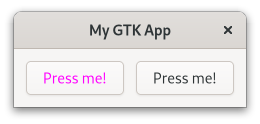
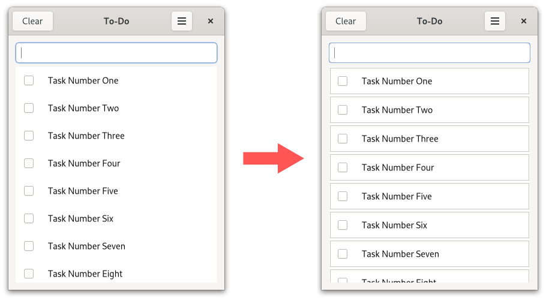

# CSS

When you want to modify the style of your website you use [CSS](https://de.wikipedia.org/wiki/Cascading_Style_Sheets).
Since so many people are already familiar with web development, it makes sense that GTK supports its own variant of CSS.

> We will not explain every piece of CSS syntax used in this chapter.
> If you are new to it or just need a refresher have a look at the [MDN Web Docs](https://developer.mozilla.org/en-US/docs/Web/CSS/Syntax)

Let us say we have a button and we want to make its text color red.
Every widget has a corresponding CSS node.
In the case of `gtk::Button` this node is called `button`.
So we create a `style.css` file with the following content.

<span class="filename">Filename: listings/css/1/style.css</span>

```css
{{#rustdoc_include ../listings/css/1/style.css}}
```

Then we load the CSS file in the startup step of the application.
As usual, the widgets are created during the activate step.

<span class="filename">Filename: listings/css/1/main.rs</span>

```rust ,no_run,noplayground
{{#rustdoc_include ../listings/css/1/main.rs:main}}
```

When we know run the app we notice that our button *and* the close button is red.
Probably not what we wanted, but that is what we typed.
We did not specify for which button the rule should apply, so it was applied to both of them.

<div style="text-align:center"></div>

>The `GtkInspector` comes quite handy (not only) when playing with CSS.
>Make sure the window of your app is focused and press <kbd>Ctrl</kbd> + <kbd>Shift</kbd> + <kbd>D</kbd>.
> A window will pop up which lets you browse and even manipulate the state of your app.
> Open the `CSS` view and override the button color with the following snippet.
>```css
>button {
>  color: blue;
>}
>```

## Classes

[Class selectors](https://developer.mozilla.org/en-US/docs/Web/CSS/Class_selectors) are one way to limit the amount of elements a CSS rule applies to.
Let us look at few different scenarios where they are involved.


### Classes Applied by GTK

GTK adds style classes to many of its nodes, often depending on a certain condition.
In the case of the node [`button`](https://gtk-rs.org/gtk4-rs/stable/latest/docs/gtk4/struct.Button.html#css-nodes), the style class `.text-button` will be added when the content of the corresponding widget is just a label.
Which is why we create a new CSS rule which only applies to `button` nodes with the style class `text_button`.


<span class="filename">Filename: listings/css/2/style.css</span>

```css
{{#rustdoc_include ../listings/css/2/style.css}}
```

<div style="text-align:center"></div>

### Classes Applied Manually

When want to apply different rules to nodes which got the same style classes added, we will have to think of a different strategy.
For that we add our own CSS class with [`add_css_class`](../docs/gtk4/prelude/trait.WidgetExt.html#tymethod.add_css_class).

<span class="filename">Filename: listings/css/3/main.rs</span>

```rust ,no_run,noplayground
{{#rustdoc_include ../listings/css/3/main.rs:buttons}}
```

And we create a CSS rule that applies to `button` nodes with the style class `button_1`.

<span class="filename">Filename: listings/css/3/style.css</span>

```css
{{#rustdoc_include ../listings/css/3/style.css}}
```

This way only the first button gets red.
If you want to make sure that CSS rules only apply to a hand-selected set of nodes, adding your own style classes is your best bet.
Just make sure that you do not choose a name for your style class that GTK either adds itself or provides CSS rules for.
Which brings us to the next point.

<div style="text-align:center"></div>

### CSS Rules Provided by GTK

Certain styles are common enough that GTK provides its own CSS rules for.
If you want to indicate that your button leads to a destructive or suggested action, you can add the "destructive-action" or "suggested-action" style class to it.
You do not have to provide a CSS file here.
After you have added the style class, the `button` node will match the CSS rule provided by GTK.
Most widgets will document these rules in their documentation under [CSS nodes](../docs/gtk4/struct.Button.html#css-nodes).

<span class="filename">Filename: listings/css/4/main.rs</span>

```rust ,no_run,noplayground
{{#rustdoc_include ../listings/css/4/main.rs:buttons}}
```

<div style="text-align:center"></div>

### Interface Builder

We can also add style classes with the interface builder.
Just add the `<style>` element to your widget.
The `<style>` element is documented [here](../docs/gtk4/struct.Widget.html#gtkwidget-as-gtkbuildable). 

<span class="filename">Filename: listings/css/5/window/window.ui</span>

```xml
{{#rustdoc_include ../listings/css/5/window/window.ui}}
```


## Pseudo-classes

Sometimes you want your CSS rules to apply for even more precise conditions than style classes allow.
That is where [pseudo-classes](https://developer.mozilla.org/en-US/docs/Web/CSS/Pseudo-classes) come in.
With pseudo classes you can specify a specific state of the CSS node.
Let us use a single button with the style class `button_1` added to demonstrate this concept.

<span class="filename">Filename: listings/css/6/window/window.ui</span>

```xml
{{#rustdoc_include ../listings/css/6/window/window.ui}}
```

By adding the pseudo-class `hover` we say that we only want this rule to apply for `button` nodes with style class `button_1` over which we currently hover.
We also set the `background-image` to `none` so that it does not overlay the `background-color` and add a bit of transition time.

<span class="filename">Filename: listings/css/6/style.css</span>

```css
{{#rustdoc_include ../listings/css/6/style.css}}
```

If we now hover over the button, we see that over the span of one second the button becomes yellow.
After we removed the cursor the button returns to its original state.

<div style="text-align:center">
 <video autoplay muted loop>
  <source src="vid/css_6.webm" type="video/webm">
Your browser does not support the video tag.
 </video>
</div>

## Nodes

[Icon Library](https://apps.gnome.org/de/app/org.gnome.design.IconLibrary/)


<span class="filename">Filename: listings/css/7/window/window.ui</span>

```xml
{{#rustdoc_include ../listings/css/7/window/window.ui}}
```

<span class="filename">Filename: listings/css/7/style.css</span>

```css
{{#rustdoc_include ../listings/css/7/style.css}}
```

<div style="text-align:center"></div>

## Images


<span class="filename">Filename: listings/css/8/style.css</span>

```css
{{#rustdoc_include ../listings/css/8/style.css}}
```

<div style="text-align:center"></div>


## Exported Colors

<span class="filename">Filename: listings/todo_app/3/todo_row/todo_row.ui</span>

```xml
{{#rustdoc_include ../listings/todo_app/3/todo_row/todo_row.ui}}
```

The exported colors are currently only documented directly in the [stylesheet](https://gitlab.gnome.org/GNOME/gtk/-/blob/main/gtk/theme/Default/_colors-public.scss) of GTK.

<span class="filename">Filename: listings/todo_app/3/style.css</span>

```css
{{#rustdoc_include ../listings/todo_app/3/style.css}}
```

<div style="text-align:center"></div>
