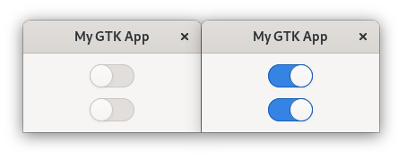

# Properties

As soon as you want to access the state of your GObjects, properties are the way to go.
With properties you get:
- setters and getters,
- an emitted "notify" signal whenever the property gets set and
- the ability to bind properties to each other.

Typically, a property corresponds to a single member of your GObject struct.
You will likely also want to use `Cell` instead of `RefCell` for your property member.
Unlike `RefCell`, `Cell` has no overhead but only allows you to swap the value — not directly modify it.
Since you only ought to modify your property through the provided setter method, this is not a problem.

Let us see if properties can help us to connect the `number` and label of our `CustomButton` more effectively than we did in the signal section.
Since properties already provide a "notify" signal, we can drop our "number-changed" signal and create a property "number" instead.
The properties are defined in the `ObjectImpl` implementation.

<span class="filename">Filename: src/main.rs</span>

```rust ,no_run
{{#rustdoc_include ../listings/gobject_properties_1/src/main.rs:object_impl}}
```

The `properties` method describes our set of properties.
We only want a single one, so we give it a name, describe its type, range and default value. We also declare that the property can be read and be written to.
`set_property` describes how the underlying values can be changed. It also emits the corresponding "notify" signals[^1]. 
`get_property` takes care of returning the underlying value when requested.

Now we have to make sure to modify `number` via `set_property` to assure that the "notify" signal gets emitted.

<span class="filename">Filename: src/main.rs</span>

```rust ,no_run
{{#rustdoc_include ../listings/gobject_properties_1/src/main.rs:button_impl}}
```

Connecting to the signal is very similar to the example in the Signal section.
We only exchange `connect_local` with `connect_notify_local` and specify the property as its first parameter. 

<span class="filename">Filename: src/main.rs</span>

```rust ,no_run
{{#rustdoc_include ../listings/gobject_properties_1/src/main.rs:label}}
```

This is already much nicer than emitting the signals ourselves.
However, this only worked nicely because the `number` was only held by one instance.
Let us see how we could synchronize two `CustomButton` instances, both with their own `number`.

<span class="filename">Filename: src/main.rs</span>

```rust ,no_run
{{#rustdoc_include ../listings/gobject_properties_2/src/main.rs:buttons}}
```

Properties can be bound to each other.
In our case, we want to bind the "number" property of `button_1` to the "number" property of `button_2`.
We also want the binding to be bidirectional, so we specify this with the [`BindingFlags`](http://gtk-rs.org/docs/glib/struct.BindingFlags.html).

<span class="filename">Filename: src/main.rs</span>

```rust ,no_run
{{#rustdoc_include ../listings/gobject_properties_2/src/main.rs:bind_number}}
```

This is nearly enough, but if we now press on one button, the label of the other one does not get updated.
Luckily, "label" is a built-in property of `Button`, the class from which `CustomButton` inherits of.
All we have to do is to bind the "label" property of `button_1` to the "label" property of `button_2`.

<span class="filename">Filename: src/main.rs</span>

```rust ,no_run
{{#rustdoc_include ../listings/gobject_properties_2/src/main.rs:bind_label}}
```

If we now click on one button, the "number" and "label" properties of the other button change as well.

<div style="text-align:center"></div>

[^1]: This behavior can be disabled by passing [`EXPLICIT_NOTIFY`](http://gtk-rs.org/docs/glib/struct.ParamFlags.html#associatedconstant.EXPLICIT_NOTIFY) flag during creation of the property. In this case, the only way to emit the signal is to call [`notify`](http://gtk-rs.org/docs/glib/object/trait.ObjectExt.html#tymethod.notify) directly.