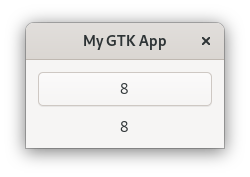

# Signals

Whenever an event occurs, the appropriate signal will be emitted by the affected widget.
For example, if we press on a button, the "clicked" signal will be emitted.
We then connect a function to the signal, which will be called whenever the signal will be emitted.
`gtk-rs` provides convenience methods for all widgets to do that.
In our "Hello World" example we connected the "clicked" signal to a closure which sets the label of the button to "Hello World" as soon as it gets called.

<span class="filename">Filename: src/main.rs</span>

```rust ,no_run
{{#rustdoc_include ../listings/gobject_signals_1/src/main.rs:callback}}
```

If we wanted to, we could have connected to it with the general (but much more verbose) method.

<span class="filename">Filename: src/main.rs</span>

```rust ,no_run
{{#rustdoc_include ../listings/gobject_signals_2/src/main.rs:callback}}
```

For pre-existing widgets, we obviously do not want to do that.
However, if we have custom objects, we might also add custom signals to it.
So let us see how to do that.

First, we `once_cell` to our dependencies.
With it, we can [lazily evaluate](https://en.wikipedia.org/wiki/Lazy_evaluation) expressions, which we often need for creating custom GObjects.

```toml
[dependencies]
once_cell = "1"
```

Let us revive the `CustomButton` of the last section and teach it a few new tricks.
First we override the necessary methods in `ObjectImpl`.

<span class="filename">Filename: src/main.rs</span>

```rust ,no_run
{{#rustdoc_include ../listings/gobject_signals_3/src/main.rs:object_impl}}
```

The `signal` method is responsible for defining a set of signals.
We only create a single signal named "number-changed".
When emitted, it sends an `i32` value and expects nothing in return.

<span class="filename">Filename: src/main.rs</span>

```rust ,no_run
{{#rustdoc_include ../listings/gobject_signals_3/src/main.rs:button_impl}}
```

We want the signal to be emitted, whenever `number` gets changed.
Luckily that only happens when the button has been clicked on.
Together with the signal we send the value `number` currently holds.


<span class="filename">Filename: src/main.rs</span>

```rust ,no_run
{{#rustdoc_include ../listings/gobject_signals_3/src/main.rs:label}}
```

By adding a label, we can update it whenever the "number-changed" signal gets emitted.

<div style="text-align:center"></div>


Signals are especially useful, if you want to notify users of your GObject that a certain event occurred.