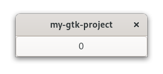

# Subclassing

GObjects rely heavily on inheritance.
Therefore, it makes sense that if we want to create a custom GObject, this is done via subclassing.
Let's see how this works by replacing the button in our “Hello World!” app with a custom one.

First we need to create an implementation struct that holds the state and overrides the virtual methods.
It is advised to keep it in a private module,
since it is not supposed to be used directly.

<span class="filename">Filename: src/main.rs</span>

```rust,no_run
{{#rustdoc_include ../listings/gobject_subclassing_1/src/main.rs:impl}}
```
The description of the subclassing is in `ObjectSubclass`.
- `NAME` can be chosen arbitrarily as long as it is unique within the project
- `Type` refers to the actual GObject that will be created afterwards
- `ParentType` is the GObject we inherit of

After that, we would have the option to override the virtual methods of our ancestors.
Since we only want to have a plain button for now, we override nothing.
We still have to add the empty `impl` though.
Next, we describe our custom GObject.

<span class="filename">Filename: src/main.rs</span>

```rust,no_run
{{#rustdoc_include ../listings/gobject_subclassing_1/src/main.rs:gobject}}
```

`glib::wrapper!` does the most of the work of subclassing for us.
We only have to point to the implementation struct and which ancestor GObjects we extend.
Please note that the list of ancestor GObjects does not mention `glib::Object`.
This is because `glib::Object` is *always* the base class in the object hierarchy and therefore already implied.

After these steps, nothing is stopping us anymore from replacing `gtk::Button` with our `CustomButton`.

<span class="filename">Filename: src/main.rs</span>

```rust,no_run
{{#rustdoc_include ../listings/gobject_subclassing_1/src/main.rs:call}}
```
We are able to use `CustomButton` as a drop-in replacement for `gtk::Button`.
This is cool, but also not very tempting to do in a real application.
For the gain of zero benefits, it did involve quite a bit of boilerplate after all.

So let's make it a bit more interesting!
`gtk::Button` does not hold much state, but we can let `CustomButton` hold a number.

<span class="filename">Filename: src/main.rs</span>

```rust,no_run
{{#rustdoc_include ../listings/gobject_subclassing_2/src/main.rs:impl}}
```
We override `constructed` in `ObjectImpl` so that the label of the button initializes with `number`.
We also override `clicked` in `ButtonImpl` so that every click increases `number` and updates the label.

<span class="filename">Filename: src/main.rs</span>

```rust,no_run
{{#rustdoc_include ../listings/gobject_subclassing_2/src/main.rs:activate}}
```

In `on_activate` we stop calling `connect_clicked`, and that was it.
After a rebuild, the app now features our `CustomButton` with the label “0”.
Every time we click on the button, the number displayed by the label increases by 1.

<div style="text-align:center"></div>

So, when do we want to inherit from GObject?
- We want to use a certain widget, but with added state and overridden virtual functions.
- We want to pass a Rust object to a function, but the function expects a GObject.
- We want to add properties, signals or actions to an object.
