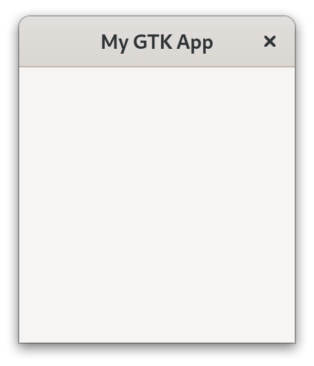

# Hello World!

Now that we've got a working installation, let's get right into it!

At the very least, we need to create a [`gtk::Application`](../docs/gtk4/struct.Application.html) instance with an [application id](https://developer.gnome.org/documentation/tutorials/application-id.html).
For that we use the [builder pattern](https://rust-unofficial.github.io/patterns/patterns/creational/builder.html) which many `gtk-rs` objects support.
Note that we also import the prelude to bring the necessary traits into scope.

Filename: <a class=file-link href="https://github.com/gtk-rs/gtk4-rs/blob/master/book/listings/hello_world/1/main.rs">listings/hello_world/1/main.rs</a>

```rust ,no_run,noplayground
{{#rustdoc_include ../listings/hello_world/1/main.rs}}
```

It builds fine, but nothing but a warning in our terminal appears.

```
GLib-GIO-WARNING: Your application does not implement g_application_activate()
and has no handlers connected to the 'activate' signal. It should do one of these.
```

GTK tells us that something should be called in its `activate` step.
So let's create a [`gtk::ApplicationWindow`](../docs/gtk4/struct.ApplicationWindow.html) there.

Filename: <a class=file-link href="https://github.com/gtk-rs/gtk4-rs/blob/master/book/listings/hello_world/2/main.rs">listings/hello_world/2/main.rs</a>

```rust ,no_run,noplayground
{{#rustdoc_include ../listings/hello_world/2/main.rs}}
```
That is better!

<div style="text-align:center"></div>

Normally we expect to be able to interact with the user interface.
Also, the name of the chapter suggests that the phrase "Hello World!" will be involved.

Filename: <a class=file-link href="https://github.com/gtk-rs/gtk4-rs/blob/master/book/listings/hello_world/3/main.rs">listings/hello_world/3/main.rs</a>

```rust ,no_run,noplayground
{{#rustdoc_include ../listings/hello_world/3/main.rs:build_ui}}
```

> If you look closely at the code snippet you will notice that it has a small eye symbol on its top right.
> After you press on it you can see the full code of the listing.
> We will use this throughout the book to hide details which are not important to bring the message across.
> Pay attention to this if you want to write apps by following the book step-by-step.
> Here, we've hidden that we brought `gtk::Button` into scope.

There is now a button and if we click on it, its label becomes "Hello World!".

<div style="text-align:center">
 <video autoplay muted loop>
  <source src="vid/hello_world_button.webm" type="video/webm">
Your browser does not support the video tag.
 </video>
</div>

Wasn't that hard to create our first `gtk-rs` app, right?
Let's now get a better understanding of what we did here.
