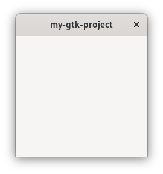
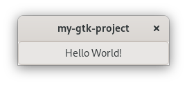

# Hello World!

Now that we got a working installation, let us get right into it!

<span class="filename">Filename: src/main.rs</span>

```rust ,no_run
{{#rustdoc_include ../listings/hello_world_1/src/main.rs}}
```
We import the necessary traits from `gtk::prelude` (you will learn more about this in the next section).
In `main` we create an `Application` instance, with an application id and the default application flags.
When it comes to naming your own app, it is advisable to read [this guide](https://wiki.gnome.org/HowDoI/ChooseApplicationID) first.
Then we run the app with the given command-line parameters.

We run it with `cargo run` and it blocks the terminal, but seemingly nothing happens.
GTK warns us though, that it would have expected that something would be called in its `activate` step.
So let us create a window there.

<span class="filename">Filename: src/main.rs</span>

```rust ,no_run
{{#rustdoc_include ../listings/hello_world_2/src/main.rs}}
```
That's better!

<div style="text-align:center"></div>

Normally we expect to be able to interact with the user interface.
Also, the name of the chapter suggests that the phrase “Hello World!” will be involved.

<span class="filename">Filename: src/main.rs</span>

```rust ,no_run
{{#rustdoc_include ../listings/hello_world_3/src/main.rs}}
```
There is now a button and if we click on it, its label becomes “Hello World!”.

<div style="text-align:center"></div>

Wasn't that hard to create our first `gtk-rs` app, right?
Let us now get a better understanding of what we did here.
