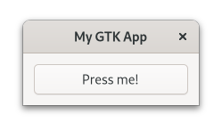

# Hello World!

Now that we have got a working installation, let us get right into it!

At the very least, we need to create an `Application` instance, with an application id and the default application flags.
[This guide](https://wiki.gnome.org/HowDoI/ChooseApplicationID) helps you find a suitable application id for your app.

<span class="filename">Filename: src/main.rs</span>

```rust ,no_run
{{#rustdoc_include ../listings/hello_world_1/src/main.rs}}
```

It builds fine, but nothing appears on our screen.
GTK warns us, that it would have expected that something would be called in its `activate` step.
So let us create a window there.

<span class="filename">Filename: src/main.rs</span>

```rust ,no_run
{{#rustdoc_include ../listings/hello_world_2/src/main.rs}}
```
That is better!

<div style="text-align:center"></div>

Normally we expect to be able to interact with the user interface.
Also, the name of the chapter suggests that the phrase "Hello World!" will be involved.

<span class="filename">Filename: src/main.rs</span>

```rust ,no_run
{{#rustdoc_include ../listings/hello_world_3/src/main.rs:on_activate}}
```
There is now a button and if we click on it, its label becomes "Hello World!".

<div style="text-align:center"></div>

Was not that hard to create our first `gtk-rs` app, right?
Let us now get a better understanding of what we did here.
