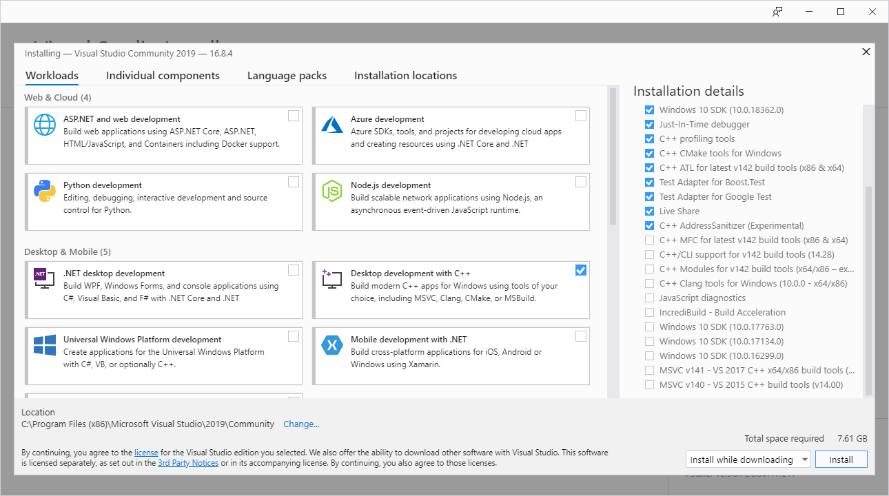

# Windows

When preparing your Windows machine, you have to decide between either using the **MSVC toolchain** or the **GNU toolchain**.
If in doubt, go for MSVC since that is the default on Windows.
You will want to go for the GNU toolchain if you depend on libraries that can only be compiled with the GNU toolchain.

## Install Rustup

Install the rust toolchain via [rustup](https://rustup.rs/).

## Install GTK 4

<details>

<summary>Build GTK 4 with gvsbuild and MSVC (recommended)</summary>

### Set Rust toolchain to MSVC

Set the Rust toolchain to MSVC by executing:

```
rustup default stable-msvc
```

### Build GTK 4 

Follow the [`gvsbuild` docs to build GTK 4](https://github.com/wingtk/gvsbuild#development-environment).
When choosing the GTK version to build, select `gtk4` instead of `gtk3`: 
```
gvsbuild build gtk4
```
### Update `Path` environment variable

2. Add `New User Variable` in environment variable to include `PKG_CONFIG_PATH`:
   1. Go to settings -> Search and open `Advanced system settings` -> Click on `Environment variables`
   3. Select `New` -> Input `Variable name` : `PKG_CONFIG_PATH` & `Variable value` : `C:\gtk-build\gtk\x64\release\lib\pkgconfig`

3. Update your `Path` environment variable to include the GTK 4 libraries:
   1. Go to settings -> Search and open `Advanced system settings` -> Click on `Environment variables`
   2. Select `Path` -> Click on `Edit` -> Add `C:\gtk-build\gtk\x64\release\bin`


You can now continue with the [project setup](./project_setup.html).

</details>

<details>

<summary>Build GTK 4 manually with MSVC</summary>

If it's not possible to build with `gvsbuild` (or you want to customize your build), you
can build GTK 4 and the minimum dependencies you need manually.

### Set Rust toolchain to MSVC

Set the Rust toolchain to MSVC by executing:

```
rustup default stable-msvc
```

### Visual Studio

Install Visual Studio Community from [visualstudio.microsoft.com](https://visualstudio.microsoft.com/de/vs/community/).
Make sure to check the box "Desktop development with C++" during the installation process.

<div style="text-align:center"></div>

### Git

Download git from [gitforwindows.org](https://gitforwindows.org/).


### CMake
Download CMake from [https://cmake.org/download/](https://cmake.org/download/)


### Python

Download python from [python.org](https://www.python.org/downloads).
Make sure to opt-in to adding Python to your Path during the installation process.


### Meson

Install meson by executing:

```powershell
pip install meson ninja
```

### Gettext 0.21

Download Gettext 0.21 from [mlocati.github.io](https://mlocati.github.io/articles/gettext-iconv-windows.html).
Make sure to select the static version.


### Pkg-config

Download pkg-config-lite from [sourceforge.net](https://sourceforge.net/projects/pkgconfiglite/).
Then extract and unpack it in `C:/`, so that the executable is in `C:\pkg-config-lite-0.28-1\bin`.


### Update environment variables

1. Go to settings -> Search and open `Advanced system settings` -> Click on `Environment variables`
2. Select `Path` -> Click on `Edit` -> Add the following entries:

```
C:\pkg-config-lite-0.28-1\bin
C:\gnome\bin
```

3. Go back to `Environment variables`
4. Under `User variables` click on `New` and add:

- Variable name: `PKG_CONFIG_PATH`
- Variable value: `C:\gnome\lib\pkgconfig`


### Compile and install GTK 4

From the Windows start menu, search for `x64 Native Tools Command Prompt for VS 2019`.
That will open a terminal configured to use MSVC x64 tools.
From there, run the following commands:

```cmd
cd /
git clone https://gitlab.gnome.org/GNOME/gtk.git --depth 1
git clone https://gitlab.gnome.org/GNOME/libxml2.git --depth 1
git clone https://gitlab.gnome.org/GNOME/librsvg.git --depth 1

:: Make sure that cmd finds pkg-config-lite when searching for pkg-config
where pkg-config

cd gtk
meson setup builddir --prefix=C:/gnome -Dbuild-tests=false -Dmedia-gstreamer=disabled
meson install -C builddir
cd /

cd libxml2
cmake -S . -B build -D CMAKE_BUILD_TYPE=Release -D CMAKE_INSTALL_PREFIX=C:\gnome -D LIBXML2_WITH_ICONV=OFF -D LIBXML2_WITH_LZMA=OFF -D LIBXML2_WITH_PYTHON=OFF -D LIBXML2_WITH_ZLIB=OFF
cmake --build build --config Release
cmake --install build
cd /

cd librsvg/win32
nmake /f generate-msvc.mak generate-nmake-files
nmake /f Makefile.vc CFG=release install PREFIX=C:\gnome
cd /
```

You can now continue with the [project setup](./project_setup.html).

</details>

<details>

<summary>Install GTK 4 with MSYS2 and the GNU toolchain</summary>

### Install Rustup

Install the rust toolchain via [rustup](https://rustup.rs/).

### Remove residues from the MSVC toolchain

If you used the MSVC toolchain before, make sure to revert all changes you made to environment variables during the installation process.

### MSYS2

Install MSYS2 from [www.msys2.org](https://www.msys2.org/) 

### Install GTK 4

From the Windows start menu, search for `MSYS2 MinGW 64-bit`.
That will open a terminal configured to use MinGW x64 tools.

There, execute the following commands to install `GTK 4`, `pkgconf` and `gcc`.

```sh
pacman -S mingw-w64-x86_64-gtk4 mingw-w64-x86_64-gettext mingw-w64-x86_64-libxml2 mingw-w64-x86_64-librsvg mingw-w64-x86_64-pkgconf mingw-w64-x86_64-gcc
```


### Update `Path` environment variable

1. Go to settings -> Search and open `Advanced system settings` -> Click on `Environment variables`
2. Select `Path` -> Click on `Edit` -> Add the following three entries:
 
```
C:\msys64\mingw64\include
C:\msys64\mingw64\bin
C:\msys64\mingw64\lib
```

### Setup the GNU toolchain for Rust

The default toolchain on windows is `stable-msvc`.
To switch to `stable-gnu`, run the following commands from your terminal:

1. `rustup toolchain install stable-gnu`
2. `rustup default stable-gnu`

Please note that this command might change in the future.
If it does not work anymore, please open an [issue](https://github.com/gtk-rs/gtk4-rs/issues/new/choose) on our repo.

You can now continue with the [project setup](./project_setup.html).
</details>
