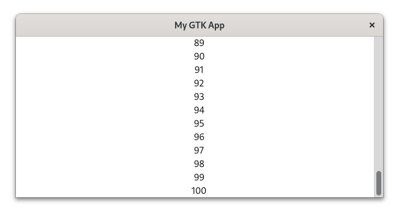
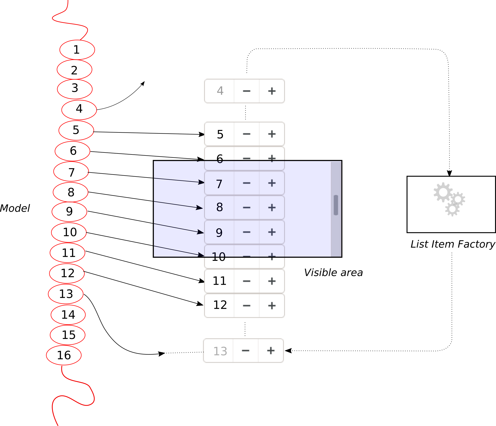
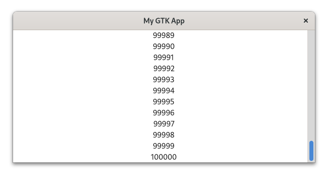
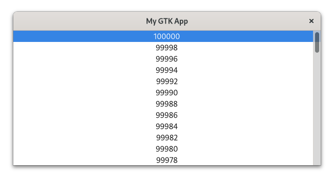

# List Widgets

Sometimes you want to display a list of elements in a certain arrangement.
[`gtk::ListBox`](../docs/gtk4/struct.ListBox.html) and [`gtk::FlowBox`](../docs/gtk4/struct.FlowBox.html) are two container widgets which allow you to do this.
`ListBox` describes a vertical list and `FlowBox` describes a grid.

Let's explore this concept by adding labels to a `ListBox`.
Each label will display an integer starting from 0 and ranging up to 100.  

Filename: <a class=file-link href="https://github.com/gtk-rs/gtk4-rs/blob/master/book/listings/list_widgets/1/main.rs">listings/list_widgets/1/main.rs</a>

```rust ,no_run,noplayground
{{#rustdoc_include ../listings/list_widgets/1/main.rs:list_box}}
```

We cannot display so many widgets at once.
Therefore, we add `ListBox` to a [`gtk::ScrolledWindow`](../docs/gtk4/struct.ScrolledWindow.html).
Now we can scroll through our elements.

Filename: <a class=file-link href="https://github.com/gtk-rs/gtk4-rs/blob/master/book/listings/list_widgets/1/main.rs">listings/list_widgets/1/main.rs</a>

```rust ,no_run,noplayground
{{#rustdoc_include ../listings/list_widgets/1/main.rs:scrolled_window}}
```

<div style="text-align:center"></div>

## Views

That was easy enough.
However, we currently create one widget per element.
Since each widget takes up a bit of resources, many of them can lead to slow and unresponsive user interfaces.
Depending on the widget type even thousands of elements might not be a problem.
But how could we possibly deal with the infinite amount of posts in a social media timeline?

We use scalable lists instead!

- The **model** holds our data, filters it and describes its order.
- The **list item factory** defines how the data transforms into widgets.
- The **view** specifies how the widgets are then arranged.

What makes this concept scalable is that GTK only has to create slightly more widgets than we can currently look at.
As we scroll through our elements, the widgets which become invisible will be reused.
The following figure demonstrates how this works in practice.

<div style="text-align:center"></div>

100 000 elements is something `ListBox` will struggle with, so let's use this to demonstrate scalable lists.

We start by defining and filling up our model.
The model is an instance of [`gio::ListStore`](https://gtk-rs.org/gtk-rs-core/stable/latest/docs/gio/struct.ListStore.html).
The main limitation here is that `gio::ListStore` only accepts GObjects.
So let's create a custom GObject `IntegerObject` that which is initialized with a number.

Filename: <a class=file-link href="https://github.com/gtk-rs/gtk4-rs/blob/master/book/listings/list_widgets/2/integer_object/mod.rs">listings/list_widgets/2/integer_object/mod.rs</a>

```rust ,no_run,noplayground
{{#rustdoc_include ../listings/list_widgets/2/integer_object/mod.rs:integer_object}}
#
```

This number represents the internal state of `IntegerObject`.

Filename: <a class=file-link href="https://github.com/gtk-rs/gtk4-rs/blob/master/book/listings/list_widgets/2/integer_object/imp.rs">listings/list_widgets/2/integer_object/imp.rs</a>

```rust ,no_run,noplayground
{{#rustdoc_include ../listings/list_widgets/2/integer_object/imp.rs:integer_object}}
#
```

We now fill the model with integers from 0 to 100 000.
Please note that models only takes care of the data.
Neither `Label` nor any other widget is mentioned here.

Filename: <a class=file-link href="https://github.com/gtk-rs/gtk4-rs/blob/master/book/listings/list_widgets/2/main.rs">listings/list_widgets/2/main.rs</a>

```rust ,no_run,noplayground
{{#rustdoc_include ../listings/list_widgets/2/main.rs:model}}
```

The `ListItemFactory` takes care of the widgets as well as their relationship to the model.
Here, we use the [`SignalListItemFactory`](../docs/gtk4/struct.SignalListItemFactory.html) which emits a signal for every relevant step in the life of a [`ListItem`](../docs/gtk4/struct.ListItem.html).
The "setup" signal will be emitted when new widgets have to be created.
We connect to it to create a `Label` for every requested widget.

Filename: <a class=file-link href="https://github.com/gtk-rs/gtk4-rs/blob/master/book/listings/list_widgets/2/main.rs">listings/list_widgets/2/main.rs</a>

```rust ,no_run,noplayground
{{#rustdoc_include ../listings/list_widgets/2/main.rs:factory_setup}}
```

In the "bind" step we bind the data in our model to the individual list items.

Filename: <a class=file-link href="https://github.com/gtk-rs/gtk4-rs/blob/master/book/listings/list_widgets/2/main.rs">listings/list_widgets/2/main.rs</a>

```rust ,no_run,noplayground
{{#rustdoc_include ../listings/list_widgets/2/main.rs:factory_bind}}
```

We only want single items to be selectable, so we choose [`SingleSelection`](../docs/gtk4/struct.SingleSelection.html).
The other options would have been [`MultiSelection`](../docs/gtk4/struct.MultiSelection.html) or [`NoSelection`](../docs/gtk4/struct.NoSelection.html).
Then we pass the model and the factory to the [`ListView`](../docs/gtk4/struct.ListView.html).

Filename: <a class=file-link href="https://github.com/gtk-rs/gtk4-rs/blob/master/book/listings/list_widgets/2/main.rs">listings/list_widgets/2/main.rs</a>

```rust ,no_run,noplayground
{{#rustdoc_include ../listings/list_widgets/2/main.rs:selection_list}}
```

Every `ListView` has to be a direct child of a `ScrolledWindow`, so we are adding it to one.

Filename: <a class=file-link href="https://github.com/gtk-rs/gtk4-rs/blob/master/book/listings/list_widgets/2/main.rs">listings/list_widgets/2/main.rs</a>

```rust ,no_run,noplayground
{{#rustdoc_include ../listings/list_widgets/2/main.rs:scrolled_window}}
```

We can now easily scroll through our long list of integers.

<div style="text-align:center"></div>

Let's see what else we can do.
We might want to increase the number every time we activate its row.
For that we first add the method `increase_number` to our `IntegerObject`.

Filename: <a class=file-link href="https://github.com/gtk-rs/gtk4-rs/blob/master/book/listings/list_widgets/3/integer_object/mod.rs">listings/list_widgets/3/integer_object/mod.rs</a>

```rust ,no_run,noplayground
{{#rustdoc_include ../listings/list_widgets/3/integer_object/mod.rs:integer_object}}
```

In order to interact with our `ListView`, we connect to its "activate" signal.

Filename: <a class=file-link href="https://github.com/gtk-rs/gtk4-rs/blob/master/book/listings/list_widgets/3/main.rs">listings/list_widgets/3/main.rs</a>

```rust ,no_run,noplayground
{{#rustdoc_include ../listings/list_widgets/3/main.rs:list_view_activate}}
```

Now every time we activate an element, for example by double-clicking on it,
the corresponding "number" property of the `IntegerObject` in the model will be increased by 1.
However, just because the `IntegerObject` has been modified the corresponding `Label` does not immediately change.
One naive approach would be to bind the properties in the "bind" step of the `SignalListItemFactory`.

Filename: <a class=file-link href="https://github.com/gtk-rs/gtk4-rs/blob/master/book/listings/list_widgets/3/main.rs">listings/list_widgets/3/main.rs</a>

```rust ,no_run,noplayground
{{#rustdoc_include ../listings/list_widgets/3/main.rs:factory_bind}}
```

At first glance, that seems to work.
However, as you scroll around and activate a few list elements,
you will notice that sometimes multiple numbers change even though you only activated a single one.
This relates to how the view works internally.
Not every model item belongs to a single widget, but the widgets get recycled instead as you scroll through the view.
That also means that in our case, multiple numbers will be bound to the same widget.

### Expressions

Situations like these are so common that GTK offers an alternative to property binding: [expressions](../docs/gtk4/struct.Expression.html).
As a first step it allows us to remove the "bind" step.
Let's see how the "setup" step now works.

Filename: <a class=file-link href="https://github.com/gtk-rs/gtk4-rs/blob/master/book/listings/list_widgets/4/main.rs">listings/list_widgets/4/main.rs</a>

```rust ,no_run,noplayground
{{#rustdoc_include ../listings/list_widgets/4/main.rs:factory_setup}}
```

An expression provides a way to describe references to values.
One interesting part here is that these references can be several steps away.
This allowed us in the snippet above to bind the property "number" of the property "item" of `list_item` to the property "label" of `label`.

It is also worth noting that at the "setup" stage there is no way of knowing which list item belongs to which label, simply because this changes as we scroll through the list.
Here, another power of expressions becomes evident.
Expressions allow us to describe relationships between objects or properties that might not even exist yet.
We just had to tell it to change the label whenever the number that belongs to it changes.
That way, we also don't face the problem that multiple labels are bound to the same number.
When we now activate a label, only the corresponding number visibly changes.

Let's extend our app a bit more.
We can, for example, filter our model to only allow even numbers.
We do that by passing it to a [`gtk::FilterListModel`](../docs/gtk4/struct.FilterListModel.html) together with a [`gtk::CustomFilter`](../docs/gtk4/struct.CustomFilter.html) 

Filename: <a class=file-link href="https://github.com/gtk-rs/gtk4-rs/blob/master/book/listings/list_widgets/5/main.rs">listings/list_widgets/5/main.rs</a>

```rust ,no_run,noplayground
{{#rustdoc_include ../listings/list_widgets/5/main.rs:filter}}
```

Additionally, we can reverse the order of our model.
Now we pass the filtered model to [`gtk::SortListModel`](../docs/gtk4/struct.SortListModel.html) together with [`gtk::CustomSorter`](../docs/gtk4/struct.CustomSorter.html).

Filename: <a class=file-link href="https://github.com/gtk-rs/gtk4-rs/blob/master/book/listings/list_widgets/5/main.rs">listings/list_widgets/5/main.rs</a>

```rust ,no_run,noplayground
{{#rustdoc_include ../listings/list_widgets/5/main.rs:sorter}}
```

To ensure that our filter and sorter get updated when we modify the numbers, we call the `changed` method on them.

Filename: <a class=file-link href="https://github.com/gtk-rs/gtk4-rs/blob/master/book/listings/list_widgets/5/main.rs">listings/list_widgets/5/main.rs</a>

```rust ,no_run,noplayground
{{#rustdoc_include ../listings/list_widgets/5/main.rs:activate}}
```

After our changes, the application looks like this:

<div style="text-align:center"></div>

### String List

Often, all you want is to display a list of strings.
However, if you either need to filter and sort your displayed data or have too many elements to be displayed by `ListBox`, you will still want to use a view.
GTK provides a convenient model for this use case: [`gtk::StringList`](../docs/gtk4/struct.StringList.html).

Let's see with a small example how to use this API.
Filter and sorter is controlled by the factory, so nothing changes here.
This is why we will skip this topic here.

First, we add a bunch of strings to our model.

Filename: <a class=file-link href="https://github.com/gtk-rs/gtk4-rs/blob/master/book/listings/list_widgets/6/main.rs">listings/list_widgets/6/main.rs</a>

```rust ,no_run,noplayground
{{#rustdoc_include ../listings/list_widgets/6/main.rs:string_list}}
```

Note that we can create a `StringList` directly from an iterator over strings.
This means we don't have to create a custom GObject for our model anymore.

As usual, we connect the label to the list item via an expression.
Here we can use [`StringObject`](../docs/gtk4/struct.StringObject.html), which exposes its content via the [property "string"](../docs/gtk4/struct.StringObject.html#string).

Filename: <a class=file-link href="https://github.com/gtk-rs/gtk4-rs/blob/master/book/listings/list_widgets/6/main.rs">listings/list_widgets/6/main.rs</a>

```rust ,no_run,noplayground
{{#rustdoc_include ../listings/list_widgets/6/main.rs:factory_setup}}
```

## Conclusion

We now know how to display a list of data.
Small amount of elements can be handled by `ListBox` or `FlowBox`.
These widgets are easy to use and can, if necessary, be bound to a model such as [`gio::ListStore`](https://gtk-rs.org/gtk-rs-core/stable/latest/docs/gio/struct.ListStore.html).
Their data can then be modified, sorted and filtered more easily.
However, if we need the widgets to be scalable, we still need to use [`ListView`](../docs/gtk4/struct.ListView.html), [`ColumnView`](../docs/gtk4/struct.ColumnView.html) or [`GridView`](../docs/gtk4/struct.GridView.html) instead.
