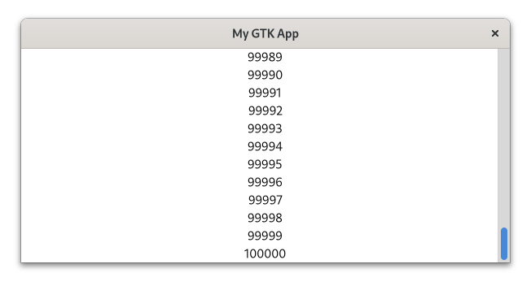
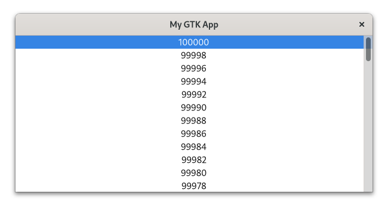

# Lists

Sometimes you want to display a list of elements in a certain arrangement.
[`ListBox`](../docs/gtk4/struct.ListBox.html) and [`FlowBox`](../docs/gtk4/struct.FlowBox.html) are two container widgets which allow you to do this.
`ListBox` describes a vertical list and `FlowBox` describes a grid.

Let us explore this concept by adding labels to a `ListBox`.
Each label will display an integer starting from 0 and ranging up to 100.  

<span class="filename">Filename: listings/lists/1/main.rs</span>

```rust,no_run
{{#rustdoc_include ../listings/lists/1/main.rs:list_box}}
```

We cannot display so many widgets at once.
Therefore, we add `ListBox` to a [`ScrolledWindow`](../docs/gtk/struct.ScrolledWindow.html).
Now we can scroll through our elements.

<span class="filename">Filename: listings/lists/1/main.rs</span>

```rust,no_run
{{#rustdoc_include ../listings/lists/1/main.rs:scrolled_window}}
```

<div style="text-align:center"></div>

That was easy enough.
However, we currently create one widget per element.
Since each widget takes up a bit of resources, many of them can lead to slow and unresponsive user interfaces.
Depending on the widget type even thousands of elements might not be a problem.
But how could we possibly deal with the infinite amount of posts in a social media timeline?

We use scalable lists instead!

- The **model** holds our data, filters it and describes its order.
- The **list item factory** defines how the data transforms into widgets.
- The **view** specifies how the widgets are then arranged.

What makes this concept scalable is that GTK only has to create slightly more widgets than we can currently look at.
As we scroll through our elements, the widgets which become invisible will be reused.
The following figure demonstrates how this works in practice.

<div style="text-align:center"></div>

100 000 elements is something `ListBox` will struggle with, so let us use this to demonstrate scalable lists.

We start by defining and filling up our model.
The model is an instance of [`gio::ListStore`](https://gtk-rs.org/gtk-rs-core/stable/latest/docs/gio/struct.ListStore.html).
The main limitation here is that `gio::ListStore` only accepts GObjects.
What we would need is a GObject which holds an integer and exposes it as property.
To get that we just have to adapt the `CustomButton` we created in the subclassing [chapter](gobject_subclassing.html).
We only need to let it inherit from GObject instead of `Button` and let the `new` method accept an integer as parameter.

<span class="filename">Filename: listings/lists/2/integer_object/mod.rs</span>

```rust,no_run
{{#rustdoc_include ../listings/lists/2/integer_object/mod.rs:integer_object}}
#
# // Please ignore this line
# // It is only there to make mdbook happy
# fn main() {}
```

The `imp` module can stay the same apart from the rename from `CustomButton` to `IntegerObject`.

<span class="filename">Filename: listings/lists/2/integer_object/imp.rs</span>

```rust,no_run
{{#rustdoc_include ../listings/lists/2/integer_object/imp.rs:integer_object}}
#
# // Please ignore this line
# // It is only there to make mdbook happy
# fn main() {}
```

We now fill the model with integers from 0 to 100 000.
Please note that the models only takes care of the data.
Neither `Label` nor any other widget is mentioned here.

<span class="filename">Filename: listings/lists/2/main.rs</span>

```rust,no_run
{{#rustdoc_include ../listings/lists/2/main.rs:model}}
```

The `ListItemFactory` takes care of the widgets as well as their relationship to the model.
Here, we use the [`SignalListItemFactory`](../docs/gtk4/struct.SignalListItemFactory.html) which emits a signal for every relevant step in the life of a [`ListItem`](../docs/gtk4/struct.ListItem.html).
The "setup" signal will be emitted when new widgets have to be created.
We connect to it to create a `Label` for every requested widget.

<span class="filename">Filename: listings/lists/2/main.rs</span>

```rust,no_run
{{#rustdoc_include ../listings/lists/2/main.rs:factory_setup}}
```

In the "bind" step we bind the data in our model to the individual list items.

<span class="filename">Filename: listings/lists/2/main.rs</span>

```rust,no_run
{{#rustdoc_include ../listings/lists/2/main.rs:factory_bind}}
```

We only want single items to be selectable, so we choose [`SingleSelection`](../docs/gtk4/struct.SingleSelection.html).
The other options would have been [`MultiSelection`](../docs/gtk4/struct.MultiSelection.html) or [`NoSelection`](../docs/gtk4/struct.NoSelection.html).
Then we pass the model and the factory to the [`ListView`](../docs/gtk4/struct.ListView.html).

<span class="filename">Filename: listings/lists/2/main.rs</span>

```rust,no_run
{{#rustdoc_include ../listings/lists/2/main.rs:selection_list}}
```

Every `ListView` has to be a direct child of a `ScrolledWindow`, so we are adding it to one.

<span class="filename">Filename: listings/lists/2/main.rs</span>

```rust,no_run
{{#rustdoc_include ../listings/lists/2/main.rs:scrolled_window}}
```

We can now easily scroll through our long list of integers.

<div style="text-align:center"></div>

Let us see what else we can do.
We might want to increase the number every time we activate its row.
For that we first add the method `increase_number` to our `IntegerObject`.

<span class="filename">Filename: listings/lists/3/integer_object/mod.rs</span>

```rust,no_run
{{#rustdoc_include ../listings/lists/3/integer_object/mod.rs:integer_object}}
```

In order to interact with our `ListView`, we connect to its "activate" signal.

<span class="filename">Filename: listings/lists/3/main.rs</span>

```rust,no_run
{{#rustdoc_include ../listings/lists/3/main.rs:list_view_activate}}
```

Now every time we activate an element, for example by double-clicking on it,
the corresponding "number" property of the `IntegerObject` in the model will be increased by 1.
However, just because the `IntegerObject` has been modified the corresponding `Label` does not immediately change.
One naive approach would be to bind the properties in the "bind" step of the `SignalListItemFactory`.

<span class="filename">Filename: listings/lists/3/main.rs</span>

```rust,no_run
{{#rustdoc_include ../listings/lists/3/main.rs:factory_bind}}
```

At first glance, that seems to work.
However, as you scroll around and activate a few list elements,
you will notice that sometimes multiple numbers change even though you only activated a single one.
This relates to how the view works internally.
Not every model item belongs to a single widget, but the widgets get recycled instead as you scroll through the view.
That also means that in our case, multiple numbers will be bound to the same widget.

Situations like these are so common that GTK offers an alternative to property binding: [expressions](../docs/gtk4/struct.Expression.html).
As a first step it allows us to remove the "bind" step.
Let us see how the "setup" step now works.

<span class="filename">Filename: listings/lists/4/main.rs</span>

```rust,no_run
{{#rustdoc_include ../listings/lists/4/main.rs:factory_setup}}
```

An expression describes a reference to a value.
So when we create a [`ConstantExpression`](../docs/gtk4/struct.ConstantExpression.html) of `list_item`, we create a reference to a `ListItem`.
We then create a [`PropertyExpression`](../docs/gtk4/struct.PropertyExpression.html) to get a reference to the "item" property of `list_item`.
With another `PropertyExpression` we get a reference to the "number" property of the "item" property of `list_item`.
That already makes the first power of expressions obvious: It allows nested relationships.
Finally, we bind "number" to "label".
In pseudo code that would be `label->label = list_item->item->number`.

It is worth noting that at the "setup" stage there is no way of knowing which list item belongs to which label, simply because this changes as we scroll through the list.
This is the power of expressions!
We do not have to define a fixed relationship, the object and properties might not even exist yet.
We just had to tell it to change the label whenever the number that belongs to it changes.
That way, we also do not face the problem that multiple labels are bound to the same number.
When we now activate a label, only the corresponding number visibly changes.

That is still not everything we can do.
We can, for example, filter our model to only allow even numbers.

<span class="filename">Filename: listings/lists/5/main.rs</span>

```rust,no_run
{{#rustdoc_include ../listings/lists/5/main.rs:filter}}
```

Additionally, we can reverse the order of our model.

<span class="filename">Filename: listings/lists/5/main.rs</span>

```rust,no_run
{{#rustdoc_include ../listings/lists/5/main.rs:sorter}}
```

To ensure that our filter and sorter get updated when we modify the numbers, we call the `changed` method on them.

<span class="filename">Filename: listings/lists/5/main.rs</span>

```rust,no_run
{{#rustdoc_include ../listings/lists/5/main.rs:activate}}
```

After our changes, the application looks like this:

<div style="text-align:center"></div>

We now know how to display a list of data.
Small amount of elements can be handled by `ListBox` or `FlowBox`.
These widgets are easy to use and allow, if necessary, to be bound to a model such as [`gio::ListStore`](http://gtk-rs.org/gtk-rs-core/stable/latest/docs/gio/struct.ListStore.html).
Their data can then be modified, sorted and filtered more easily.
However, if we need the widgets to be scalable we still need to use [`ListView`](../docs/gtk4/struct.ListView.html), [`ColumnView`](../docs/gtk4/struct.ColumnView.html) or [`GridView`](../docs/gtk4/struct.GridView.html) instead.
