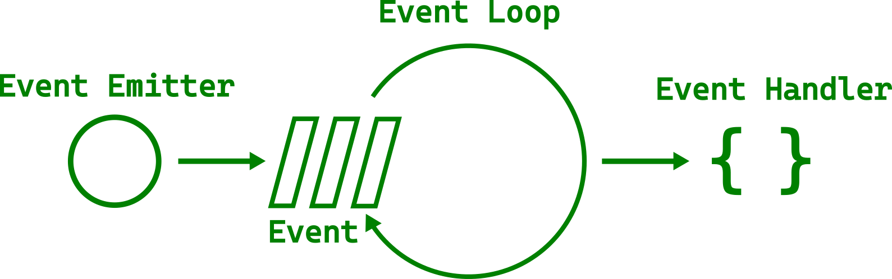

# The Main Event Loop

We now got comfortable using callbacks, but how do they actually work?
All of this happens asynchronously, so there must be something managing the events and scheduling the responses.
Unsurprisingly, this is called the main event loop.

<div style="text-align:center"></div>

The main loop manages all kinds of events — from mouse clicks and keyboard presses to file events.
It does all of that within the same thread.
Quickly iterating between all tasks gives the illusion of parallelism.
That is why you can move the window at the same time as a progress bar is growing.

However, you surely saw GUIs that became unresponsive, at least for a few seconds.
That happens when a single task takes too long.
The following example uses [`std::thread::sleep`](https://doc.rust-lang.org/std/thread/fn.sleep.html) to represent a long-running task.

Filename: <a class=file-link href="https://github.com/gtk-rs/gtk4-rs/blob/master/book/listings/main_event_loop/1/main.rs">listings/main_event_loop/1/main.rs</a>

```rust
{{#rustdoc_include ../listings/main_event_loop/1/main.rs}}
```

After we press the button, the GUI is completely frozen for five seconds.
We can't even move the window.
The `sleep` call is an artificial example,
but it is not unusual wanting to run a slightly longer operation in one go.

## How to Avoid Blocking the Main Loop

In order to avoid blocking the main loop we can spawn a new task with [`gio::spawn_blocking`](https://gtk-rs.org/gtk-rs-core/stable/latest/docs/gio/fn.spawn_blocking.html) and let the operation run there.

Filename: <a class=file-link href="https://github.com/gtk-rs/gtk4-rs/blob/master/book/listings/main_event_loop/2/main.rs">listings/main_event_loop/2/main.rs</a>

```rust
{{#rustdoc_include ../listings/main_event_loop/2/main.rs:callback}}
```

<div style="text-align:center">
 <video autoplay muted loop>
  <source src="vid/main_event_loop_2.webm" type="video/webm">
  <p>A video which shows that after pressing the button, the window can still be moved</p>
 </video>
</div>


> If you come from another language than Rust, you might be uncomfortable with the thought of running tasks in separate threads before even looking at other options.
> Luckily, Rust's safety guarantees allow you to stop worrying about the nasty bugs that concurrency tends to bring.


Typically, we want to keep track of the work in the task.
In our case, we don't want the user to spawn additional tasks while an existing one is still running.
In order to achieve that we can create a channel with the crate [`async-channel`](https://docs.rs/async-channel/latest/async_channel/index.html).
Let's add it by executing the following in the terminal:

```
cargo add async-channel
```

We want to send a `bool` to inform, whether we want the button to react to clicks or not.
Since we send in a separate thread, we can use [`send_blocking`](https://docs.rs/async-channel/latest/async_channel/struct.Sender.html#method.send_blocking).
But what about receiving?
Every time we get a message we want to set the sensitivity of the button according to the `bool` we've received.
However, we don't want to block the main loop while waiting for a message to receive.
That is the whole point of the exercise after all!

We solve that problem by waiting for messages to receive in an [`async`](https://rust-lang.github.io/async-book/) block.
We spawn that `async` block on the glib main loop with [`spawn_local`](https://gtk-rs.org/gtk-rs-core/stable/latest/docs/glib/struct.MainContext.html#method.spawn_local) (from other threads than the main thread [`spawn`](https://gtk-rs.org/gtk-rs-core/stable/latest/docs/glib/struct.MainContext.html#method.spawn) has to be used).

Filename: <a class=file-link href="https://github.com/gtk-rs/gtk4-rs/blob/master/book/listings/main_event_loop/3/main.rs">listings/main_event_loop/3/main.rs</a>

```rust
{{#rustdoc_include ../listings/main_event_loop/3/main.rs:callback}}
```

As you can see, spawning a task still doesn't freeze our user interface.
Now, we also can't spawn multiple tasks at the same time since the button becomes insensitive after the first task has been spawned.
After the task is finished, the button becomes sensitive again.

<div style="text-align:center">
 <video autoplay muted loop>
  <source src="vid/main_event_loop_3.webm" type="video/webm">
  <p>The button now stops being responsive for 10 seconds after being pressed</p>
 </video>
</div>

What if the task is asynchronous by nature?
Let's use [`glib::timeout_future_seconds`](https://gtk-rs.org/gtk-rs-core/stable/latest/docs/glib/fn.timeout_future_seconds.html) as representation for our task instead of `std::thread::slepp`.
It returns a [`std::future::Future`](https://doc.rust-lang.org/std/future/trait.Future.html), which means we can `await` on it within an `async` context.
The converted code looks and behaves very similar to the multithreaded code.

Filename: <a class=file-link href="https://github.com/gtk-rs/gtk4-rs/blob/master/book/listings/main_event_loop/4/main.rs">listings/main_event_loop/4/main.rs</a>

```rust
{{#rustdoc_include ../listings/main_event_loop/4/main.rs:callback}}
```

Since we are single-threaded again, we can even get rid of the channel while achieving the same result.

Filename: <a class=file-link href="https://github.com/gtk-rs/gtk4-rs/blob/master/book/listings/main_event_loop/5/main.rs">listings/main_event_loop/5/main.rs</a>

```rust
{{#rustdoc_include ../listings/main_event_loop/5/main.rs:callback}}
```

But why did we not do the same thing with our multithreaded example?

```rust ,no_run,compile_fail
# use std::{thread, time::Duration};
# 
# use glib::{clone, MainContext, PRIORITY_DEFAULT};
# use gtk::{glib, gio};
# use gtk::prelude::*;
# use gtk::{Application, ApplicationWindow, Button};
# 
# fn main() {
#     // Create a new application
#     let app = Application::builder()
#        .application_id("org.gtk_rs.MainEventLoop6")
#        .build();
#
#     // Connect to "activate" signal
#     app.connect_activate(build_ui);
# 
#     // Get command-line arguments
#     let args: Vec<String> = args().collect();
#     // Run the application
#     app.run(&args);
# }
# 
# // When the application is launched…
# fn build_ui(application: &Application) {
#     // Create a window
#     let window = ApplicationWindow::builder()
#         .application(application)
#         .title("My GTK App")
#         .build();
# 
#     // Create a button
#     let button = Button::builder()
#         .label("Press me!")
#         .margin_top(12)
#         .margin_bottom(12)
#         .margin_start(12)
#         .margin_end(12)
#         .build();
# 
    // DOES NOT COMPILE!
    // Connect to "clicked" signal of `button`
    button.connect_clicked(move |button| {
        button.clone();
        // The long running operation runs now in a separate thread
        gio::spawn_blocking(move || {
            // Deactivate the button until the operation is done
            button.set_sensitive(false);
            let five_seconds = Duration::from_secs(5);
            thread::sleep(five_seconds);
            // Activate the button again
            button.set_sensitive(true);
        });
    });
# 
#     // Add button
#     window.set_child(Some(&button));
#     window.present();
# }
```

Simply because we would get this error message:

```console
error[E0277]: `NonNull<GObject>` cannot be shared between threads safely

help: within `gtk4::Button`, the trait `Sync` is not implemented for `NonNull<GObject>`
```

After reference cycles we found the second disadvantage of GTK GObjects: They are not thread safe.

## Async

We've seen in the previous snippets that spawning an async block or async future on the glib main loop can lead to more concise code than running tasks on separate threads.
Let's focus on a few more aspects that are interesting to know when running async functions with gtk-rs apps.

For one, blocking functions can be embedded within an async context.
In the following listing, we want to execute a synchronous function that returns a boolean and takes ten seconds to run.
In order to integrate it in our async block, we run the function in a separate thread via `spawn_blocking`.
We can then get the return value of the function by calling `await` on the return value of `spawn_blocking`.

Filename: <a class=file-link href="https://github.com/gtk-rs/gtk4-rs/blob/master/book/listings/main_event_loop/6/main.rs">listings/main_event_loop/6/main.rs</a>

```rust
{{#rustdoc_include ../listings/main_event_loop/6/main.rs:callback}}
```

Asynchronous functions from the glib ecosystem can always be spawned on the glib main loop.
Typically, crates from the async-std/smol ecosystem work as well.
Let us take ashpd for example which allows sandboxed applications to interact with the desktop.
Per default it depends on `async-std`.
We can add it to our dependencies by running the following command.

```
cargo add ashpd --features gtk4
```

You need to use a Linux desktop environment in order to run the following example locally.
We are using [`ashpd::desktop::account::UserInformation`](https://docs.rs/ashpd/latest/ashpd/desktop/account/index.html) in order to access user information.
We are getting a [`gtk::Native`](https://gtk-rs.org/gtk4-rs/stable/latest/docs/gtk4/struct.Native.html) object from our button, create a [`ashpd::WindowIdentifier`](https://docs.rs/ashpd/latest/ashpd/enum.WindowIdentifier.html) and pass it to the user information request.
That way the dialog that will pop up will be modal.
That means that it will be on top of the window and freezes the rest of the application from user input.

Filename: <a class=file-link href="https://github.com/gtk-rs/gtk4-rs/blob/master/book/listings/main_event_loop/7/main.rs">listings/main_event_loop/7/main.rs</a>

```rust
{{#rustdoc_include ../listings/main_event_loop/7/main.rs:callback}}
```

After pressing the button, a dialog should open that shows the information that will be shared.
If you decide to share it, you user name will be printed on the console.

<div style="text-align:center"></div>


```
cargo add tokio@1 --features rt-multi-thread
cargo add reqwest@0.11 --features rustls-tls --no-default-features
```

Filename: <a class=file-link href="https://github.com/gtk-rs/gtk4-rs/blob/master/book/listings/main_event_loop/8/main.rs">listings/main_event_loop/8/main.rs</a>

```rust
{{#rustdoc_include ../listings/main_event_loop/8/main.rs:tokio_runtime}}
```

Filename: <a class=file-link href="https://github.com/gtk-rs/gtk4-rs/blob/master/book/listings/main_event_loop/8/main.rs">listings/main_event_loop/8/main.rs</a>

```rust
{{#rustdoc_include ../listings/main_event_loop/8/main.rs:callback}}
```


So when should you spawn an `async` block and when should you spawn a thread?
- If you have `async` functions for your IO-bound operations at your disposal, feel free to spawn them on the main loop.
- If your operation is computation-bound or there is no `async` function available, you have to spawn threads.
