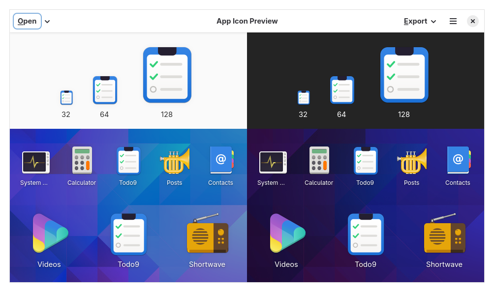

# Building with Meson

So far we have been using Cargo and `build.rs` to compile our GResources.
While this works great for simple setups, it has limitations when distributing your app:

- Resources are embedded into the binary at compile time
- No support for system integration (desktop files, icons, GSettings schemas)
- Difficult to integrate with distribution packaging systems

That's why we will start relying on [Meson](https://mesonbuild.com/).
Meson is a build system used by most GNOME projects.
We'll find out how it works as we go, however you can also read this [tutorial](https://mesonbuild.com/Tutorial.html) in case you want to prepare in advance.
It provides:

- Dynamic GResource loading from installed locations
- Automatic installation of desktop files, icons, and GSettings schemas
- Easy integration with Flatpak and distribution packaging
- Foundation for internationalization (gettext)

In this chapter we convert our To-Do app to use Meson.

## Project Structure

With Meson, we organize the todo app folder structure differently:

```
├── meson.build              # Root build configuration
├── meson.options            # Build options (e.g., profile)
├── Cargo.toml
├── src/
│   ├── meson.build          # Cargo integration
│   ├── config.rs            # App metadata via env vars
│   ├── main.rs
│   └── ...
└── data/
    ├── meson.build          # Desktop file, schema
    ├── icons/
    │   └── meson.build
    └── resources/
        ├── meson.build      # GResource compilation
        └── ...
```

## Root meson.build

The root `meson.build` file is the heart of the Meson setup.
It defines variables, executes `meson.build` files in subdirectories and defines post-install tasks.

Filename: <a class=file-link href="https://github.com/gtk-rs/gtk4-rs/blob/main/book/listings/todo/9/meson.build">listings/todo/9/meson.build</a>

```meson
{{#include ../listings/todo/9/meson.build}}
```

## Build Options

Before, we saw that the values of certain variables change depending on which value the option `profile` has.
In `meson.options` we define this option, which values it accepts and its default value.
Later we'll see how to set this option in the command line during setup with `-Dprofile=development`.

Filename: <a class=file-link href="https://github.com/gtk-rs/gtk4-rs/blob/main/book/listings/todo/9/meson.options">listings/todo/9/meson.options</a>

```meson
{{#include ../listings/todo/9/meson.options}}
```

## The Config Module

The `config.rs` module provides app metadata given by Meson.
That way we can let Meson manage this data, while still being able to access it from within our Rust code.

Filename: <a class=file-link href="https://github.com/gtk-rs/gtk4-rs/blob/main/book/listings/todo/9/src/config.rs">listings/todo/9/src/config.rs</a>

```rust
{{#rustdoc_include ../listings/todo/9/src/config.rs}}
```

Using `option_env!()` reads environment variables at compile time.
Meson passes these values when invoking Cargo (see next section).

## Cargo Integration

The `src/meson.build` invokes Cargo with the appropriate environment variables.
While Meson supports Rust, it doesn't support Cargo.
That unfortunately leads to this situation where the whole setup becomes a bit involved.
One might summarize it like this: let everything related to Rust compilation and dependency management be handled by Cargo.
Meson's main contribution is setting a few environment variables so they are accessible in the Rust code.

Filename: <a class=file-link href="https://github.com/gtk-rs/gtk4-rs/blob/main/book/listings/todo/9/src/meson.build">listings/todo/9/src/meson.build</a>

```meson
{{#include ../listings/todo/9/src/meson.build}}
```

## Loading Resources Dynamically

The main change in Rust code is how we load resources:

Filename: <a class=file-link href="https://github.com/gtk-rs/gtk4-rs/blob/main/book/listings/todo/9/src/main.rs">listings/todo/9/src/main.rs</a>

```rust
{{#rustdoc_include ../listings/todo/9/src/main.rs:resource_loading}}
```

Instead of [`gio::resources_register_include!`](https://gtk-rs.org/gtk-rs-core/stable/latest/docs/gio/macro.resources_register_include.html) which embeds resources at compile time, we use [`gio::Resource::load()`](https://gtk-rs.org/gtk-rs-core/stable/latest/docs/gio/struct.Resource.html#method.load) to load them from the installed path at runtime.
That means that we can change images and `.ui` files without triggering Rust compilation.

We also use `config::app_id()` instead of a hardcoded constant.

## System Integration

### Data meson.build

This file sets subdirs where `meson.build` files will be executed, and declares that a desktop and gschema file will be templated and installed.

Filename: <a class=file-link href="https://github.com/gtk-rs/gtk4-rs/blob/main/book/listings/todo/9/data/meson.build">listings/todo/9/data/meson.build</a>

```meson
{{#include ../listings/todo/9/data/meson.build}}
```

### Desktop File

The desktop file tells the system how to display and launch your app:

Filename: <a class=file-link href="https://github.com/gtk-rs/gtk4-rs/blob/main/book/listings/todo/9/data/org.gtk_rs.Todo9.desktop.in">listings/todo/9/data/org.gtk_rs.Todo9.desktop.in</a>

```ini
{{#include ../listings/todo/9/data/org.gtk_rs.Todo9.desktop.in}}
```

The `@APP_ID@` placeholder is substituted during the build.
This way, we can install the app in default and development, without the two installations clashing with each other. 


### GSettings Schema

As mentioned before, the GSettings schema will be templated now.
Therefore, we rename the extension from `.xml` to `.xml.in` to clarify that.

Filename: <a class=file-link href="https://github.com/gtk-rs/gtk4-rs/blob/main/book/listings/todo/9/data/org.gtk_rs.Todo9.gschema.xml.in">listings/todo/9/data/org.gtk_rs.Todo9.gschema.xml.in</a>

```xml
{{#include ../listings/todo/9/data/org.gtk_rs.Todo9.gschema.xml.in}}
```

### Application Icon

It's also great to have an icon.
This will then be used for the launcher and dock of the desktop environment.

Scalable Vector Graphics or [SVG](https://de.wikipedia.org/wiki/Scalable_Vector_Graphics) is a good base format for icons and inkscpace is a great editor to create them.
If you are on Linux, creating a good icon is especially easy with [App Icon Preview](https://flathub.org/apps/org.gnome.design.AppIconPreview).
First, create a new empty icon with App Icon Preview and leave the program open.
Now, you can start editing with Inkscape, while being able to compare it to other icons in App Icon Preview.

<div style="text-align:center"></div>

It even allows you to automatically generate a second icon for the development profile.

<div style="text-align:center">
  <figure style="display:inline-block">
    
    <figcaption>org.gtk_rs.Todo9.svg</figcaption>
  </figure>
  <figure style="display:inline-block">
    
    <figcaption>org.gtk_rs.Todo9.Devel.svg</figcaption>
  </figure>
</div>


In the corresponding `meson.build` file, we then make sure to install the correct icon.

Filename: <a class=file-link href="https://github.com/gtk-rs/gtk4-rs/blob/main/book/listings/todo/9/data/icons/meson.build">listings/todo/9/data/icons/meson.build</a>

```meson
{{#include ../listings/todo/9/data/icons/meson.build}}
```

## GResource Compilation

Instead of `glib_build_tools::compile_resources()` in `build.rs`, we now use Meson's `gnome.compile_resources()`:

Filename: <a class=file-link href="https://github.com/gtk-rs/gtk4-rs/blob/main/book/listings/todo/9/data/resources/meson.build">listings/todo/9/data/resources/meson.build</a>

```meson
{{#include ../listings/todo/9/data/resources/meson.build}}
```

The `gresource_bundle: true` option creates a standalone `.gresource` file that gets installed to `pkgdatadir`.


## Building and Running

### Development Build

```
cd listings/todo/9
meson setup builddir -Dprofile=development
meson compile -C builddir
```

To run without installing, use `meson devenv` which sets up the environment:

```
meson devenv -C builddir ./builddir/todo
```

### Release Build and Installation

```
meson setup builddir --prefix=/usr
meson compile -C builddir
meson install -C builddir --destdir=/tmp/install
```

### Local Installation

For testing, install to a local prefix:

```
meson setup builddir --prefix=$HOME/.local
meson compile -C builddir
meson install -C builddir
~/.local/bin/todo
```

## Cargo.toml Changes

The Meson version no longer needs `glib-build-tools` since resources are compiled by Meson:

```
cargo remove --build glib-build-tools
```
