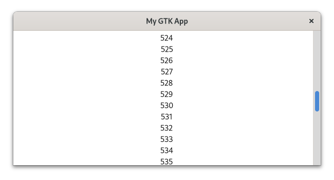
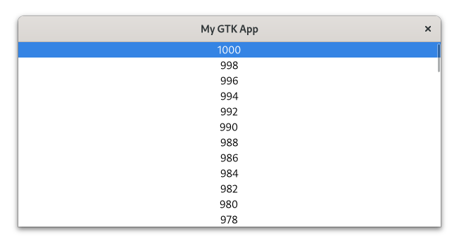

# Scalable Lists

Sometimes you have more elements than you can display at once.
The typical solution is to put them into a [`ScrolledWindow`](../docs/gtk/struct.ScrolledWindow.html) so you can scroll through the complete list.
Howevee, in the most trivial case you would still create one widget per element.
Because creating new widgets takes a bit of time, this can become a problem if you have many element.
Just think of the nearly infinite amount of posts in your social media timeline.

This is why we use scalable lists instead.
Here, a model holds our data, filters them and describes its order.
The list item factory defines how the data transforms into widgets.
The view specifies how the widgets are then arranged.
Howvever, the most important part is that GTK only has to create slightly more widgets than we can currently look at.
As we scroll through our elements, the widgets who are not visible anymore will be reused 


<div style="text-align:center"></div>

Demonstrating this by creating a social media app is far beyond the scope of this book.
This is why, we will start with a long list of consecutive integers.

The model is an instance of [`gio::ListStore`](https://gtk-rs.org/docs/gio/struct.ListStore.html).
The main limitation here is that `gio::ListStore` only accepts GObjects.
What we want here is a custom GObject which holds an integer and exposes it as property.
To get that we just have to slightly adapt the `CustomButton` we created in the subclassing [chapter](gobject_subclassing.html).
The only difference is that it directly inherits from GObject instead of `Button` and that we added the method `from_integer`.

<span class="filename">Filename: listings/scalable_lists/1/integer_object/mod.rs</span>

```rust,no_run
{{#rustdoc_include ../listings/scalable_lists/1/integer_object/mod.rs:integer_object}}

# // Please ignore this line
# // It is only there to make mdbook happy
# fn main() {}
```

We start be filling our models with the integers from 0 to 1000.

<span class="filename">Filename: listings/scalable_lists/1/main.rs</span>

```rust,no_run
{{#rustdoc_include ../listings/scalable_lists/1/main.rs:model}}
```

The `ListItemFactory` takes care of the widgets as well as their relationship to the model.
Here we use the [`SignalListItemFactory`](../docs/gtk4/struct.SignalListItemFactory.html) which emits a signal for every relevant step in the life of a `ListItem`.
The "setup" signal will be emitted when new widgets have to be created.
We connect to it to create a `Label` for every requested widget.

<span class="filename">Filename: listings/scalable_lists/1/main.rs</span>

```rust,no_run
{{#rustdoc_include ../listings/scalable_lists/1/main.rs:factory_setup}}
```

In the "bind" step we bind the data in our model to the individual list items.

<span class="filename">Filename: listings/scalable_lists/1/main.rs</span>

```rust,no_run
{{#rustdoc_include ../listings/scalable_lists/1/main.rs:factory_bind}}
```

We only want single items to be selectable so we choose [`SingleSelection`](../docs/gtk4/struct.SingleSelection.html).
The other options would have been [`MultiSelection`](../docs/gtk4/struct.MultiSelection.html) or [`NoSelection`](../docs/gtk4/struct.NoSelection.html).
Then we pass the model and the factory to the [`ListView`](../git/docs/gtk4/struct.ListView.html).

<span class="filename">Filename: listings/scalable_lists/1/main.rs</span>

```rust,no_run
{{#rustdoc_include ../listings/scalable_lists/1/main.rs:selection_list}}
```

Every `ListView` has to be inside a [`ScrolledWindow`](../docs/gtk/struct.ScrolledWindow.html) so we are adding it to one.

<span class="filename">Filename: listings/scalable_lists/1/main.rs</span>

```rust,no_run
{{#rustdoc_include ../listings/scalable_lists/1/main.rs:scrolled_window}}
```

We can now easily scroll through our long list of integers.

<div style="text-align:center"></div>

Let us see what else we can do.
We might want to increase the number every time we activate its row.
For that we first add the method `increase_number` to our `IntegerObject`.

<span class="filename">Filename: listings/scalable_lists/2/integer_object/mod.rs</span>

```rust,no_run
{{#rustdoc_include ../listings/scalable_lists/2/integer_object/mod.rs:integer_object}}
```

In order to interact with our `ListView`, we connect to its "activate" signal.

<span class="filename">Filename: listings/scalable_lists/2/main.rs</span>

```rust,no_run
{{#rustdoc_include ../listings/scalable_lists/2/main.rs:list_view_activate}}
```

Now every time we activate an element, for example by double-clicking on it, the corresponding "number" property of the `IntegerObject` in the model will be increased by 1.
However, just because the `IntegerObject` has been modified the corresponding `Label` does not immediately change.
One naive approach would be to bind the properties in the bind step of the `SignalListItemFactory`.

<span class="filename">Filename: listings/scalable_lists/2/main.rs</span>

```rust,no_run
{{#rustdoc_include ../listings/scalable_lists/2/main.rs:factory_bind}}
```

On first glance, that seems to work.
However, as you scroll around and activate a few list elements, you will notice that sometimes multiple numbers change even though you only activated a single one.
This relates to how the Model-View-system works internally.
Not every model item belongs to a single widget, but the widgets get recycled instead as you scroll.
That also means that in our case, multiple numbers will be bound to the same widget.

Situations like these are so common that GTK offers an alternative to property binding: [expressions](../git/docs/gtk4/struct.Expression.html).
As a first step it allows us to remove the "bind" step.
Now let us see how the "setup" step now works.

<span class="filename">Filename: listings/scalable_lists/3/main.rs</span>

```rust,no_run
{{#rustdoc_include ../listings/scalable_lists/3/main.rs:factory_setup}}
```

An expression describe references to values.
So when we create a [`ConstantExpression`](../git/docs/gtk4/struct.ConstantExpression.html) of `list_item`, we create a reference to a `ListItem`.
We then create a [`PropertyExpression`](../git/docs/gtk4/struct.PropertyExpression.html) to get a reference to the "item" property of `list_item`.
With another `PropertyExpression` we get a reference to the "number" property of the "item" property of `list_item`.
That already makes the first power of expressions obvious: it allows nested relationships.
Finally, we bind "number" to "label".
In pseudo code that would be `list_item->item->number == label->label`.

It is worth noting that at the "setup" stage there is no way of knowing which list item belongs to which label.
Simply because this changes as we scroll through the list.
And this is the power of expressions.
We do not have to define a fixed relationship, the object and properties might not even exist yet.
We just had to tell it to change the label whenever the number changes that belongs to it.
That we way, we also do not face the problem that multiple labels are bound to the same number.

Whenever we now activate a label, the number gets visibly changed.
However, that is still not everything we can do.
We can, for example, filter our model to only allow even numbers.

<span class="filename">Filename: listings/scalable_lists/4/main.rs</span>

```rust,no_run
{{#rustdoc_include ../listings/scalable_lists/4/main.rs:filter}}
```

Additionally, we can reverse the sorting of our model.

<span class="filename">Filename: listings/scalable_lists/4/main.rs</span>

```rust,no_run
{{#rustdoc_include ../listings/scalable_lists/4/main.rs:sorter}}
```

In order to ensure that our filter and sorter gets updated when we modify the numbers, we call the `changed` method on them.

<span class="filename">Filename: listings/scalable_lists/4/main.rs</span>

```rust,no_run
{{#rustdoc_include ../listings/scalable_lists/4/main.rs:activate}}
```

After our changes, the application looks like this.

<div style="text-align:center"></div>


We now know how to handle huge amount of data with the help of models such as [`gio::ListStore`](http://gtk-rs.org/docs/gio/struct.ListStore.html)and widgets like [`ListView`](../git/docs/gtk4/struct.ListView.html) or [`GridView`](../git/docs/gtk4/struct.GridView.html).
Please note that you do not have to have thousands of element until it makes sense to use this pattern.
As soon as you feel the need to add a [`ScrolledWindow`](../docs/gtk/struct.ScrolledWindow.html), it is probably already reasonable to start using models and views.
