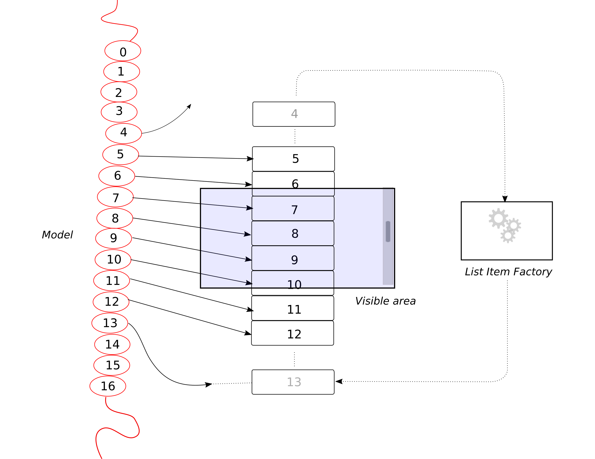

# Scalable Lists

In quite a few instances you have more elements than you can display at once.
Just think of the infinite amount of posts in your social media timeline.
Creating a widget for each individual post is impossible, but even for less extreme cases that is typically not what we want.
Ideally, we could specify our data and how it transforms into a widget.
GTK would then reuse the widgets as we scroll through our elements.

