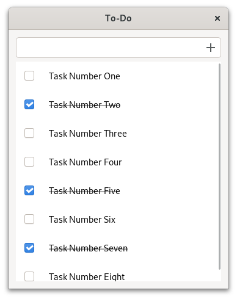
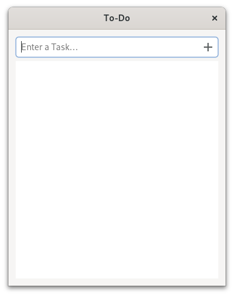

# Building a Simple To-Do App

After we have learned so many concepts, it is finally time to put them into practice.
We are going to build a To-Do app!

For now, we would already be satisfied with a minimal version.
An entry to input new tasks and a list view to display them will suffice.
Something like this:

<div style="text-align:center"></div>

## Window

This mockup can be described by the following composite template.

Filename: <a class=file-link href="https://github.com/gtk-rs/gtk4-rs/blob/master/book/listings/todo/1/resources/window.ui">listings/todo/1/resources/window.ui</a>

```xml
{{#rustdoc_include ../listings/todo/1/resources/window.ui}}
```


In order to use the composite template, we create a custom widget.
The `parent` is `gtk::ApplicationWindow`, so we inherit from it.
As usual, we have to list all [ancestors](https://docs.gtk.org/gtk4/class.ApplicationWindow.html#ancestors) and [interfaces](https://docs.gtk.org/gtk4/class.ApplicationWindow.html#implements) apart from `GObject` and `GInitiallyUnowned`.

Filename: <a class=file-link href="https://github.com/gtk-rs/gtk4-rs/blob/master/book/listings/todo/1/window/mod.rs">listings/todo/1/window/mod.rs</a>

```rust
{{#rustdoc_include ../listings/todo/1/window/mod.rs:glib_wrapper}}
```

Then we initialize the composite template for `imp::Window`.
We store references to the entry, the list view as well as the list model.
This will come in handy when we later add methods to our window.
After that, we add the typical boilerplate for initializing composite templates.
We only have to assure that the `class` attribute of the template in `window.ui` matches `NAME`.

Filename: <a class=file-link href="https://github.com/gtk-rs/gtk4-rs/blob/master/book/listings/todo/1/window/imp.rs">listings/todo/1/window/imp.rs</a>

```rust
{{#rustdoc_include ../listings/todo/1/window/imp.rs:struct_and_subclass}}
```

`main.rs` also does not hold any surprises for us.

Filename: <a class=file-link href="https://github.com/gtk-rs/gtk4-rs/blob/master/book/listings/todo/1/main.rs">listings/todo/1/main.rs</a>

```rust
{{#rustdoc_include ../listings/todo/1/main.rs:main}}
```

Finally, we specify our resources.
Here, they already include `task_row.ui` which we will handle later in this chapter.

Filename: <a class=file-link href="https://github.com/gtk-rs/gtk4-rs/blob/master/book/listings/todo/1/resources/resources.gresource.xml">listings/todo/1/resources/resources.gresource.xml</a>

```xml
{{#rustdoc_include ../listings/todo/1/resources/resources.gresource.xml}}
```


## Task Object

So far so good.
The main user interface is done, but the entry does not react to input yet.
Also, where would the input go?
We haven't even set up the list model yet.
Let's do that!

<div style="text-align:center"></div>

As discussed in the [list widgets chapter](./list_widgets.html),
we start out by creating a custom GObject.
This object will store the state of the task consisting of:
- a boolean describing whether the task is completed or not, and
- a string holding the task name.

Filename: <a class=file-link href="https://github.com/gtk-rs/gtk4-rs/blob/master/book/listings/todo/1/task_object/mod.rs">listings/todo/1/task_object/mod.rs</a>

```rust
{{#rustdoc_include ../listings/todo/1/task_object/mod.rs:glib_wrapper_and_new}}
```

Unlike the lists chapter, the state is stored in a struct rather than in individual members of `imp::TaskObject`.
This will be very convenient when saving the state in one of the following chapters.

Filename: <a class=file-link href="https://github.com/gtk-rs/gtk4-rs/blob/master/book/listings/todo/1/task_object/mod.rs">listings/todo/1/task_object/mod.rs</a>

```rust
{{#rustdoc_include ../listings/todo/1/task_object/mod.rs:task_data}}
```

We are going to expose `completed` and `content` as properties.
Since the data is now inside a struct rather than individual member variables we have to add more annotations.
For each property we additionally specify the name, the type and which member variable of `TaskData` we want to access.  

Filename: <a class=file-link href="https://github.com/gtk-rs/gtk4-rs/blob/master/book/listings/todo/1/task_object/imp.rs">listings/todo/1/task_object/imp.rs</a>

```rust
{{#rustdoc_include ../listings/todo/1/task_object/imp.rs:struct_and_subclass}}
```

## Task Row

Let's move on to the individual tasks.
The row of a task should look like this:


<div style="text-align:center"></div>

Again, we describe the mockup with a composite template.


Filename: <a class=file-link href="https://github.com/gtk-rs/gtk4-rs/blob/master/book/listings/todo/1/resources/task_row.ui">listings/todo/1/resources/task_row.ui</a>

```xml
{{#rustdoc_include ../listings/todo/1/resources/task_row.ui}}
```

In the code, we [derive](https://docs.gtk.org/gtk4/class.Box.html#hierarchy) `TaskRow` from `gtk:Box`:

Filename: <a class=file-link href="https://github.com/gtk-rs/gtk4-rs/blob/master/book/listings/todo/1/task_row/mod.rs">listings/todo/1/task_row/mod.rs</a>

```rust
{{#rustdoc_include ../listings/todo/1/task_row/mod.rs:glib_wrapper}}
```

In `imp::TaskRow`, we hold references to `completed_button` and `content_label`.
We also store a mutable vector of bindings.
Why we need that will become clear as soon as we get to bind the state of `TaskObject` to the corresponding `TaskRow`.


Filename: <a class=file-link href="https://github.com/gtk-rs/gtk4-rs/blob/master/book/listings/todo/1/task_row/imp.rs">listings/todo/1/task_row/imp.rs</a>

```rust
{{#rustdoc_include ../listings/todo/1/task_row/imp.rs:struct_and_subclass}}
```

Now we can bring everything together.
We override the `imp::Window::constructed` in order to set up window contents at the time of its construction.

Filename: <a class=file-link href="https://github.com/gtk-rs/gtk4-rs/blob/master/book/listings/todo/1/window/imp.rs">listings/todo/1/window/imp.rs</a>

```rust
{{#rustdoc_include ../listings/todo/1/window/imp.rs:constructed}}
```

Since we need to access the list model quite often, we add the convenience method `Window::model` for that.
In `Window::setup_tasks` we create a new model.
Then we store a reference to the model in `imp::Window` as well as in `gtk::ListView`.

Filename: <a class=file-link href="https://github.com/gtk-rs/gtk4-rs/blob/master/book/listings/todo/1/window/mod.rs">listings/todo/1/window/mod.rs</a>

```rust
{{#rustdoc_include ../listings/todo/1/window/mod.rs:tasks}}
```

We also create a method `new_task` which takes the content of the entry, clears the entry and uses the content to create a new task.

Filename: <a class=file-link href="https://github.com/gtk-rs/gtk4-rs/blob/master/book/listings/todo/1/window/mod.rs">listings/todo/1/window/mod.rs</a>

```rust
{{#rustdoc_include ../listings/todo/1/window/mod.rs:new_task}}
```

In `Window::setup_callbacks` we connect to the "activate" signal of the entry.
This signal is triggered when we press the enter key in the entry.
Then a new `TaskObject` with the content will be created and appended to the model.
Finally, the entry will be cleared.

Filename: <a class=file-link href="https://github.com/gtk-rs/gtk4-rs/blob/master/book/listings/todo/1/window/mod.rs">listings/todo/1/window/mod.rs</a>

```rust
{{#rustdoc_include ../listings/todo/1/window/mod.rs:setup_callbacks}}
```
The list elements for the `gtk::ListView` are produced by a factory.
Before we move on to the implementation, let's take a step back and think about which behavior we expect here.
`content_label` of `TaskRow` should follow `content` of `TaskObject`.
We also want `completed_button` of `TaskRow` follow `completed` of `TaskObject`.
This could be achieved with expressions similar to what we did in the lists chapter.

However, if we toggle the state of `completed_button` of `TaskRow`, `completed` of `TaskObject` should change too.
Unfortunately, expressions cannot handle bidirectional relationships.
This means we have to use property bindings.
We will need to unbind them manually when they are no longer needed.

We will create empty `TaskRow` objects in the "setup" step in `Window::setup_factory` and deal with binding in the "bind" and "unbind" steps.

Filename: <a class=file-link href="https://github.com/gtk-rs/gtk4-rs/blob/master/book/listings/todo/1/window/mod.rs">listings/todo/1/window/mod.rs</a>

```rust
{{#rustdoc_include ../listings/todo/1/window/mod.rs:setup_factory}}
```

Binding properties in `TaskRow::bind` works just like in former chapters.
The only difference is that we store the bindings in a vector.
This is necessary because a `TaskRow` will be reused as you scroll through the list.
That means that over time a `TaskRow` will need to bound to a new `TaskObject` and has to be unbound from the old one.
Unbinding will only work if it can access the stored [`glib::Binding`](https://gtk-rs.org/gtk-rs-core/stable/latest/docs/glib/struct.Binding.html).

Filename: <a class=file-link href="https://github.com/gtk-rs/gtk4-rs/blob/master/book/listings/todo/1/task_row/mod.rs">listings/todo/1/task_row/mod.rs</a>

```rust
{{#rustdoc_include ../listings/todo/1/task_row/mod.rs:bind}}
```

`TaskRow::unbind` takes care of the cleanup.
It iterates through the vector and unbinds each binding.
In the end, it clears the vector.

Filename: <a class=file-link href="https://github.com/gtk-rs/gtk4-rs/blob/master/book/listings/todo/1/task_row/mod.rs">listings/todo/1/task_row/mod.rs</a>

```rust
{{#rustdoc_include ../listings/todo/1/task_row/mod.rs:unbind}}
```

That was it, we created a basic To-Do app!
We will extend it with additional functionality in the following chapters.

<div style="text-align:center">
 <video autoplay muted loop>
  <source src="vid/todo_1_animation.webm" type="video/webm">
  <p>A video which shows how to enter tasks to the To-Do app</p>
 </video>
</div>
