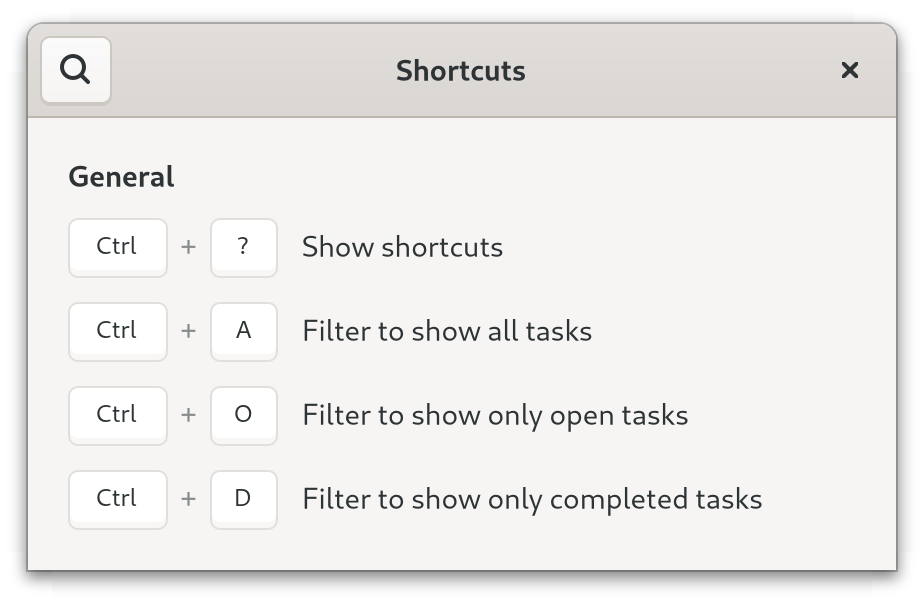

# Manipulating State of To-Do App

## Filtering Tasks

Now it is time to continue working on our To-Do app.
One nice feature to add would be filtering of the tasks.
What a chance to use our newly gained knowledge of actions!
Using actions, we can access the filter via the menu as well as via keyboard shortcuts.
This is how we want this to work in the end:

<div style="text-align:center">
 <video autoplay muted loop>
  <source src="vid/todo_2_animation.webm" type="video/webm">
  <p>A video which shows a more featureful To-Do app/p>
 </video>
</div>

Note that the screencast also shows a button with label "Clear" which will remove all done tasks.
This will come in handy when we later make the app preserve the tasks between sessions.

Let's start by adding a menu and a header bar to `window.ui`.
After reading the [actions](actions.html) chapter the added code should feel familiar.

Filename: <a class=file-link href="https://github.com/gtk-rs/gtk4-rs/blob/master/book/listings/todo/2/resources/window.ui">listings/todo/2/resources/window.ui</a>

```diff
 <?xml version="1.0" encoding="UTF-8"?>
 <interface>
+  <menu id="main-menu">
+    <submenu>
+      <attribute name="label" translatable="yes">_Filter</attribute>
+      <item>
+        <attribute name="label" translatable="yes">_All</attribute>
+        <attribute name="action">win.filter</attribute>
+        <attribute name="target">All</attribute>
+      </item>
+      <item>
+        <attribute name="label" translatable="yes">_Open</attribute>
+        <attribute name="action">win.filter</attribute>
+        <attribute name="target">Open</attribute>
+      </item>
+      <item>
+        <attribute name="label" translatable="yes">_Done</attribute>
+        <attribute name="action">win.filter</attribute>
+        <attribute name="target">Done</attribute>
+      </item>
+    </submenu>
+    <item>
+      <attribute name="label" translatable="yes">_Remove Done Tasks</attribute>
+      <attribute name="action">win.remove-done-tasks</attribute>
+    </item>
+    <item>
+      <attribute name="label" translatable="yes">_Keyboard Shortcuts</attribute>
+      <attribute name="action">win.show-help-overlay</attribute>
+    </item>
+  </menu>
   <template class="TodoWindow" parent="GtkApplicationWindow">
     <property name="width-request">360</property>
     <property name="title" translatable="yes">To-Do</property>
+    <child type="titlebar">
+      <object class="GtkHeaderBar">
+        <child type="end">
+          <object class="GtkMenuButton" id="menu_button">
+            <property name="icon-name">open-menu-symbolic</property>
+            <property name="menu-model">main-menu</property>
+          </object>
+        </child>
+      </object>
+    </child>
```

Then, we create a settings schema.
Again, the "filter" setting correspond to the stateful actions called by the menu.

Filename: <a class=file-link href="https://github.com/gtk-rs/gtk4-rs/blob/master/book/listings/todo/2/org.gtk_rs.Todo2.gschema.xml">listings/todo/2/org.gtk_rs.Todo2.gschema.xml</a>

```xml
{{#rustdoc_include ../listings/todo/2/org.gtk_rs.Todo2.gschema.xml}}
```

We install the schema as described in the settings [chapter](./settings.html)
Then we add a reference to `settings` to `imp::Window`.

Filename: <a class=file-link href="https://github.com/gtk-rs/gtk4-rs/blob/master/book/listings/todo/2/window/imp.rs">listings/todo/2/window/imp.rs</a>

```rust
{{#rustdoc_include ../listings/todo/2/window/imp.rs:struct_default}}
```

Again, we create functions to make it easier to access settings.

Filename: <a class=file-link href="https://github.com/gtk-rs/gtk4-rs/blob/master/book/listings/todo/2/window/mod.rs">listings/todo/2/window/mod.rs</a>

```rust
{{#rustdoc_include ../listings/todo/2/window/mod.rs:settings}}
```


We also add the methods `is_completed`, `task_data` and `from_task_data` to `TaskObject`.
We will make use of them in the following snippets.

Filename: <a class=file-link href="https://github.com/gtk-rs/gtk4-rs/blob/master/book/listings/todo/2/task_object/mod.rs">listings/todo/2/task_object/mod.rs</a>

```rust
{{#rustdoc_include ../listings/todo/2/task_object/mod.rs:impl}}
```

Similar to the previous chapter, we let `settings` create the action.
Then we add the newly created action "filter" to our window.

Filename: <a class=file-link href="https://github.com/gtk-rs/gtk4-rs/blob/master/book/listings/todo/2/window/mod.rs">listings/todo/2/window/mod.rs</a>

```rust
{{#rustdoc_include ../listings/todo/2/window/mod.rs:setup_actions}}
```

We also add an action which allows us to remove done tasks. 
<!-- TODO -->

Filename: <a class=file-link href="https://github.com/gtk-rs/gtk4-rs/blob/master/book/listings/todo/2/window/imp.rs">listings/todo/2/window/imp.rs</a>

```rust
{{#rustdoc_include ../listings/todo/2/window/imp.rs:object_subclass}}
```

After activating the action "win.filter", the corresponding setting will be changed.
So we need a method which translates this setting into a filter that the [`gtk::FilterListModel`](https://gtk-rs.org/gtk4-rs/stable/latest/docs/gtk4/struct.FilterListModel.html) understands.
The possible states are "All", "Open" and "Done". 
We return `Some(filter)` for "Open" and "Done".
If the state is "All" nothing has to be filtered out, so we return `None`.

Filename: <a class=file-link href="https://github.com/gtk-rs/gtk4-rs/blob/master/book/listings/todo/2/window/mod.rs">listings/todo/2/window/mod.rs</a>

```rust
{{#rustdoc_include ../listings/todo/2/window/mod.rs:filter}}
```

Now, we can set up the model.
We initialize `filter_model` with the state from the settings by calling the method `filter`.
Whenever the state of the key "filter" changes, we call the method `filter` again to get the updated `filter_model`.

Filename: <a class=file-link href="https://github.com/gtk-rs/gtk4-rs/blob/master/book/listings/todo/2/window/mod.rs">listings/todo/2/window/mod.rs</a>

```rust
{{#rustdoc_include ../listings/todo/2/window/mod.rs:setup_tasks}}
```

Then, we bind the shortcuts to their actions with `set_accels_for_action`.
Here as well, a detailed action name is used.
Since this has to be done at the application level, `setup_shortcuts` takes a `gtk::Application` as parameter.

Filename: <a class=file-link href="https://github.com/gtk-rs/gtk4-rs/blob/master/book/listings/todo/2/main.rs">listings/todo/2/main.rs</a>

```rust
{{#rustdoc_include ../listings/todo/2/main.rs:main}}
```

Now that we created all these nice shortcuts we will want our users to find them.
We do that by creating a shortcut window.
Again we use an `ui` file to describe it, but here we don't want to use it as template for our custom widget.
Instead we instantiate a widget of the existing class [`gtk::ShortcutsWindow`](https://gtk-rs.org/gtk4-rs/stable/latest/docs/gtk4/struct.ShortcutsWindow.html) with it. 


Filename: <a class=file-link href="https://github.com/gtk-rs/gtk4-rs/blob/master/book/listings/todo/2/resources/shortcuts.ui">listings/todo/2/resources/shortcuts.ui</a>

```xml
{{#rustdoc_include ../listings/todo/2/resources/shortcuts.ui}}
```

The entries can be organized with [`gtk::ShortcutsSection`](https://gtk-rs.org/gtk4-rs/stable/latest/docs/gtk4/struct.ShortcutsSection.html) and [`gtk::ShortcutsGroup`](https://gtk-rs.org/gtk4-rs/stable/latest/docs/gtk4/struct.ShortcutsGroup.html).
If we specify the action name, we also don't have to repeat the keyboard accelerator.
[`gtk::ShortcutsShortcut`](https://gtk-rs.org/gtk4-rs/stable/latest/docs/gtk4/struct.ShortcutsShortcut.html) looks it up on its own.


> Note the way we set `action-name` for `ShortcutsShortcut`.
Instead of using a separate property for the target, it takes a *detailed* action name.
Detailed names look like this: `action_group.action_name(target)`.
Formatting of the target depends on its type and is documented [here](https://gtk-rs.org/gtk-rs-core/stable/latest/docs/gio/struct.Action.html#method.parse_detailed_name).
In particular, strings have to be enclosed single quotes as you can see in this example.

Finally, we have to add the `shortcuts.ui` to our resources.
Note that we give it the alias `gtk/help-overlay.ui`.
We do that to take advantage of a convenience functionality documented [here](https://gtk-rs.org/gtk4-rs/stable/latest/docs/gtk4/struct.Application.html#automatic-resources).
It will look for a resource at `gtk/help-overlay.ui` which defines a `ShortcutsWindow` with id `help_overlay`.
If it can find one it will create a action `win.show-help-overlay` which will show the window and associate the shortcut <kbd>Ctrl</kbd> + <kbd>?</kbd> with this action.

Filename: <a class=file-link href="https://github.com/gtk-rs/gtk4-rs/blob/master/book/listings/todo/2/resources/resources.gresource.xml">listings/todo/2/resources/resources.gresource.xml</a>

```xml
{{#rustdoc_include ../listings/todo/2/resources/resources.gresource.xml}}
```

<div style="text-align:center"></div>


## Saving and Restoring Tasks

Since we use `Settings`, our filter state will persist between sessions.
However, the tasks themselves will not.
Let us implement that.
We could store our tasks in `Settings`, but it would be inconvenient.
When it comes to serializing and deserializing nothing beats the crate [`serde`](https://lib.rs/crates/serde).
Combined with [`serde_json`](https://lib.rs/crates/serde_json) we can save our tasks as serialized [json](https://en.wikipedia.org/wiki/JSON) files.

First, we extend our `Cargo.toml` with the `serde` and `serde_json` crate.

```
cargo add serde --features derive
cargo add serde_json
```

Filename: <a class=file-link href="https://github.com/gtk-rs/gtk4-rs/blob/master/book/listings/Cargo.toml">listings/Cargo.toml</a>

```toml
[dependencies]
serde = { version = "1.0", features = ["derive"] }
serde_json = "1.0"
```

Serde is a framework for serializing and deserializing Rust data structures.
The `derive` feature allows us to make our structures (de-)serializable with a single line of code.
We also use the `rc` feature so that Serde can deal with `std::rc::Rc` objects.
This is why we stored the data of `TodoObject` in a distinct `TodoData` structure.
Doing so allows us to derive `Serialize` and `Deserialize` for `TodoData`.

Filename: <a class=file-link href="https://github.com/gtk-rs/gtk4-rs/blob/master/book/listings/todo/2/task_object/mod.rs">listings/todo/2/task_object/mod.rs</a>

```rust
{{#rustdoc_include ../listings/todo/2/task_object/mod.rs:task_data}}
```

We plan to store our data as a file, so we create a utility function to provide a suitable file path for us.
We use [`glib::user_config_dir`](https://gtk-rs.org/gtk-rs-core/stable/latest/docs/glib/fn.user_config_dir.html) to get the path to the config directory and create a new subdirectory for our app.
Then we return the file path.

Filename: <a class=file-link href="https://github.com/gtk-rs/gtk4-rs/blob/master/book/listings/todo/2/utils.rs">listings/todo/2/utils.rs</a>

```rust
{{#rustdoc_include ../listings/todo/2/utils.rs:data_path}}
```

We override the `close_request` virtual function to save the tasks when the window is closed.
To do so, we first iterate through all entries and store them in a `Vec`.
Then we serialize the `Vec` and store the data as a json file.

Filename: <a class=file-link href="https://github.com/gtk-rs/gtk4-rs/blob/master/book/listings/todo/2/window/imp.rs">listings/todo/2/window/imp.rs</a>

```rust
{{#rustdoc_include ../listings/todo/2/window/imp.rs:window_impl}}
```

Let's it have a look into what a `Vec<TaskData>` will be serialized.
Note that [`serde_json::to_writer`](https://docs.serde.rs/serde_json/fn.to_writer.html) saves the data into a more concise, but also less readable way.
To create the equivalent but nicely formatted json below you can just replace `to_writer` with [`serde_json::to_writer_pretty`](https://docs.serde.rs/serde_json/fn.to_writer_pretty.html).

Filename: data.json

```json
[
  {
    "completed": true,
    "content": "Task Number Two"
  },
  {
    "completed": false,
    "content": "Task Number Five"
  },
  {
    "completed": true,
    "content": "Task Number Six"
  },
  {
    "completed": false,
    "content": "Task Number Seven"
  },
  {
    "completed": false,
    "content": "Task Number Eight"
  }
]
```

When we start the app, we will want to restore the saved data.
Let us add a `restore_data` method for that.
We make sure to handle the case where there is no data file there yet.
It might be the first time that we started the app and therefore there is no former session to restore.

Filename: <a class=file-link href="https://github.com/gtk-rs/gtk4-rs/blob/master/book/listings/todo/2/window/mod.rs">listings/todo/2/window/mod.rs</a>

```rust
{{#rustdoc_include ../listings/todo/2/window/mod.rs:restore_data}}
```

Finally, we make sure that everything is set up in `constructed`.

Filename: <a class=file-link href="https://github.com/gtk-rs/gtk4-rs/blob/master/book/listings/todo/2/window/imp.rs">listings/todo/2/window/imp.rs</a>

```rust
{{#rustdoc_include ../listings/todo/2/window/imp.rs:object_impl}}

```
Our To-Do app suddenly became much more useful.
Not only can we filter tasks, we also retain our tasks between sessions.
