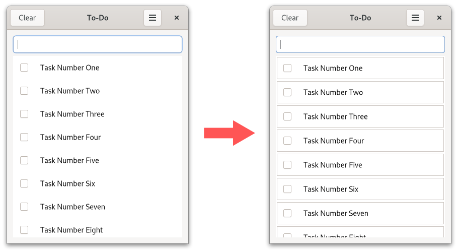

# Let To-Do App Follow GNOME's HIG

Within this chapter we will adapt our To-Do app so that it follow GNOME's [HIG](https://developer.gnome.org/hig/).
Let's start by installing libadwaita and adding the libadwaita crate to our dependencies as explained in the former [chapter](libadwaita.html).

The most simple change we can make is replacing [`gtk::Application`](https://gtk-rs.org/gtk4-rs/stable/latest/docs/gtk4/struct.Application.html) with [`adw::Application`](https://world.pages.gitlab.gnome.org/Rust/libadwaita-rs/stable/latest/docs/libadwaita/struct.Application.html).

Filename: <a class=file-link href="https://github.com/gtk-rs/gtk4-rs/blob/master/book/listings/todo/5/main.rs">listings/todo/5/main.rs</a>

```rust,no_run,noplayground
{{#rustdoc_include ../listings/todo/5/main.rs:main}}
```

Filename: <a class=file-link href="https://github.com/gtk-rs/gtk4-rs/blob/master/book/listings/todo/5/window/mod.rs">listings/todo/5/window/mod.rs</a>

```rust,no_run,noplayground
{{#rustdoc_include ../listings/todo/5/window/mod.rs:new}}
```

`adw::Application` calls [`init`](https://world.pages.gitlab.gnome.org/Rust/libadwaita-rs/stable/latest/docs/libadwaita/functions/fn.init.html) internally and makes sure that translations, types, stylesheets, and icons are set up properly for Libadwaita. 
It also loads stylesheets automatically from resources as long as they are named [accordingly](https://world.pages.gitlab.gnome.org/Rust/libadwaita-rs/stable/latest/docs/libadwaita/struct.Application.html#automatic-resources).

Looking at our To-Do app we can see that the looks of its widgets changed.
This is because the Default stylesheet provided by GTK has been replaced with the Adwaita stylesheet provided by Libadwaita.

<div style="text-align:center"></div>

If the setting is set to dark, then dark styles are loaded.

<div style="text-align:center">
 <video autoplay muted loop>
  <source src="vid/todo_dark.webm" type="video/webm">
Your browser does not support the video tag.
 </video>
</div>


## Start using Libadwaita widgets

We start by replacing all occurrences of `gtk::prelude` and `gtk::subclass::prelude` with [`adw::prelude`](https://world.pages.gitlab.gnome.org/Rust/libadwaita-rs/stable/latest/docs/libadwaita/prelude/index.html) and [`adw::subclass::prelude`](https://world.pages.gitlab.gnome.org/Rust/libadwaita-rs/stable/latest/docs/libadwaita/subclass/prelude/index.html).
The `adw` preludes re-export the `gtk` ones plus add a couple of Libadwaita specific traits.

In the remainder of this chapter we are going to follow two patterns of GNOME's HIG.
Let's start by adapting the header bar to be [HIG compliant](https://developer.gnome.org/hig/patterns/containers/header-bars.html).
We do that by replacing [`gtk::ApplicationWindow`](../docs/gtk4/struct.ApplicationWindow.html) with [`adw::ApplicationWindow`](https://world.pages.gitlab.gnome.org/Rust/libadwaita-rs/stable/latest/docs/libadwaita/struct.ApplicationWindow.html).
We also use [`adw::HeaderBar`](https://world.pages.gitlab.gnome.org/Rust/libadwaita-rs/stable/latest/docs/libadwaita/struct.HeaderBar.html) as title bar.
Finally, we add [tooltips](https://developer.gnome.org/hig/patterns/feedback/tooltips.html).

The second pattern we are going to follow are [boxed lists](https://developer.gnome.org/hig/patterns/containers/boxed-lists.html).
It is not mandatory to use them to be HIG compliant and there's a good reason for that: they are incompatible with recycling lists.
This means they cannot be used [list views](https://developer.gnome.org/hig/patterns/containers/list-column-views.html) and are therefore only appropriate for relatively small lists.

> Try to add tasks programmatically and see how many of them you need until the UI noticeably slows down.
> Determine for yourself if you think that is a reasonable number or if we should have rather stuck with list views.

We can use boxed lists by using [`gtk::ListBox`](../docs/gtk4/struct.ListBox.html) instead of [`gtk::ListView`](../docs/gtk4/struct.ListView.html).
We then add the [`boxed-list`](https://gnome.pages.gitlab.gnome.org/libadwaita/doc/main/boxed-lists.html) that is provided by Libadwaita.


Let's implement the discussed changes in the `window.ui` file.
You can find the relevant subset of the diff below.
To see the complete file just click on the link after "Filename:".

Filename: <a class=file-link href="https://github.com/gtk-rs/gtk4-rs/blob/master/book/listings/todo/6/resources/window.ui">listings/todo/6/resources/window.ui</a>


```diff
-  <template class="TodoWindow" parent="GtkApplicationWindow">
+  <template class="TodoWindow" parent="AdwApplicationWindow">
     <property name="width-request">360</property>
     <property name="title" translatable="yes">To-Do</property>
+    <property name="content">
       <object class="GtkBox">
         <property name="orientation">vertical</property>
+        <property name="hexpand">True</property>
         <child>
+          <object class="AdwHeaderBar">
+            <child type="end">
+              <object class="GtkMenuButton">
+                <property name="icon-name">view-more-symbolic</property>
+                <property name="menu-model">main-menu</property>
+              </object>
+            </child>
           </object>
         </child>
         <child>
           <object class="GtkScrolledWindow">
             <property name="hscrollbar-policy">never</property>
             <property name="min-content-height">360</property>
-            <child>
-              <object class="GtkListView" id="tasks_list" />
-            </child>
+            <property name="child">
+              <object class="GtkViewport">
+                <property name="scroll-to-focus">True</property>
+                <property name="child">
+                  <object class="AdwClamp">
+                    <property name="child">
+                      <object class="GtkBox">
+                        <property name="orientation">vertical</property>
+                        <property name="spacing">18</property>
+                        <property name="margin-top">24</property>
+                        <property name="margin-bottom">24</property>
+                        <property name="margin-start">12</property>
+                        <property name="margin-end">12</property>
+                        <child>
+                          <object class="GtkEntry" id="entry">
+                            <property name="placeholder-text" translatable="yes">Enter a Task…</property>
+                            <property name="secondary-icon-name">list-add-symbolic</property>
+                          </object>
+                        </child>
+                        <child>
+                          <object class="GtkListBox" id="tasks_list">
+                            <property name="visible">False</property>
+                            <property name="selection-mode">none</property>
+                            <style>
+                              <class name="boxed-list" />
+                            </style>
+                          </object>
+                        </child>
+                      </object>
+                    </property>
+                  </object>
+                </property>
+              </object>
+            </property>
           </object>
         </child>
       </object>
+    </property>
   </template>
 </interface>
```

We replaced the `gtk::ApplicationWindow` with `adw::ApplicationWindow` and added a `adw::HeaderBar` to it.
In order to follow the boxed list pattern, we started using [`gtk::ListBox`](../docs/gtk4/struct.ListBox.html), set its property "selection-mode" to "none" and let it match with the `boxed-list` style class. 

Let's continue with `window/imp.rs`.
`tasks_list` now binds to `ListBox` rather than `ListView`.
We also change the `ParentType` from `gtk::ApplicationWindow` to `adw::ApplicationWindow`.


Filename: <a class=file-link href="https://github.com/gtk-rs/gtk4-rs/blob/master/book/listings/todo/6/window/imp.rs">listings/todo/6/window/imp.rs</a>

```rust,no_run,noplayground
{{#rustdoc_include ../listings/todo/6/window/imp.rs:window}}
```

We don't override any function of `adw::ApplicationWindow`, but we still have to add the empty `impl`.

Filename: <a class=file-link href="https://github.com/gtk-rs/gtk4-rs/blob/master/book/listings/todo/6/window/imp.rs">listings/todo/6/window/imp.rs</a>

```rust,no_run,noplayground
{{#rustdoc_include ../listings/todo/6/window/imp.rs:AdwApplicationWindowImpl}}
```

Moving on to `window/mod.rs`.
First, we add `adw::ApplicationWindow` to our list of derived classes.

Filename: <a class=file-link href="https://github.com/gtk-rs/gtk4-rs/blob/master/book/listings/todo/6/window/mod.rs">listings/todo/6/window/mod.rs</a>

```rust,no_run,noplayground
{{#rustdoc_include ../listings/todo/6/window/mod.rs:glib_wrapper}}
```

`ListBox` supports models just fine, but without any recycling of widgets we also don't need factories anymore.
`setup_factory` can therefore be safely deleted.
In `setup_tasks` we call `bind_model`.
There we specify the model, as well as a closure describing how to transform the given GObject into a widget the list box can display. 

Filename: <a class=file-link href="https://github.com/gtk-rs/gtk4-rs/blob/master/book/listings/todo/6/window/mod.rs">listings/todo/6/window/mod.rs</a>

```rust,no_run,noplayground
{{#rustdoc_include ../listings/todo/6/window/mod.rs:bind_model}}
```

We still have to specify the `create_task_row` method.
Here, we create an [`adw::ActionRow`](https://world.pages.gitlab.gnome.org/Rust/libadwaita-rs/stable/latest/docs/libadwaita/struct.ActionRow.html) with a [`gtk::CheckButton`](https://gtk-rs.org/gtk4-rs/stable/latest/docs/gtk4/struct.CheckButton.html) as activatable widget.
Without recycling, a GObject will always belong to the same widget.
That means we can just bind their properties without having to worry about unbinding them later on.

Filename: <a class=file-link href="https://github.com/gtk-rs/gtk4-rs/blob/master/book/listings/todo/6/window/mod.rs">listings/todo/6/window/mod.rs</a>

```rust,no_run,noplayground
{{#rustdoc_include ../listings/todo/6/window/mod.rs:create_task_row}}
```

When using boxed lists you also have to take care to hide the `ListBox` when there is no task present.

Filename: <a class=file-link href="https://github.com/gtk-rs/gtk4-rs/blob/master/book/listings/todo/6/window/mod.rs">listings/todo/6/window/mod.rs</a>

```rust,no_run,noplayground
{{#rustdoc_include ../listings/todo/6/window/mod.rs:connect_items_changed}}
```

Finally, we specify the method `set_task_list_visible`.

Filename: <a class=file-link href="https://github.com/gtk-rs/gtk4-rs/blob/master/book/listings/todo/6/window/mod.rs">listings/todo/6/window/mod.rs</a>

```rust,no_run,noplayground
{{#rustdoc_include ../listings/todo/6/window/mod.rs:set_task_list_visible}}
```

# TODO: Comparison
