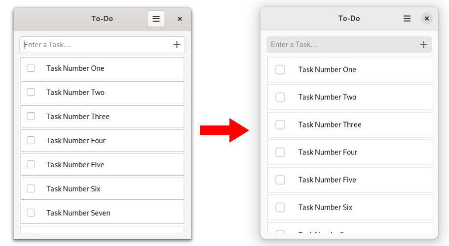
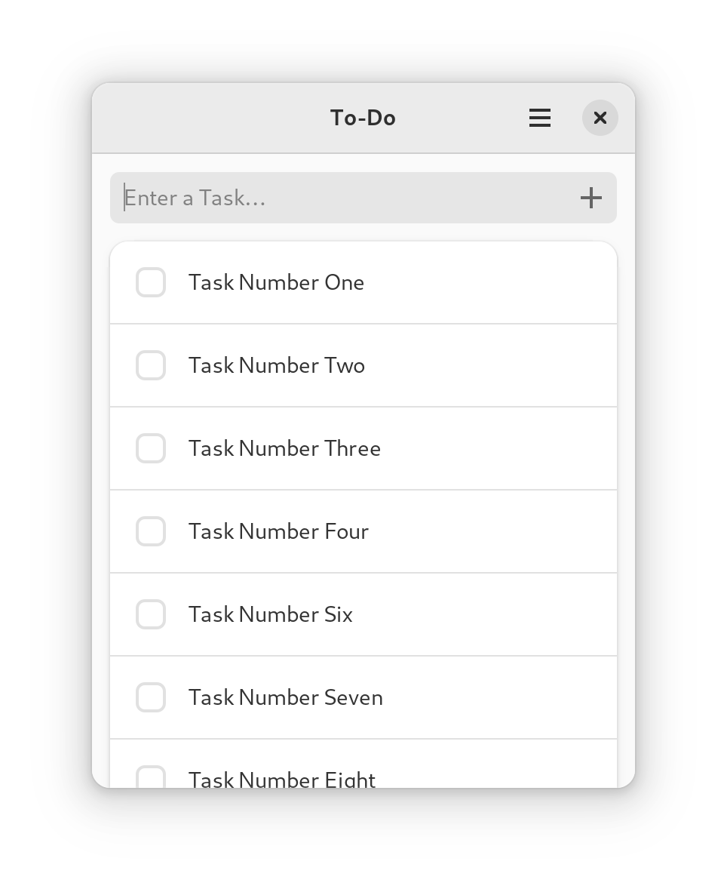

# Let To-Do App use Libadwaita

Within this chapter we will adapt our To-Do app so that it follows GNOME's [HIG](https://developer.gnome.org/hig/).
Let's start by installing Libadwaita and adding the `libadwaita` crate to our dependencies as explained in the [previous chapter](libadwaita.html).

The simplest way to take advantage of Libadwaita is by replacing [`gtk::Application`](https://gtk-rs.org/gtk4-rs/stable/latest/docs/gtk4/struct.Application.html) with [`adw::Application`](https://world.pages.gitlab.gnome.org/Rust/libadwaita-rs/stable/latest/docs/libadwaita/struct.Application.html).

Filename: <a class=file-link href="https://github.com/gtk-rs/gtk4-rs/blob/master/book/listings/todo/5/main.rs">listings/todo/5/main.rs</a>

```rust,no_run,noplayground
{{#rustdoc_include ../listings/todo/5/main.rs:main}}
```

Filename: <a class=file-link href="https://github.com/gtk-rs/gtk4-rs/blob/master/book/listings/todo/5/window/mod.rs">listings/todo/5/window/mod.rs</a>

```rust,no_run,noplayground
{{#rustdoc_include ../listings/todo/5/window/mod.rs:new}}
```

`adw::Application` calls [`adw::init`](https://world.pages.gitlab.gnome.org/Rust/libadwaita-rs/stable/latest/docs/libadwaita/functions/fn.init.html) internally and makes sure that translations, types, stylesheets, and icons are set up properly for Libadwaita. 
It also loads stylesheets automatically from resources as long as they are named [correctly](https://world.pages.gitlab.gnome.org/Rust/libadwaita-rs/stable/latest/docs/libadwaita/struct.Application.html#automatic-resources).

Looking at our To-Do app we can see that the looks of its widgets changed.
This is because the `Default` stylesheet provided by GTK has been replaced with the `Adwaita` stylesheet provided by Libadwaita.

<div style="text-align:center"></div>

Also, our app now switches to the dark style together with the rest of the system.

<div style="text-align:center">
 <video autoplay muted loop>
  <source src="vid/todo_dark.webm" type="video/webm">
   <p>A video which shows how the To-Do app changes color scheme from light to dark</p>
 </video>
</div>


## Boxed lists

Of course Libadwaita is more than just a couple of stylesheets and a [`StyleManager`](https://world.pages.gitlab.gnome.org/Rust/libadwaita-rs/stable/latest/docs/libadwaita/struct.StyleManager.html).
But before we get to the interesting stuff, we will make our lives easier for the future by replacing all occurrences of `gtk::prelude` and `gtk::subclass::prelude` with [`adw::prelude`](https://world.pages.gitlab.gnome.org/Rust/libadwaita-rs/stable/latest/docs/libadwaita/prelude/index.html) and [`adw::subclass::prelude`](https://world.pages.gitlab.gnome.org/Rust/libadwaita-rs/stable/latest/docs/libadwaita/subclass/prelude/index.html).
This works because the `adw` preludes, in addition to the Libadwaita-specific traits, re-export the corresponding `gtk` preludes.

Now we are going let our tasks follow the [boxed lists pattern](https://developer.gnome.org/hig/patterns/containers/boxed-lists.html).
The HIG does not require us to use this style and there's a good reason for that: it is incompatible with recycling lists.
This means they cannot be used with [list views](https://developer.gnome.org/hig/patterns/containers/list-column-views.html) and are therefore only appropriate for relatively small lists.

> Try to add tasks programmatically and see how many of them you have to add until the UI noticeably slows down.
> Determine for yourself if you think that is a reasonable number or if we should have rather stuck with list views.

We can use boxed lists by using [`gtk::ListBox`](../docs/gtk4/struct.ListBox.html) instead of [`gtk::ListView`](../docs/gtk4/struct.ListView.html).
We will also add the [`boxed-list`](https://gnome.pages.gitlab.gnome.org/libadwaita/doc/main/boxed-lists.html) style class provided by Libadwaita.

Let's implement all these changes in the `window.ui` file.
All of the changes are confined within the second child of the `ApplicationWindow`.
To see the complete file, just click on the link after "Filename".

Filename: <a class=file-link href="https://github.com/gtk-rs/gtk4-rs/blob/master/book/listings/todo/6/resources/window.ui">listings/todo/6/resources/window.ui</a>


```xml
<child>
  <object class="GtkScrolledWindow">
    <property name="hscrollbar-policy">never</property>
    <property name="min-content-height">420</property>
    <property name="vexpand">True</property>
    <property name="child">
      <object class="AdwClamp">
        <property name="child">
          <object class="GtkBox">
            <property name="orientation">vertical</property>
            <property name="spacing">18</property>
            <property name="margin-top">24</property>
            <property name="margin-bottom">24</property>
            <property name="margin-start">12</property>
            <property name="margin-end">12</property>
            <child>
              <object class="GtkEntry" id="entry">
                <property name="placeholder-text" translatable="yes">Enter a Task…</property>
                <property name="secondary-icon-name">list-add-symbolic</property>
              </object>
            </child>
            <child>
              <object class="GtkListBox" id="tasks_list">
                <property name="visible">False</property>
                <property name="selection-mode">none</property>
                <style>
                  <class name="boxed-list" />
                </style>
              </object>
            </child>
          </object>
        </property>
      </object>
    </property>
  </object>
</child>
```

In order to follow the boxed list pattern, we switched to [`gtk::ListBox`](../docs/gtk4/struct.ListBox.html), set its property "selection-mode" to "none" and added the `boxed-list` style class. 

Let's continue with `window/imp.rs`.
The member variable `tasks_list` now describes a `ListBox` rather than a `ListView`.

Filename: <a class=file-link href="https://github.com/gtk-rs/gtk4-rs/blob/master/book/listings/todo/6/window/imp.rs">listings/todo/6/window/imp.rs</a>

```rust,no_run,noplayground
{{#rustdoc_include ../listings/todo/6/window/imp.rs:window}}
```


We now move on to `window/mod.rs`.
`ListBox` supports models just fine, but without any widget recycling we don't need factories anymore.
`setup_factory` can therefore be safely deleted.
To setup the `ListBox`, we call `bind_model` in `setup_tasks`.
There we specify the model, as well as a closure describing how to transform the given GObject into a widget the list box can display. 

Filename: <a class=file-link href="https://github.com/gtk-rs/gtk4-rs/blob/master/book/listings/todo/6/window/mod.rs">listings/todo/6/window/mod.rs</a>

```rust,no_run,noplayground
{{#rustdoc_include ../listings/todo/6/window/mod.rs:bind_model}}
```

We still have to specify the `create_task_row` method.
Here, we create an [`adw::ActionRow`](https://world.pages.gitlab.gnome.org/Rust/libadwaita-rs/stable/latest/docs/libadwaita/struct.ActionRow.html) with a [`gtk::CheckButton`](https://gtk-rs.org/gtk4-rs/stable/latest/docs/gtk4/struct.CheckButton.html) as activatable widget.
Without recycling, a GObject will always belong to the same widget.
That means we can just bind their properties without having to worry about unbinding them later on.

Filename: <a class=file-link href="https://github.com/gtk-rs/gtk4-rs/blob/master/book/listings/todo/6/window/mod.rs">listings/todo/6/window/mod.rs</a>

```rust,no_run,noplayground
{{#rustdoc_include ../listings/todo/6/window/mod.rs:create_task_row}}
```

When using boxed lists, you also have to take care to hide the `ListBox` when there is no task present.

Filename: <a class=file-link href="https://github.com/gtk-rs/gtk4-rs/blob/master/book/listings/todo/6/window/mod.rs">listings/todo/6/window/mod.rs</a>

```rust,no_run,noplayground
{{#rustdoc_include ../listings/todo/6/window/mod.rs:connect_items_changed}}
```

Finally, we define the `set_task_list_visible` method.

Filename: <a class=file-link href="https://github.com/gtk-rs/gtk4-rs/blob/master/book/listings/todo/6/window/mod.rs">listings/todo/6/window/mod.rs</a>

```rust,no_run,noplayground
{{#rustdoc_include ../listings/todo/6/window/mod.rs:set_task_list_visible}}
```

This is how the boxed list style looks like in our app.

<div style="text-align:center"></div>
