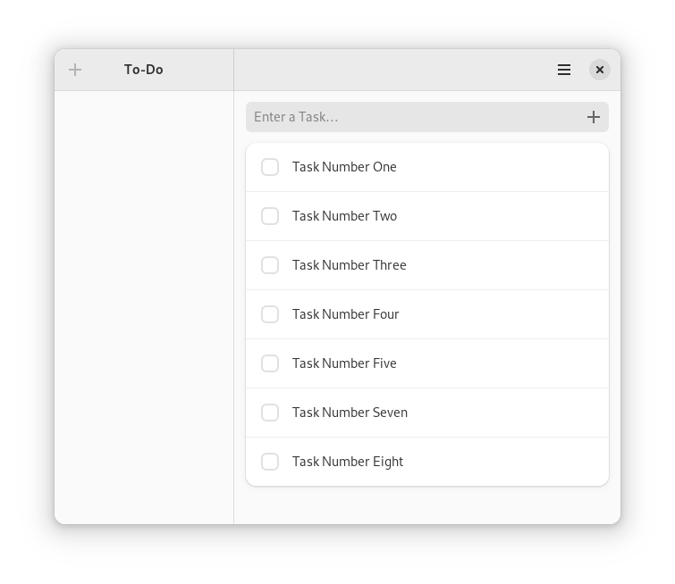
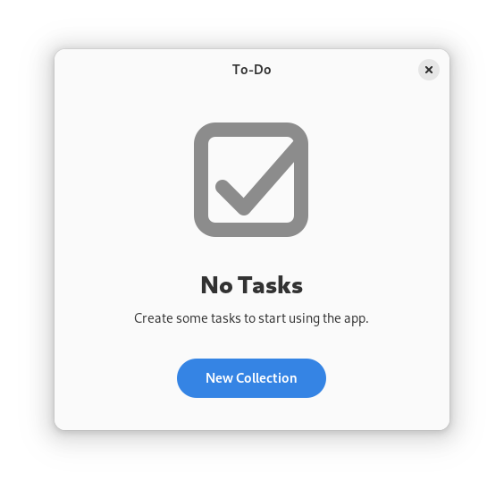

# Adding Collections

## Sidebar

Using Libadwaita on its own was already a big leap forward when it came to the look and feel of the To-Do app.
Let us go one step further by adding a way to group tasks into collections.
These collections will get their own sidebar on the left of the app.
We will start by adding an empty sidebar without any functionality.

<div style="text-align:center"></div>

There are a couple of steps we have to go through to get to this state.
First, we have to replace [`gtk::ApplicationWindow`](../docs/gtk4/struct.ApplicationWindow.html) with [`adw::ApplicationWindow`](https://world.pages.gitlab.gnome.org/Rust/libadwaita-rs/stable/latest/docs/libadwaita/struct.ApplicationWindow.html).
The only difference between those two is that `adw::ApplicationWindow` has no titlebar area.
That comes in handy when we build up our interface with [`adw::Leaflet`](https://world.pages.gitlab.gnome.org/Rust/libadwaita-rs/stable/latest/docs/libadwaita/struct.Leaflet.html).
In the screenshot above, the `Leaflet` behaves like a [`gtk::Box`](../docs/gtk4/struct.Box.html) and contains the collection view on the left, a separator in the middle and the task view on the right.
When using `adw::ApplicationWindow` the collection view and task view have their own [`adw::HeaderBar`](https://world.pages.gitlab.gnome.org/Rust/libadwaita-rs/stable/latest/docs/libadwaita/struct.HeaderBar.html) and the separator spans over the whole window.


Filename: <a class=file-link href="https://github.com/gtk-rs/gtk4-rs/blob/master/book/listings/todo/7/resources/window.ui">listings/todo/7/resources/window.ui</a>

```xml
<?xml version="1.0" encoding="UTF-8"?>
<interface>
  <menu id="main-menu">
    <!--Menu implementation-->      
  </menu>
  <template class="TodoWindow" parent="AdwApplicationWindow">
    <property name="title" translatable="yes">To-Do</property>
    <property name="default_width">650</property>
    <property name="default_height">550</property>
    <property name="content">
      <object class="AdwLeaflet" id="leaflet">
        <property name="can-navigate-back">True</property>
        <child>
          <object class="GtkBox">
            <!--Collection view implementation-->
          </object>
        </child>
        <child>
          <object class="AdwLeafletPage">
            <property name="navigatable">False</property>
            <property name="child">
              <object class="GtkSeparator" />
            </property>
          </object>
        </child>
        <child>
          <object class="GtkBox">
            <!--Task view implementation-->
          </object>
        </child>
      </object>
    </property>
  </template>
</interface>
```

The `Leaflet` does not always behave like a `gtk::Box`.
As soon as the requested size is too small to fit all children at the same time, the leaflet folds, and starts behaving like a [`gtk::Stack`](../docs/gtk4/struct.Stack.html).
This means that it only displays one of its children at a time.
The property "can-navigate-back" controls whether gestures and shortcuts for navigating backward are enabled.
The `AdwLeafletPage` with the `gtk::Separator` will never be displayed in the folded state since its property "navigatable" is set to `False`.)
The adaptive behavior of the leaflet allows the To-Do app to work on smaller screen sizes even with the added collection view.


<div style="text-align:center">
 <video autoplay muted loop>
  <source src="vid/todo_7_leaflet.webm" type="video/webm">
   <p>A video which shows that reduzing the width of the app let's the sidebar collapse</p>
 </video>
</div>


We add the necessary UI elements for the collection view, such as a header bar with a button to add a new collection, as well as the list box `collections_list` to display the collections later on.

As you can see in the screencast above, the header bar also displays a close button if the leaflet is folded.
We include this logic with an expression which can be built up in the UI file with the tag [`lookup`](https://gtk-rs.org/gtk4-rs/stable/latest/docs/gtk4/struct.Expression.html#gtkexpression-in-ui-files).


Filename: <a class=file-link href="https://github.com/gtk-rs/gtk4-rs/blob/master/book/listings/todo/7/resources/window.ui">listings/todo/7/resources/window.ui</a>

```xml
<object class="GtkBox">
  <property name="orientation">vertical</property>
  <property name="width-request">200</property>
  <child>
    <object class="AdwHeaderBar">
      <binding name="show-end-title-buttons">
        <lookup name="folded">leaflet</lookup>
      </binding>
      <child type="start">
        <object class="GtkToggleButton">
          <property name="icon-name">list-add-symbolic</property>
          <property name="tooltip-text" translatable="yes">New Collection</property>
          <property name="action-name">win.new-collection</property>
        </object>
      </child>
    </object>
  </child>
  <child>
    <object class="GtkScrolledWindow">
      <property name="vexpand">True</property>
      <property name="child">
        <object class="GtkListBox" id="collections_list">
          <style>
            <class name="navigation-sidebar" />
          </style>
        </object>
      </property>
    </object>
  </child>
</object>
```

We also add a header bar to the task view.
We don't have to worry about the close button here: it will always be displayed.
However, we will need a way to go back to the collection view when the leaflet is folded.
That is why we add `back_button` which can be used to return to the collection view and which is only visible when the leaflet is folded. 


Filename: <a class=file-link href="https://github.com/gtk-rs/gtk4-rs/blob/master/book/listings/todo/7/resources/window.ui">listings/todo/7/resources/window.ui</a>

```xml
<object class="GtkBox">
  <property name="orientation">vertical</property>
  <property name="hexpand">True</property>
  <property name="width-request">250</property> 
  <child>
    <object class="AdwHeaderBar">
      <property name="title-widget">
        <object class="AdwWindowTitle" />
      </property>
      <child type="start">
        <object class="GtkButton" id="back_button">
          <binding name="visible">
            <lookup name="folded">leaflet</lookup>
          </binding>
          <property name="icon-name">go-previous-symbolic</property>
          <property name="tooltip-text" translatable="yes">Back</property>
        </object>
      </child>
      <child type="end">
        <object class="GtkMenuButton">
          <property name="icon-name">open-menu-symbolic</property>
          <property name="menu-model">main-menu</property>
          <property name="tooltip-text" translatable="yes">Main Menu</property>
        </object>
      </child>
    </object>
  </child>
  <child>
    <!--This part stays the same-->
  </child>
</object>
```

We also have to adapt the window implementation.
For example, the parent type of our window is now `adw::ApplicationWindow` instead of `gtk::ApplicationWindow`. 

Filename: <a class=file-link href="https://github.com/gtk-rs/gtk4-rs/blob/master/book/listings/todo/7/window/imp.rs">listings/todo/7/window/imp.rs</a>

```rust,no_run,noplayground
{{#rustdoc_include ../listings/todo/7/window/imp.rs:object_subclass}}
```

That also means that we have to implement the trait `AdwApplicationWindowImpl`.

Filename: <a class=file-link href="https://github.com/gtk-rs/gtk4-rs/blob/master/book/listings/todo/7/window/imp.rs">listings/todo/7/window/imp.rs</a>

```rust,no_run,noplayground
{{#rustdoc_include ../listings/todo/7/window/imp.rs:adw_application_window_impl}}
```

Finally, we add `adw::ApplicationWindow` to the ancestors of `Window` in `mod.rs`.

Filename: <a class=file-link href="https://github.com/gtk-rs/gtk4-rs/blob/master/book/listings/todo/7/window/mod.rs">listings/todo/7/window/mod.rs</a>

```rust,no_run,noplayground
{{#rustdoc_include ../listings/todo/7/window/mod.rs:glib_wrapper}}
```


## Placeholder Page

Even before we start to populate the collection view, we ought to think about a different challenge: the empty state of our To-Do app.
Before, the empty state without a single task was quite okay.
It was clear that you had to add tasks in the entry bar.
However, now the situation is different.
Users will have to add a collection first, and we have to make that clear.
The GNOME HIG suggests to use a [placeholder page](https://developer.gnome.org/hig/patterns/feedback/placeholders.html) for that.
In our case, this placeholder page will be presented to the user if they open the app without any collections present.

<div style="text-align:center"></div>

We now wrap our UI in a [`gtk::Stack`](../docs/gtk4/struct.Stack.html).
One stack page describes the placeholder page, the other describes the main page.
We will later wire up the logic to display the correct stack page in the Rust code.

Filename: <a class=file-link href="https://github.com/gtk-rs/gtk4-rs/blob/master/book/listings/todo/8/resources/window.ui">listings/todo/8/resources/window.ui</a>

```xml
<?xml version="1.0" encoding="UTF-8"?>
<interface>
  <menu id="main-menu">
    <!--Menu implementation--> 
  </menu>
  <template class="TodoWindow" parent="AdwApplicationWindow">
    <property name="title" translatable="yes">To-Do</property>
    <property name="default_width">650</property>
    <property name="default_height">550</property>
    <property name="content">
      <object class="GtkStack" id="stack">
        <property name="transition-type">crossfade</property>
        <child>
          <object class="GtkStackPage">
            <property name="name">empty</property>
            <property name="child">
              <object class="GtkBox">
                <!--Placeholder page implementation--> 
              </object>
            </property>
          </object>
        </child>
        <child>
          <object class="GtkStackPage">
            <property name="name">main</property>
            <property name="child">
              <object class="AdwLeaflet" id="leaflet">
                <!--Main page implementation-->
              </object>
            </property>
          </object>
        </child>
      </object>
    </property>
  </template>
</interface>
```

In order to create the pageholder page as displayed before, we combine a flat header bar with [`adw::StatusPage`](https://world.pages.gitlab.gnome.org/Rust/libadwaita-rs/stable/latest/docs/libadwaita/struct.StatusPage.html).


Filename: <a class=file-link href="https://github.com/gtk-rs/gtk4-rs/blob/master/book/listings/todo/8/resources/window.ui">listings/todo/8/resources/window.ui</a>

```xml
<object class="GtkBox">
  <property name="orientation">vertical</property>
  <child>
    <object class="GtkHeaderBar">
      <style>
        <class name="flat" />
      </style>
    </object>
  </child>
  <child>
    <object class="GtkWindowHandle">
      <property name="vexpand">True</property>
      <property name="child">
        <object class="AdwStatusPage">
          <property name="icon-name">checkbox-checked-symbolic</property>
          <property name="title" translatable="yes">No Tasks</property>
          <property name="description" translatable="yes">Create some tasks to start using the app.</property>
          <property name="child">
            <object class="GtkButton">
              <property name="label" translatable="yes">_New Collection</property>
              <property name="use-underline">True</property>
              <property name="halign">center</property>
              <property name="action-name">win.new-collection</property>
              <style>
                <class name="pill" />
                <class name="suggested-action" />
              </style>
            </object>
          </property>
        </object>
      </property>
    </object>
  </child>
</object>
```

## Collections

We still need a way to store our collections.
Just like we have already created `TaskObject`, we will now introduce `CollectionObject`.
It will have the members `title` and `tasks`, both of which will be exposed as properties.
As usual, the full implementation can be seen by clicking at the eye symbol at the top right of the snippet. 

Filename: <a class=file-link href="https://github.com/gtk-rs/gtk4-rs/blob/master/book/listings/todo/8/collection_object/imp.rs">listings/todo/8/collection_object/imp.rs</a>

```rust,no_run,noplayground
{{#rustdoc_include ../listings/todo/8/collection_object/imp.rs:collection_object}}
```

We also add the struct `CollectionData` to aid in serialization and deserialization.

Filename: <a class=file-link href="https://github.com/gtk-rs/gtk4-rs/blob/master/book/listings/todo/8/collection_object/mod.rs">listings/todo/8/collection_object/mod.rs</a>

```rust,no_run,noplayground
{{#rustdoc_include ../listings/todo/8/collection_object/mod.rs:collection_data}}
```

Finally, we add methods to `CollectionObject` in order to
- construct it with `new`,
- easily access the tasks `ListStore` with `tasks` and
- convert to and from `CollectionData` with `to_collection_data` and `from_collection_data`. 


Filename: <a class=file-link href="https://github.com/gtk-rs/gtk4-rs/blob/master/book/listings/todo/8/collection_object/mod.rs">listings/todo/8/collection_object/mod.rs</a>

```rust,no_run,noplayground
{{#rustdoc_include ../listings/todo/8/collection_object/mod.rs:impl}}
```

## Window

In order to hook up the new logic, we have to add more state to `imp::Window`.
There are additional widgets that we access via the `template_child` macro.
Additionally, we reference the `collections` list store, the `current_collection` as well as the `current_filter_model`.
We also store `tasks_changed_handler_id`.
Its purpose will become clear in later snippets.

Filename: <a class=file-link href="https://github.com/gtk-rs/gtk4-rs/blob/master/book/listings/todo/7/window/imp.rs">listings/todo/8/window/imp.rs</a>

```rust,no_run,noplayground
{{#rustdoc_include ../listings/todo/8/window/imp.rs:struct}}
```

Further, we add a couple of helper methods which will come in handy later on.

Filename: <a class=file-link href="https://github.com/gtk-rs/gtk4-rs/blob/master/book/listings/todo/8/window/imp.rs">listings/todo/8/window/mod.rs</a>

```rust,no_run,noplayground
{{#rustdoc_include ../listings/todo/8/window/mod.rs:helper}}
```

As always, we want our data to be saved when we close the window.
Since most of the implementation is in the method `CollectionObject::to_collection_data`, the implementation of `close_request` doesn't change much.

Filename: <a class=file-link href="https://github.com/gtk-rs/gtk4-rs/blob/master/book/listings/todo/8/window/imp.rs">listings/todo/8/window/imp.rs</a>

```rust,no_run,noplayground
{{#rustdoc_include ../listings/todo/8/window/imp.rs:window_impl}}
```

`constructed` stays mostly the same as well.
Instead of `setup_tasks` we now call `setup_collections`.

Filename: <a class=file-link href="https://github.com/gtk-rs/gtk4-rs/blob/master/book/listings/todo/7/window/imp.rs">listings/todo/8/window/imp.rs</a>

```rust,no_run,noplayground
{{#rustdoc_include ../listings/todo/8/window/imp.rs:object_impl}}
```

`setup_collections` sets up the `collections` list store as well as assuring that changes in the model will be reflected in the `collections_list`.
To do that it uses the method `create_collection_row`.

Filename: <a class=file-link href="https://github.com/gtk-rs/gtk4-rs/blob/master/book/listings/todo/8/window/imp.rs">listings/todo/8/window/mod.rs</a>

```rust,no_run,noplayground
{{#rustdoc_include ../listings/todo/8/window/mod.rs:setup_collections}}
```

`create_collection_row` takes a `CollectionObject` and builds a [`gtk::ListBoxRow`](../docs/gtk4/struct.ListBoxRow.html) from its information.

Filename: <a class=file-link href="https://github.com/gtk-rs/gtk4-rs/blob/master/book/listings/todo/8/window/imp.rs">listings/todo/8/window/mod.rs</a>

```rust,no_run,noplayground
{{#rustdoc_include ../listings/todo/8/window/mod.rs:create_collection_row}}
```

We also adapt `restore_data`.
Again, the heavy lifting comes from `CollectionObject::from_collection_data`, so we don't have to change too much here.
Since the rows of `collections_list` can be selected, we have to select one of them after restoring the data.
We choose the first one and let the method `set_current_collection` do the rest.

Filename: <a class=file-link href="https://github.com/gtk-rs/gtk4-rs/blob/master/book/listings/todo/8/window/imp.rs">listings/todo/8/window/mod.rs</a>

```rust,no_run,noplayground
{{#rustdoc_include ../listings/todo/8/window/mod.rs:restore_data}}
```

`set_current_collection` assures that all elements accessing tasks refer to the task model of the current collection.
We bind the `tasks_list` to the current collection and store the filter model.
Whenever there are no tasks in our current collection we want to hide our tasks list.
Otherwise, the list box will leave a bad-looking line behind.
However, we don't want to accumulate signal handlers whenever we switch collections.
This is why we store the `tasks_changed_handler_id` and disconnect the old handler as soon as we set a new collection.
Finally, we select the collection row.

Filename: <a class=file-link href="https://github.com/gtk-rs/gtk4-rs/blob/master/book/listings/todo/8/window/imp.rs">listings/todo/8/window/mod.rs</a>

```rust,no_run,noplayground
{{#rustdoc_include ../listings/todo/8/window/mod.rs:set_current_collection}}
```

Previously, we used the method `set_task_list_visible`.
It assures that `tasks_list` is only visible if the number of tasks is greater than 0.

Filename: <a class=file-link href="https://github.com/gtk-rs/gtk4-rs/blob/master/book/listings/todo/8/window/imp.rs">listings/todo/8/window/mod.rs</a>

```rust,no_run,noplayground
{{#rustdoc_include ../listings/todo/8/window/mod.rs:set_task_list_visible}}
```

`select_collection_row` assures that the row for the current collection is selected in `collections_list`.

Filename: <a class=file-link href="https://github.com/gtk-rs/gtk4-rs/blob/master/book/listings/todo/8/window/imp.rs">listings/todo/8/window/mod.rs</a>

```rust,no_run,noplayground
{{#rustdoc_include ../listings/todo/8/window/mod.rs:select_collection_row}}
```


## Leaflet and Dialog

Thanks to the leaflet the To-Do app folds now when we resize it to a smaller width.
However, there isn't yet a way to navigate between the different leaflet pages.
Let us start with the most important one: adding a new collection.

<div style="text-align:center">
 <video autoplay muted loop>
  <source src="vid/todo_8_dialog.webm" type="video/webm">
   <p>A video which shows the new dialog</p>
 </video>
</div>

The screencast above demonstrates the desired behavior.
When we activate the button with the `+` symbol, a dialog appears.
While the entry is empty, the "Create" button remains insensitive.
As soon as we start typing, the button becomes sensitive.
When we remove all typed letters and the entry becomes empty again, the "Create" button becomes insensitive and the entry gets the "error" style.
After clicking the "Create" button, a new collection is created, and we navigate to its task view.

To implement that behavior we will first add a "new-collection" action to the `setup_actions` method.
This action will be activated by a click on the `+` button as well as on the button in the placeholder page.

Filename: <a class=file-link href="https://github.com/gtk-rs/gtk4-rs/blob/master/book/listings/todo/8/window/imp.rs">listings/todo/8/window/mod.rs</a>

```rust,no_run,noplayground
{{#rustdoc_include ../listings/todo/8/window/mod.rs:setup_actions}}
```

As soon as the "new-collection" action is activated, the `new_collection` method is called.
Here, we create the [`adw::MessageDialog`](https://world.pages.gitlab.gnome.org/Rust/libadwaita-rs/stable/latest/docs/libadwaita/struct.MessageDialog.html), set up the buttons as well as add the entry to it.
We add a callback to the entry to ensure that when the content changes, an empty content sets `dialog_button` as insensitive and adds an "error" CSS class to the entry.
We also add a callback to the dialog itself.
If we click "Cancel", the dialog should just be destroyed without any further actions.
However, if we click "Create", we want a new collection to be created and set as current collection.
Afterwards we navigate forward on our leaflet, which means we navigate to the task view.


Filename: <a class=file-link href="https://github.com/gtk-rs/gtk4-rs/blob/master/book/listings/todo/8/window/imp.rs">listings/todo/8/window/mod.rs</a>

```rust,no_run,noplayground
{{#rustdoc_include ../listings/todo/8/window/mod.rs:new_collection}}
```

We also add more callbacks to `setup_callbacks`.
Importantly, we want to filter our current task model whenever the value of the "filter" setting changes.
Whenever the items of our collections change we also want to set the stack.
This makes sure that our placeholder page is shown if there are no collections.
When we click on an item of `collections_list`, `current_collection` should be set to the selected collection and we should then navigate to the task view.
That is setup in `collections_list.connect_row_activated`, but we also need to setup `leaflet.connect_folded_notify` to make sure that no selection of `collections_list` items is happening in folded mode so that it just directly moves to the task view.
Finally, we connect to a click of the `back_button` in the task view so that we can return to the collections view again in folded mode.


Filename: <a class=file-link href="https://github.com/gtk-rs/gtk4-rs/blob/master/book/listings/todo/8/window/imp.rs">listings/todo/8/window/mod.rs</a>

```rust,no_run,noplayground
{{#rustdoc_include ../listings/todo/8/window/mod.rs:setup_callbacks}}
```

Before, we called the method `set_stack`.
This method ensure when there is at least one collection, the "main" page is shown, and the "placeholder" page otherwise.

Filename: <a class=file-link href="https://github.com/gtk-rs/gtk4-rs/blob/master/book/listings/todo/8/window/imp.rs">listings/todo/8/window/mod.rs</a>

```rust,no_run,noplayground
{{#rustdoc_include ../listings/todo/8/window/mod.rs:set_stack}}
```

And that was it!
Now we can enjoy the final result.

<div style="text-align:center">
 <video autoplay muted loop>
  <source src="vid/todo_8_adaptive_sidebar.webm" type="video/webm">
   <p>A video which shows the final To-Do app</p>
 </video>
</div>


> You might have noticed that there is not yet a way to remove a collection.
> Try to implement this missing piece of functionality in your local version of the To-Do app.
> Which edge cases do you have to consider?
