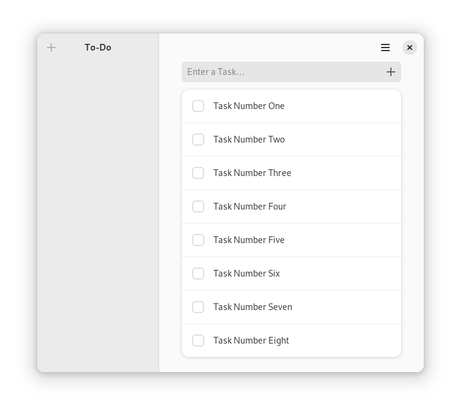

# Make To-Do App Adaptive

## Adding a Sidebar

Using Libadwaita on its own was already a big leap forward when it came to the look and feel of the To-Do app.
Let us go one step further by adding a way to group tasks into collections.
These collections will get their own sidebar on the left of the app.
Since this adds a significant amount of complexity, we are first aiming for an empty space without any functionality.

<div style="text-align:center"></div>

There are a couple of steps we have to go through to get to this state.
First, we have to replace [`gtk::ApplicationWindow`](../docs/gtk4/struct.ApplicationWindow.html) with [`adw::ApplicationWindow`](https://world.pages.gitlab.gnome.org/Rust/libadwaita-rs/stable/latest/docs/libadwaita/struct.ApplicationWindow.html).
The only difference is that `adw::ApplicationWindow` has no titlebar area.
That comes in handy when we build up our interface with [`adw::Leaflet`](https://world.pages.gitlab.gnome.org/Rust/libadwaita-rs/stable/latest/docs/libadwaita/struct.Leaflet.html).
In the screenshot above the `Leaflet` behaves like a [`gtk::Box`](../docs/gtk4/struct.Box.html) and contains a collection view on the left, separator in the middle and task view on the right.
When using `adw::ApplicationWindow` the collection view and task view just have their own [`adw::HeaderBar`](https://world.pages.gitlab.gnome.org/Rust/libadwaita-rs/stable/latest/docs/libadwaita/struct.HeaderBar.html) we can let the separator span over the whole window.


Filename: <a class=file-link href="https://github.com/gtk-rs/gtk4-rs/blob/master/book/listings/todo/7/resources/window.ui">listings/todo/7/resources/window.ui</a>

```xml
<?xml version="1.0" encoding="UTF-8"?>
<interface>
  <menu id="main-menu">
    <!--Menu implementation-->      
  </menu>
  <template class="TodoWindow" parent="AdwApplicationWindow">
    <property name="width-request">360</property>
    <property name="title" translatable="yes">To-Do</property>
    <property name="content">
      <object class="AdwLeaflet" id="leaflet">
        <property name="can-navigate-back">True</property>
        <property name="fold-threshold-policy">natural</property>
        <child>
          <object class="GtkBox">
            <!--Collection view implementation-->
          </object>
        </child>
        <child>
          <object class="AdwLeafletPage">
            <property name="navigatable">False</property>
            <property name="child">
              <object class="GtkSeparator" />
            </property>
          </object>
        </child>
        <child>
          <object class="GtkBox">
            <!--Task view implementation-->
          </object>
        </child>
      </object>
    </property>
  </template>
</interface>
```

The leaflet has properties like "can-navigate-back" and "fold-threshold-policy" which wouldn't make too much sense if a `Leaflet` would behave exactly like a `gtk::Box`.
Instead, the leaflet folds as soon as the requested size is too small to fit all children at the same time.
If it is folded, the leaflet behaves instead like a [`gtk::Stack`](../docs/gtk4/struct.Stack.html).
That means it only displays one of its children at the same time, excluding the `AdwLeafletPage` since its property "navigatable" is set to `False`.
The adaptive behavior of the leaflet allows the To-Do app to work on smaller screen sizes even with the added collection view.


<div style="text-align:center">
 <video autoplay muted loop>
  <source src="vid/todo_leaflet.webm" type="video/webm">
Your browser does not support the video tag.
 </video>
</div>


We already add the necessary UI elements for the collection view.
For once a header bar with a button to add a new collection.
As you can see in the screencast above, the header bar also displays a close button if the leaflet is folded.
We include this logic with a expression and its UI tag [`lookup`](https://gtk-rs.org/gtk4-rs/stable/latest/docs/gtk4/struct.Expression.html#gtkexpression-in-ui-files).
We also add a `ListBox` to display the collections.

Filename: <a class=file-link href="https://github.com/gtk-rs/gtk4-rs/blob/master/book/listings/todo/7/resources/window.ui">listings/todo/7/resources/window.ui</a>

```xml
<object class="GtkBox">
  <property name="orientation">vertical</property>
  <property name="width-request">200</property>
  <child>
    <object class="AdwHeaderBar">
      <binding name="show-end-title-buttons">
        <lookup name="folded">leaflet</lookup>
      </binding>
      <child type="start">
        <object class="GtkToggleButton">
          <property name="icon-name">list-add-symbolic</property>
          <property name="tooltip-text" translatable="yes">New Collection</property>
          <property name="action-name">win.new-collection</property>
        </object>
      </child>
    </object>
  </child>
  <child>
    <object class="GtkScrolledWindow">
      <property name="vexpand">True</property>
      <property name="child">
        <object class="GtkListBox" id="collections_list">
          <style>
            <class name="navigation-sidebar" />
          </style>
        </object>
      </property>
    </object>
  </child>
</object>
```

We also add a header bar to the task view.
We don't have to worry about the close button here: it will always be displayed.
However, we will need a way to go back to the collection view when the leaflet is folded.
That is why we add `back_button` which can be used to return to the collection view and which is only visible when the leaflet is folded. 


Filename: <a class=file-link href="https://github.com/gtk-rs/gtk4-rs/blob/master/book/listings/todo/7/resources/window.ui">listings/todo/7/resources/window.ui</a>

```xml
<object class="GtkBox">
  <property name="orientation">vertical</property>
  <property name="hexpand">True</property>
  <child>
    <object class="AdwHeaderBar">
      <property name="title-widget">
        <object class="AdwWindowTitle" />
      </property>
      <child type="start">
        <object class="GtkButton" id="back_button">
          <binding name="visible">
            <lookup name="folded">leaflet</lookup>
          </binding>
          <property name="icon-name">go-previous-symbolic</property>
          <property name="tooltip-text" translatable="yes">Back</property>
        </object>
      </child>
      <child type="end">
        <object class="GtkMenuButton">
          <property name="icon-name">open-menu-symbolic</property>
          <property name="menu-model">main-menu</property>
          <property name="tooltip-text" translatable="yes">Main Menu</property>
        </object>
      </child>
    </object>
  </child>
  <child>
    <!--This part stayed the same-->
  </child>
</object>
```

We also have to adapt the window implementation in our Rust code.
For one, the parent type of our window is now `adw::ApplicationWindow` instead of `gtk::ApplicationWindow`. 

Filename: <a class=file-link href="https://github.com/gtk-rs/gtk4-rs/blob/master/book/listings/todo/7/window/imp.rs">listings/todo/7/window/imp.rs</a>

```rust,no_run,noplayground
{{#rustdoc_include ../listings/todo/7/window/imp.rs:object_subclass}}
```

That also means that we have to implement `AdwApplicationWindowImpl`.

Filename: <a class=file-link href="https://github.com/gtk-rs/gtk4-rs/blob/master/book/listings/todo/7/window/imp.rs">listings/todo/7/window/imp.rs</a>

```rust,no_run,noplayground
{{#rustdoc_include ../listings/todo/7/window/imp.rs:adw_application_window_impl}}
```

Finally, we add `adw::ApplicationWindow` to the ancestors of `Window` in `mod.rs`.

Filename: <a class=file-link href="https://github.com/gtk-rs/gtk4-rs/blob/master/book/listings/todo/7/window/mod.rs">listings/todo/7/window/mod.rs</a>

```rust,no_run,noplayground
{{#rustdoc_include ../listings/todo/7/window/mod.rs:glib_wrapper}}
```


## Placeholder Page

Even before we start to populate the collection view, we ought to think about a different challenge: the empty state of our To-Do app.
Before, the empty state without a single task was quite okay.
It was clear that you had to add tasks in the entry bar.
However, now the situation is different.
Users will have to add a collection first, and we have to make that clear.
The GNOME HIG suggests to use a [placeholder page](https://developer.gnome.org/hig/patterns/feedback/placeholders.html) for that.
In our case, this placeholder page will be presented to the user if they open the app without any collections present.

<div style="text-align:center"></div>

Filename: <a class=file-link href="https://github.com/gtk-rs/gtk4-rs/blob/master/book/listings/todo/8/resources/window.ui">listings/todo/8/resources/window.ui</a>

```xml
<?xml version="1.0" encoding="UTF-8"?>
<interface>
  <menu id="main-menu">
    <!--Menu implementation--> 
  </menu>
  <template class="TodoWindow" parent="AdwApplicationWindow">
    <property name="width-request">360</property>
    <property name="title" translatable="yes">To-Do</property>
    <property name="content">
      <object class="GtkStack" id="stack">
        <property name="transition-type">crossfade</property>
        <child>
          <object class="GtkStackPage">
            <property name="name">empty</property>
            <property name="child">
              <object class="GtkBox">
                <!--Placeholder page implementation--> 
              </object>
            </property>
          </object>
        </child>
        <child>
          <object class="GtkStackPage">
            <property name="name">main</property>
            <property name="child">
              <object class="AdwLeaflet" id="leaflet">
                <!--Main view implementation-->
              </object>
            </property>
          </object>
        </child>
      </object>
    </property>
  </template>
</interface>
```

Filename: <a class=file-link href="https://github.com/gtk-rs/gtk4-rs/blob/master/book/listings/todo/8/resources/window.ui">listings/todo/8/resources/window.ui</a>

```xml
<object class="GtkBox">
  <property name="orientation">vertical</property>
  <child>
    <object class="GtkHeaderBar">
      <style>
        <class name="flat" />
      </style>
    </object>
  </child>
  <child>
    <object class="GtkWindowHandle">
      <property name="vexpand">True</property>
      <property name="child">
        <object class="AdwStatusPage">
          <property name="icon-name">checkbox-checked-symbolic</property>
          <property name="title" translatable="yes">No Tasks</property>
          <property name="description" translatable="yes">Create some tasks to start using the app.</property>
          <property name="child">
            <object class="GtkButton">
              <property name="label" translatable="yes">_New Collection</property>
              <property name="use-underline">True</property>
              <property name="halign">center</property>
              <property name="action-name">win.new-collection</property>
              <style>
                <class name="pill" />
                <class name="suggested-action" />
              </style>
            </object>
          </property>
        </object>
      </property>
    </object>
  </child>
</object>
```

## Collections

Filename: <a class=file-link href="https://github.com/gtk-rs/gtk4-rs/blob/master/book/listings/todo/8/collection_object/imp.rs">listings/todo/8/collection_object/imp.rs</a>

```rust,no_run,noplayground
{{#rustdoc_include ../listings/todo/8/collection_object/imp.rs:collection_object}}
```

Filename: <a class=file-link href="https://github.com/gtk-rs/gtk4-rs/blob/master/book/listings/todo/8/collection_object/mod.rs">listings/todo/8/collection_object/mod.rs</a>

```rust,no_run,noplayground
{{#rustdoc_include ../listings/todo/8/collection_object/mod.rs:collection_data}}
```

Filename: <a class=file-link href="https://github.com/gtk-rs/gtk4-rs/blob/master/book/listings/todo/8/collection_object/mod.rs">listings/todo/8/collection_object/mod.rs</a>

```rust,no_run,noplayground
{{#rustdoc_include ../listings/todo/8/collection_object/mod.rs:impl}}
```

Filename: <a class=file-link href="https://github.com/gtk-rs/gtk4-rs/blob/master/book/listings/todo/7/window/imp.rs">listings/todo/8/window/imp.rs</a>

```rust,no_run,noplayground
{{#rustdoc_include ../listings/todo/8/window/imp.rs:struct}}
```

Filename: <a class=file-link href="https://github.com/gtk-rs/gtk4-rs/blob/master/book/listings/todo/8/window/imp.rs">listings/todo/8/window/imp.rs</a>

```rust,no_run,noplayground
{{#rustdoc_include ../listings/todo/8/window/imp.rs:window_impl}}
```


We now call `setup_collections` instead of `setup_tasks`.

Filename: <a class=file-link href="https://github.com/gtk-rs/gtk4-rs/blob/master/book/listings/todo/7/window/imp.rs">listings/todo/8/window/imp.rs</a>

```rust,no_run,noplayground
{{#rustdoc_include ../listings/todo/8/window/imp.rs:object_impl}}
```


Filename: <a class=file-link href="https://github.com/gtk-rs/gtk4-rs/blob/master/book/listings/todo/8/window/imp.rs">listings/todo/8/window/mod.rs</a>

```rust,no_run,noplayground
{{#rustdoc_include ../listings/todo/8/window/mod.rs:setup_collections}}
```

Filename: <a class=file-link href="https://github.com/gtk-rs/gtk4-rs/blob/master/book/listings/todo/8/window/imp.rs">listings/todo/8/window/mod.rs</a>

```rust,no_run,noplayground
{{#rustdoc_include ../listings/todo/8/window/mod.rs:create_collection_row}}
```


Filename: <a class=file-link href="https://github.com/gtk-rs/gtk4-rs/blob/master/book/listings/todo/8/window/imp.rs">listings/todo/8/window/mod.rs</a>

```rust,no_run,noplayground
{{#rustdoc_include ../listings/todo/8/window/mod.rs:helper}}
```

Filename: <a class=file-link href="https://github.com/gtk-rs/gtk4-rs/blob/master/book/listings/todo/8/window/imp.rs">listings/todo/8/window/mod.rs</a>

```rust,no_run,noplayground
{{#rustdoc_include ../listings/todo/8/window/mod.rs:restore_data}}
```


Filename: <a class=file-link href="https://github.com/gtk-rs/gtk4-rs/blob/master/book/listings/todo/8/window/imp.rs">listings/todo/8/window/mod.rs</a>

```rust,no_run,noplayground
{{#rustdoc_include ../listings/todo/8/window/mod.rs:set_current_collection}}
```

The method `set_task_list_visible` assures that `tasks_list` is only visible if the number of tasks is greater than 0.

Filename: <a class=file-link href="https://github.com/gtk-rs/gtk4-rs/blob/master/book/listings/todo/8/window/imp.rs">listings/todo/8/window/mod.rs</a>

```rust,no_run,noplayground
{{#rustdoc_include ../listings/todo/8/window/mod.rs:set_task_list_visible}}
```

Filename: <a class=file-link href="https://github.com/gtk-rs/gtk4-rs/blob/master/book/listings/todo/8/window/imp.rs">listings/todo/8/window/mod.rs</a>

```rust,no_run,noplayground
{{#rustdoc_include ../listings/todo/8/window/mod.rs:select_current_row}}
```

Filename: <a class=file-link href="https://github.com/gtk-rs/gtk4-rs/blob/master/book/listings/todo/8/window/imp.rs">listings/todo/8/window/mod.rs</a>

```rust,no_run,noplayground
{{#rustdoc_include ../listings/todo/8/window/mod.rs:setup_actions}}
```

## Leaflet and Dialog

<div style="text-align:center">
 <video autoplay muted loop>
  <source src="vid/todo_adaptive_sidebar.webm" type="video/webm">
Your browser does not support the video tag.
 </video>
</div>


Filename: <a class=file-link href="https://github.com/gtk-rs/gtk4-rs/blob/master/book/listings/todo/8/window/imp.rs">listings/todo/8/window/mod.rs</a>

```rust,no_run,noplayground
{{#rustdoc_include ../listings/todo/8/window/mod.rs:new_collection}}
```

Filename: <a class=file-link href="https://github.com/gtk-rs/gtk4-rs/blob/master/book/listings/todo/8/window/imp.rs">listings/todo/8/window/mod.rs</a>

```rust,no_run,noplayground
{{#rustdoc_include ../listings/todo/8/window/mod.rs:setup_callbacks}}
```

Filename: <a class=file-link href="https://github.com/gtk-rs/gtk4-rs/blob/master/book/listings/todo/8/window/imp.rs">listings/todo/8/window/mod.rs</a>

```rust,no_run,noplayground
{{#rustdoc_include ../listings/todo/8/window/mod.rs:set_stack}}
```

> You might have noticed that there is not yet a way to remove a collection.
> Try to implement this missing piece of functionality in your local version of the To-Do app.
> Which edge cases do you have to consider?
