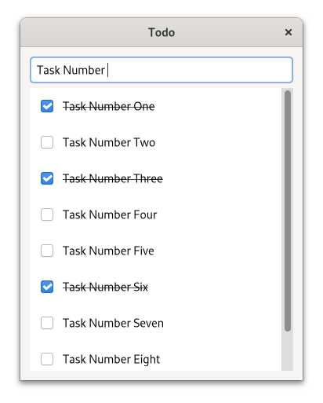

# Building a Simple To-Do App


<div style="text-align:center"></div>


<span class="filename">Filename: listings/todo_app/1/window/window.ui</span>

```xml
{{#rustdoc_include ../listings/todo_app/1/window/window.ui}}
```

<span class="filename">Filename: listings/todo_app/1/window/imp.rs</span>

```rust
{{#rustdoc_include ../listings/todo_app/1/window/imp.rs:struct_and_subclass}}
# // Please ignore this line
# // It is only there to make mdbook happy
# fn main() {}
```

<span class="filename">Filename: listings/todo_app/1/window/mod.rs</span>

```rust
{{#rustdoc_include ../listings/todo_app/1/window/mod.rs:glib_wrapper}}
# // Please ignore this line
# // It is only there to make mdbook happy
# fn main() {}
```


<span class="filename">Filename: listings/todo_app/1/main.rs</span>

```rust
{{#rustdoc_include ../listings/todo_app/1/main.rs:main}}
```

<span class="filename">Filename: listings/todo_app/1/todo_object/imp.rs</span>

```rust
{{#rustdoc_include ../listings/todo_app/1/todo_object/imp.rs:struct_and_subclass}}
# // Please ignore this line
# // It is only there to make mdbook happy
# fn main() {}
```

<span class="filename">Filename: listings/todo_app/1/todo_object/mod.rs</span>

```rust
{{#rustdoc_include ../listings/todo_app/1/todo_object/mod.rs:todo_data}}
# // Please ignore this line
# // It is only there to make mdbook happy
# fn main() {}
```

<span class="filename">Filename: listings/todo_app/1/todo_object/mod.rs</span>

```rust
{{#rustdoc_include ../listings/todo_app/1/todo_object/mod.rs:glib_wrapper}}
# // Please ignore this line
# // It is only there to make mdbook happy
# fn main() {}
```

<div style="text-align:center"></div>

<span class="filename">Filename: listings/todo_app/1/todo_row/todo_row.ui</span>

```xml
{{#rustdoc_include ../listings/todo_app/1/todo_row/todo_row.ui}}
```

<span class="filename">Filename: listings/todo_app/1/todo_row/imp.rs</span>

```rust
{{#rustdoc_include ../listings/todo_app/1/todo_row/imp.rs:struct_and_subclass}}
# // Please ignore this line
# // It is only there to make mdbook happy
# fn main() {}
```

<span class="filename">Filename: listings/todo_app/1/todo_row/mod.rs</span>

```rust
{{#rustdoc_include ../listings/todo_app/1/todo_row/mod.rs:glib_wrapper}}
# // Please ignore this line
# // It is only there to make mdbook happy
# fn main() {}
```


<span class="filename">Filename: listings/todo_app/1/window/imp.rs</span>

```rust
{{#rustdoc_include ../listings/todo_app/1/window/imp.rs:constructed}}
# // Please ignore this line
# // It is only there to make mdbook happy
# fn main() {}
```


<span class="filename">Filename: listings/todo_app/1/window/mod.rs</span>

```rust
{{#rustdoc_include ../listings/todo_app/1/window/mod.rs:model}}
# // Please ignore this line
# // It is only there to make mdbook happy
# fn main() {}
```

<span class="filename">Filename: listings/todo_app/1/window/mod.rs</span>

```rust
{{#rustdoc_include ../listings/todo_app/1/window/mod.rs:setup_callbacks}}
# // Please ignore this line
# // It is only there to make mdbook happy
# fn main() {}
```

<span class="filename">Filename: listings/todo_app/1/window/mod.rs</span>

```rust
{{#rustdoc_include ../listings/todo_app/1/window/mod.rs:setup_factory}}
# // Please ignore this line
# // It is only there to make mdbook happy
# fn main() {}
```

<span class="filename">Filename: listings/todo_app/1/todo_row/mod.rs</span>

```rust
{{#rustdoc_include ../listings/todo_app/1/todo_row/mod.rs:bind}}
# // Please ignore this line
# // It is only there to make mdbook happy
# fn main() {}
```


<span class="filename">Filename: listings/todo_app/1/todo_row/mod.rs</span>

```rust
{{#rustdoc_include ../listings/todo_app/1/todo_row/mod.rs:unbind}}
# // Please ignore this line
# // It is only there to make mdbook happy
# fn main() {}
```
