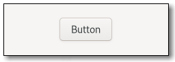

# Widgets

Widgets are the components that make up a GTK application.
GTK offers many widgets and if those don't fit, you can even create custom ones.
There are, for example, display widgets, buttons, containers and windows.
One kind of widget might be able to contain other widgets, it might present information and it might react to interaction.

The [Widget Gallery](https://docs.gtk.org/gtk4/visual_index.html) is useful to find out which widget fits your needs.
Let's say we want to add a button to our app.
We have quite a bit of choice here, but let's take the simplest one — a `Button`.

<div style="text-align:center"></div>

GTK is an object-oriented framework, so all widgets are part of an inheritance tree with `GObject` at the top.
The inheritance tree of a `Button` looks like this:

```console
GObject
╰── Widget
    ╰── Button
```

The [GTK documentation](https://docs.gtk.org/gtk4/class.Button.html#implements) also tells us that `Button` implements the interfaces `GtkAccessible`, `GtkActionable`, `GtkBuildable`, `GtkConstraintTarget`.

Now let's compare that with the corresponding `Button` struct in `gtk-rs`.
The [gtk-rs documentation](https://gtk-rs.org/gtk4-rs/stable/latest/docs/gtk4/struct.Button.html#implements) tells us which traits it implements.
We find that these traits either have a corresponding base class or interface in the GTK docs.
In the "Hello World" app we wanted to react to a button click.
This behavior is specific to a button, so we expect to find a suitable method in the `ButtonExt` trait.
And indeed, `ButtonExt` includes the method [`connect_clicked`](https://gtk-rs.org/gtk4-rs/stable/latest/docs/gtk4/prelude/trait.ButtonExt.html#tymethod.connect_clicked).

Filename: <a class=file-link href="https://github.com/gtk-rs/gtk4-rs/blob/main/book/listings/hello_world/3/main.rs">listings/hello_world/3/main.rs</a>

```rust
{{#rustdoc_include ../listings/hello_world/3/main.rs:button}}
```
