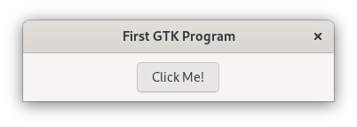

# Builder Pattern

This example shows how to use the [builder pattern](https://doc.rust-lang.org/1.0.0/style/ownership/builders.html) with GObjects.
These allow to set construct-only properties and other construct properties.

