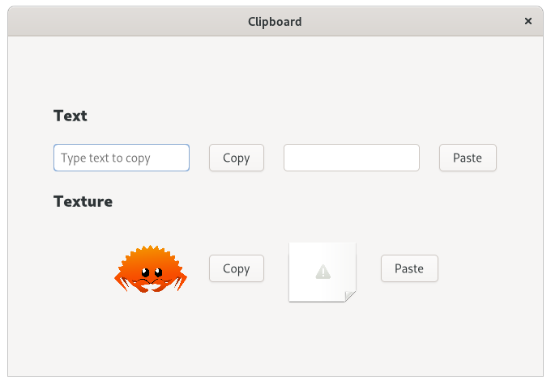

# Clipboard

The example shows how to use `gdk::Clipboard` to store/retrieve a text or a `gdk::Texture` from/into the clipboard.

## License

The ferris [asset](./asset.png) was copied from [https://rustacean.net/](https://rustacean.net/) and is published under [CC0 1.0](https://creativecommons.org/publicdomain/zero/1.0/)
