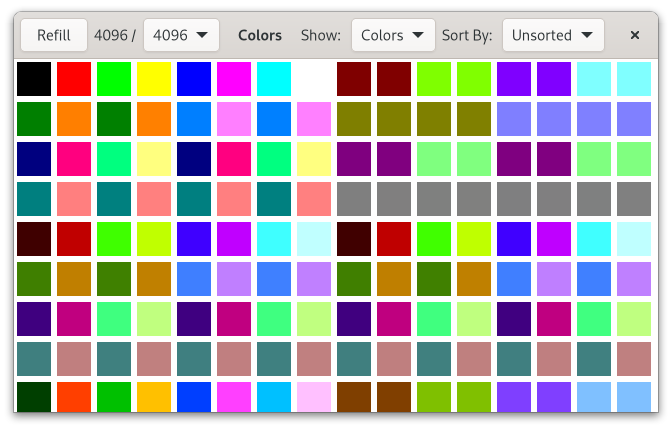
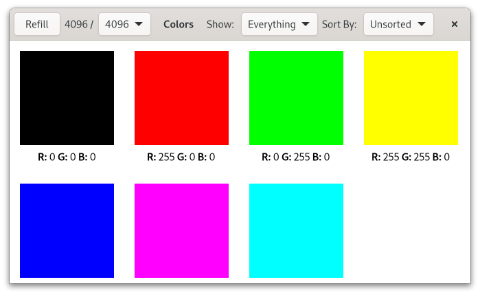

# Colors

This demo displays a grid of colors.
It is using a GtkGridView, and shows how to display and sort the data in various ways. The controls for this are implemented using GtkDropDown.
The dataset used here has up to `16777216` items.
Note that this demo also functions as a performance test for some of the list model machinery, and the biggest sizes here can lock up the application for extended times when used with sorting.

It's a Rust rewrite of a [colors](https://github.com/GNOME/gtk/blob/master/demos/gtk-demo/listview_colors.c) example from gtk4-demo written in C

