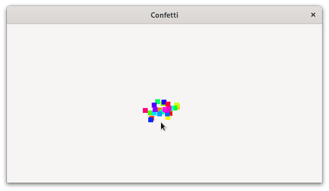

# Confetti

This example demonstrates how to create a custom widget and animate a custom drawing in it.
This also uses the `graphene` crate to work with vectors, to create a simple physics simulation.

Clicking on the custom widget will trigger a confetti explosion for X seconds. After X seconds,
the animation will stop and the related resources will be disposed. Multiple animations can be run at the
same time.

