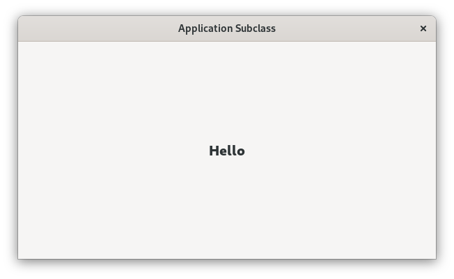

# Custom GtkApplication

This example shows how to create a custom GtkApplication by subclassing it.

Note that you don't need to init gtk manually in this case as it's done automatically
after the application has been activated.

