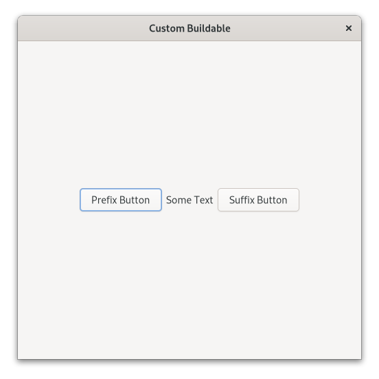

# Custom Buildable

This example shows how to create a custom widget implementing the GtkBuildable interface. This allows to specify how children are added when the widget is used in a UI declaration.

