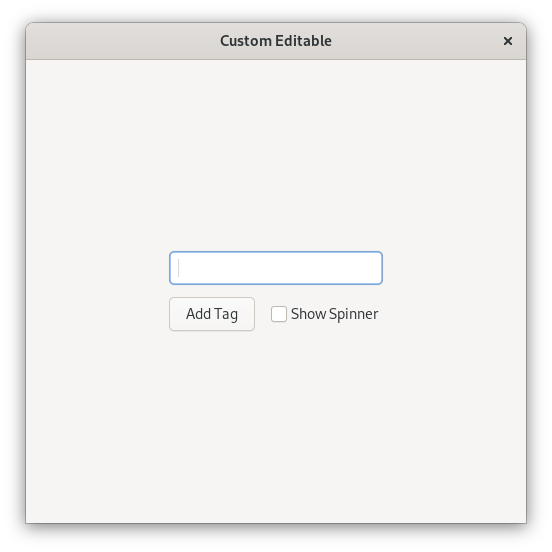

# Custom Editable

This example shows how to create a custom `gtk::Editable` which is the equivalent
of creating a custom text entry that can have tags shown on it.
It's a copy of the tagged entry demo from gtk4-demo.
The entry point is in `main.rs`, the custom editable in `custom_editable.rs` and the custom tag in `custom_tag.rs`.

