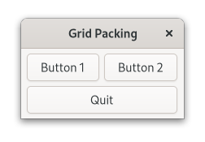

# Grid Packing

This example demonstrates how to attach widgets to a grid.

_This example was recreated from the [grid-packing example](https://gitlab.gnome.org/GNOME/gtk/-/blob/master/examples/grid-packing.c) in the upstream repository._