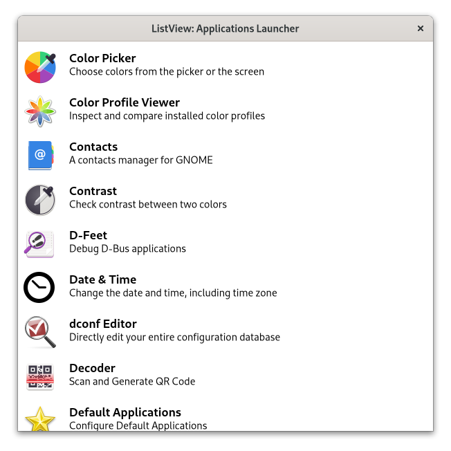

# ListView: Applications Launcher

This example shows how to create a `gtk::ListView` and fill it with applications data from `gio::AppInfo` with the possibility to open an application when an item of the list is activated.

