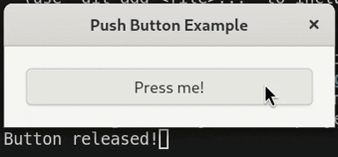
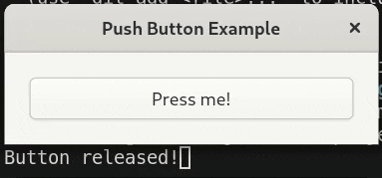

# Push Button

This example demonstrates how to handle "press" and "release" events on a button
using both mouse and keyboard interactions.

It addresses common issues like:

- Detecting when a button is released (not just clicked).
- Handling keyboard "key repeat" to prevent flickering.
- Using `EventControllerKey` and `GestureClick` together.

## Previews

|            Mouse Interaction             |            Keyboard Interaction             |
| :--------------------------------------: | :-----------------------------------------: |
|  |  |

## Usage

- Press and hold the button with the **mouse** or the **Space bar**.
- The label changes to "Release me!" while held.
- The label reverts to "Press me!" when released.
