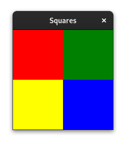

# Squares

This example demonstrates how to do custom drawing in a widget. This is a
translation to rust of [squares.py](https://gitlab.gnome.org/GNOME/gtk/-/blob/e1606ce8eb190fd9e71b9ff517339eb3de1c9209/examples/squares.py).

