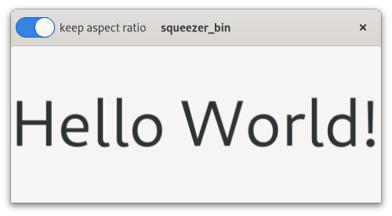
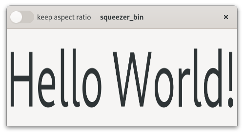

# Squeeze Widget

This example shows a basic widget that squeezes its child to fit in the parent. The widget has a property which allows the child to keep its aspect ratio.

Note that is implementation only supports one child.

#### Screenshot with `keep_aspect_ratio` set to `true`

#### Screenshot with `keep_aspect_ratio` set to `false`

