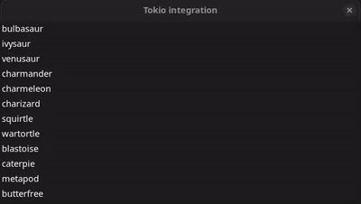

# Tokio async request

This example shows an infinite list of pokemon names, whenever it reaches the end, it searches for new names and fills the list without blocking the main thread of the program.

